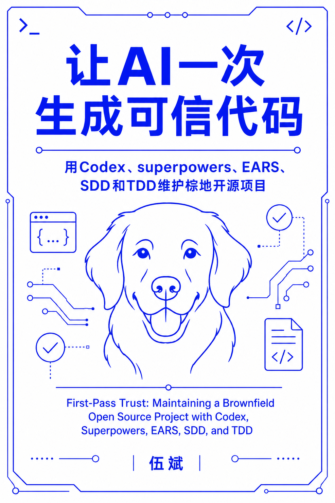

# 让AI一次生成可信代码：用Codex、superpowers、EARS、SDD和TDD维护棕地开源项目

## 引言

国内做AI辅助编程的开发者，大多绕不开一个现实约束：token不自由。国际大模型API访问受限、走中转或本地代理成本高、企业内部又对调用量有配额——这些都意味着"多轮对话慢慢纠错"这条路走不通。可现实是，AI生成的代码常常"看着对、跑不对"：编译通过、逻辑读起来顺，但一提交测试就炸，或者悄悄改变了原有行为，甚至在棕地项目里悄悄破坏了看不见的既有契约。绿地项目从零开始，出了问题推倒重来代价还小；棕地项目要维护、要兼容、要不破坏别人依赖的行为，AI一旦生成不可信代码，返工成本会成倍放大。

本书要解决的问题只有一个：**如何让AI在有限的token预算下，第一次就生成可信的代码**，而不是靠反复来回试错去逼近正确答案。

## 本书方法论：拆需求 → 出 spec → TDD 实现 → 频繁跑测试

本书提出并贯穿始终的方法论是一条链路：

1. **拆需求**——把模糊诉求拆成边界清楚、可独立验证的小颗粒需求，这是可信的起点；
2. **出 spec**——用 EARS（Easy Approach to Requirements Syntax）等结构化语法把需求写成人机之间可评审的契约，而不是一段自然语言描述；
3. **TDD 实现**——先写失败测试，再让AI写最小实现通过测试，把"信任"焊死在每一行代码上，而不是事后靠人工通读代码去赌AI没写错；
4. **频繁跑测试**——每一步都用自动化测试验证，把"这段代码是对的"这句话从主观判断变成可复现的证据。

本书以 Apache Commons CSV 为唯一贯穿案例，覆盖三个真实场景：用 TDD 开发新功能、用 TDD 修复缺陷、用 TDD 偿还技术债，并结合 Codex 与 Superpowers（Claude Code 的 Skill 编排框架）给出可复制的实操 workflow。

**如果这本开放电子书对你有帮助，请给它点个星⭐️！**

## 关于作者

伍斌，AI辅助软件开发咨询师、技术培训讲师、技术作者、实操踩坑大叔、视频号“AI辅助软件开发伍斌”博主，专注于用规范化的需求表达、测试驱动开发与AI编程工具的组合，帮助团队在棕地项目中安全、低成本地落地AI Coding。GitHub：[@wubin28](https://github.com/wubin28)。

拥有 30 余年 IT 从业经验，曾于 **2014–2022 年在 Thoughtworks 任资深软件开发咨询师 8 年**，长期服务金融、保险、证券等行业客户，聚焦敏捷工程效能提升、TDD、遗留代码改造与工程实践落地。近两年专注于 **AI 辅助软件开发咨询与培训**，围绕 Harness Engineering、AI 编码掌控感、Spec-Driven Development、Code Review 功能转移、团队技能资产沉淀等主题，为多家企业提供咨询与实战内训。

在技术传播方面，已出版 AI 编程相关著作 **《氛围编程：AI 编程像聊天一样简单》**，并著有 **《驯服烂代码》**；曾受邀在 **QECon 全球软件质量与效能大会**、**全球产品经理大会**、**中国软件大会** 等行业会议发表演讲。教育背景为 **北京邮电大学软件工程硕士**、**北京工业大学计算机应用学士**。

## 目录

### 第一章 AI 生成代码为什么不可信：三个场景的破局方法论

- 1.1 国内 token 不自由开发者的棕地困境
- 1.2 一条方法论：拆需求 → 出 spec → TDD 实现 → 频繁跑测试
- 1.3 场景一：用 TDD 开发新功能
- 1.4 场景二：用 TDD 修复缺陷
- 1.5 场景三：用 TDD 偿还技术债
- 1.6 本书的实操锚点：以 Apache Commons CSV 为唯一贯穿案例

### 第二章 用 Codex + Superpowers 理解陌生代码库：实操 commons-csv

- 2.1 工具铺垫：Codex 与 Superpowers 各自能做什么
- 2.2 理解陌生代码库的场景化 workflow
- 2.3 实操：理解 commons-csv 的核心抽象
- 2.4 产出物：一份可复用的"陌生代码库理解清单"

### 第三章 用 EARS + TDD 开发新需求：`Strict Header Schema Validation Mode`

- 3.1 需求背景与范围
- 3.2 用 EARS 精准表达 User Story
- 3.3 用 superpowers:brainstorming 生成验收标准
- 3.4 人工评审 spec：验收标准是评审重心
- 3.5 用 superpowers:test-driven-development 实现 spec
- 3.6 用 Superpowers 做 Code Review

### 第四章 用 TDD 修复缺陷：commons-csv 实战

- 4.1 缺陷发现与复现
- 4.2 用 TDD 修复缺陷
- 4.3 修复完成后的 Code Review

### 第五章 用 TDD 偿还技术债：commons-csv 重构实战

- 5.1 技术债识别与范围确认
- 5.2 用 writing-plans 拆分重构步骤
- 5.3 用 TDD 偿还技术债
- 5.4 偿还完技术债后的 Code Review

### 第六章 总结：让 AI 一次生成可信代码的工程范式

- 6.1 全书方法论回顾
- 6.2 与 Thoughtworks FOSE 洞见的呼应
- 6.3 给 token 不自由开发者的行动清单
- 6.4 展望：从个人可信到组织可信

## 版权许可协议

[让AI一次生成可信代码：用Codex、superpowers、EARS、SDD和TDD维护棕地开源项目](https://github.com/wubin28/first-pass-trust) © 2026 by [伍斌](https://github.com/wubin28) is licensed under [CC BY-NC-ND 4.0](https://creativecommons.org/licenses/by-nc-nd/4.0/)

本书采用知识共享署名-非商业性使用-禁止演绎 4.0 国际许可协议（CC BY-NC-ND 4.0）进行许可。

该协议允许你分享本书，但有以下严格限制：

- **署名（BY）**：分享时必须注明伍斌为原作者，不得隐瞒或更改此信息。
- **非商业性使用（NC）**：本书仅限非商业用途，不得用于盈利或商业项目。
- **禁止演绎（ND）**：你可以分享本书的原始版本，但不得改编、修改或重新创作。

这个协议具体意味着：

- 可以分享，但不得更改：你可以在网上分享本书，但必须保持原样，不得修改任何内容。
- 禁止商业用途：本书不得用于任何商业环境，如广告、出版物或付费项目。
- 保护原作完整性：此协议帮助原作者维护作品的完整性和原创性，防止他人进行二次创作或商业利用。

简而言之，CC BY-NC-ND 4.0 是一个相对严格的协议：允许自由分享本书，但禁止任何形式的改编或商业利用。本书版权由作者保留。

## 配套代码

本书的实操锚点是 Apache Commons CSV，全部配套代码将放在本仓库（[https://github.com/wubin28/first-pass-trust](https://github.com/wubin28/first-pass-trust)）中，按章节组织。配套代码目前正在整理，稍后会随对应章节陆续提交，每份代码清单都会标注其在仓库中的具体位置，方便读者对照查找和运行。

## 常见问题

### 1. 这本书适合什么人看？

本书假定读者已经在用AI（如Codex、Claude Code）写代码，并且已经踩过"AI生成的代码看着对、跑不对"这类坑。如果你还没实际用过AI辅助编程工具，建议先上手体验一段时间，再来看本书会更有共鸣。本书尤其适合国内token不自由、需要在有限调用预算下把AI用出确定性结果的开发者。

### 2. 这本书与其他AI Coding资源有什么不同？

市面上大多数AI Coding内容讲的是"怎么写prompt"，本书讲的是"怎么用一套工程流程（拆需求→出spec→TDD实现→频繁跑测试）把AI生成代码的可信度焊死"，并且全程用同一个真实棕地开源项目（Apache Commons CSV）贯穿三个场景（开发新功能、修复缺陷、偿还技术债），而不是零散的demo。

### 3. 这本书完成了吗？

本书正在持续撰写中，预计2026年10月前后完成，会定期更新章节，欢迎持续关注本仓库。

### 4. 我如何为这本书做出贡献？

欢迎各种贡献！如果你发现错误、有改进想法，或想补充案例，请在本GitHub仓库提交PR或开启一个issue。

### 5. 这本书有其他语言版本吗？

目前只有中文版。如果你有兴趣翻译成其他语言，欢迎在本仓库开启issue联系作者。

---

感谢关注《让AI一次生成可信代码》。希望这本书能帮你在棕地项目里，把AI Coding的第一次生成，真正变成可信的一次生成。
