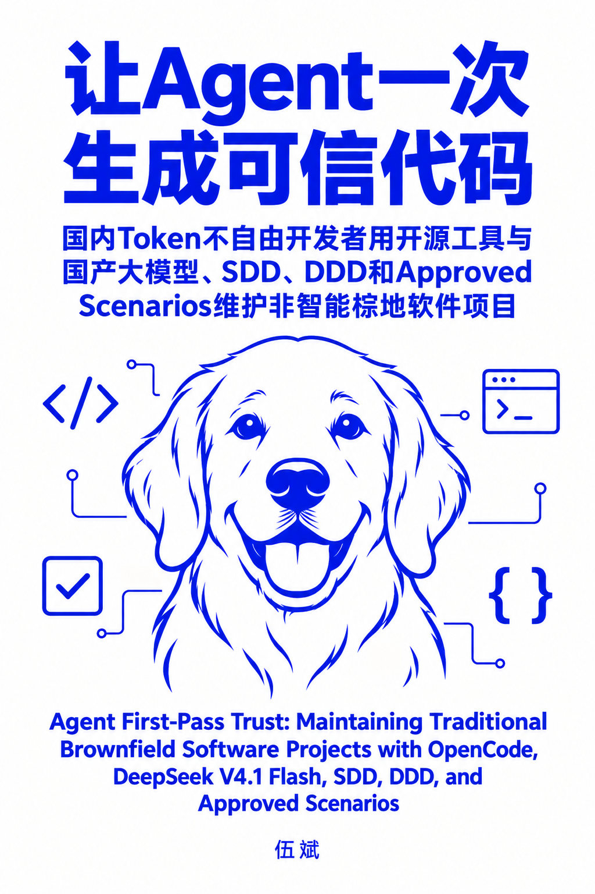

# 让Agent一次生成可信代码：国内Token不自由开发者用开源工具与国产大模型、SDD、DDD和Approved Scenarios维护非智能棕地软件项目

## 引言

先问一个问题：**如何让 Agent 在有限的 token 预算下，第一次就生成可信的代码，而不是靠反复来回试错去逼近正确答案？**

国内做 Agent 辅助编程的开发者，大多绕不开一个现实约束：token 不自由。国际大模型 API 访问受限、走中转或本地代理成本高、企业内部又对调用量有配额——这些都意味着"多轮对话慢慢纠错"这条路走不通。可现实是，Agent 生成的代码常常"看着对、跑不对"：编译通过、逻辑读起来顺，但一提交测试就炸，或者悄悄改变了原有行为，甚至在[棕地项目](https://engineering.futureuniversity.com/BOOKS%20FOR%20IT/Software-Engineering-9th-Edition-by-Ian-Sommerville.pdf)里悄悄破坏了看不见的既有契约。更关键的是，这里说的"棕地项目"不是指"开源项目"这个标签本身，而是指**需要长期维护的传统非智能软件**——它不是正在被开发的 agent 系统，而是一个已经上线、有存量用户、有历史契约的普通代码库，恰恰是国内绝大多数开发者日常打交道的对象。棕地项目要维护、要兼容、要不破坏别人依赖的行为，Agent 一旦生成不可信代码，返工成本会成倍放大。

这就是本书要回答的唯一问题。

本书的工具链选择同样服务于"token 不自由"这个现实约束：全书实操统一使用**开源 AI coding agent 搭配国产大模型**（本书以 OpenCode v2 + DeepSeek V4.1 Flash 为实操锚点），而不绑定任何需要国际信用卡、国际网络访问或高昂 token 单价的闭源工具组合。但本书讨论的方法论本身不绑定特定工具和模型——书中给出的每一条提示词，换成你自己常用的、口碑良好的开源 agent 和国产大模型（Pi、CodeBuddy CLI、mimo CLI、traecn IDE、Claude Code、Codex CLI 搭配 DeepSeek 或 GLM 等任意组合）都应该能跑通。

## 本书方法论：理解 → 设计 → 构建 → 评测，四元素闭环

回答"如何让 Agent 一次生成可信代码"这个问题，本书给出的不是一句口号，而是一条可执行、可验证的四元素链路：

1. **理解**代码所承载的复杂业务逻辑——用 [DDD（Domain-Driven Design）](https://www.oreilly.com/library/view/learning-domain-driven-design/9781098100124/) 的 strategic design，把一个陌生棕地代码库拆成核心（core）、通用（generic）、支撑（supporting）子域，分清主次，再分析新需求会牵动哪些子域、哪些类。
2. **设计**面向验收测试的 spec——用 [Decision Table Testing（决策表测试法）](https://www.geeksforgeeks.org/software-testing/what-is-decision-table-testing/) 从业务规则系统性地推导验收测试用例，保证不遗漏、不重复，而不是靠直觉随手列几个例子。
3. **构建**面向业务不变式的自动化验收测试——用 [Approved Scenarios](https://github.com/wasp-lang/awesome-prompts) 模式（结合 TDD 的红绿重构节奏）把每一条验收测试用例落地为一份人类可读、Agent 真正执行的 markdown fixture，解决"Agent 生成的测试和生产代码都不可信"的问题。
4. **评测**自动化验收测试确实保护了生产代码——用 Fault Injection Testing（故障注入测试）在生产代码里精心注入与每条测试保护意图语义对应的故障，验证测试确实会变红、报错信息确实对应，排除"测试形同虚设"的可能。

这条链路背后有一条共同的方法论气质：**理解、设计、构建、评测这四步里的每一步，一旦遇到探索未知或复杂的判断，都先做一次"假设体检"——列出隐含假设、列出缺失信息、指出常见错误、只问最关键的问题——再给出带推荐理由的方案，而不是直接甩出一个看似权威、实则谁都能套用的通用答案**。本书第 2～5 章的实操过程会反复示范这套"追问"风格，这也是本书希望读者在自己的实践中养成的工作习惯。

本书以 [Apache Commons CSV](https://github.com/apache/commons-csv) 为唯一贯穿案例，用同一个新需求——给 `CSVFormat.Builder` 新增 `setRequiredHeaders(String...)`——走完理解、设计、构建、评测四个环节。

**如果这本开放电子书对你有帮助，请给它点个星⭐️！**

## 关于作者

伍斌，AI辅助软件开发咨询师、技术培训讲师、技术作者、实操踩坑大叔、视频号"AI辅助软件开发伍斌"博主，专注于用规范化的需求表达、测试驱动开发与AI编程工具的组合，帮助团队在棕地项目中安全、低成本地落地AI Coding。GitHub：[@wubin28](https://github.com/wubin28)。

拥有 30 余年 IT 从业经验，曾于 **2014–2022 年在 Thoughtworks 任资深软件开发咨询师 8 年**，长期服务金融、保险、证券等行业客户，聚焦敏捷工程效能提升、TDD、遗留代码改造与工程实践落地。近两年专注于 **AI 辅助软件开发咨询与培训**，围绕 Harness Engineering、AI 编码掌控感、Spec-Driven Development、Code Review 功能转移、团队技能资产沉淀等主题，为多家企业提供咨询与实战内训。

在技术传播方面，已出版 AI 编程相关著作 **《氛围编程：AI 编程像聊天一样简单》**，并著有 **《驯服烂代码》**；曾受邀在 **QECon 全球软件质量与效能大会**、**全球产品经理大会**、**中国软件大会** 等行业会议发表演讲。教育背景为 **北京邮电大学软件工程硕士**、**北京工业大学计算机应用学士**。

## 目录

### 第一章 Agent 生成代码为什么不可信：读者的困境与四元素方法论

- 1.1 国内 token 不自由的 Agent Coding 开发者的棕地困境
- 1.2 本书方法论：理解 → 设计 → 构建 → 评测
- 1.3 本书的实操锚点：Apache Commons CSV + OpenCode v2 + DeepSeek V4.1 Flash
- 动手练习（第1章）：先凭直觉写下你觉得会踩的坑

### 第二章 理解代码所承载的复杂业务逻辑

- 2.1 用 DDD 的 strategic design 快速理解陌生代码库并分清主次
- 2.2.1 把代码库看作业务域
- 2.2.2 用来验证子域边界的端到端测试场景
- 2.2.3 识别核心、支持与通用子域
- 2.2.4 可视化子域内部类之间的依赖关系
- 2.2.5 可视化子域之间的协作关系
- 2.3 新需求实现的影响分析
  - 2.3.1 代码现状
  - 2.3.2 需要改动哪些子域
  - 2.3.3 需要改动哪些类
  - 2.3.4 子域接口变化
  - 2.3.5 开放设计问题

### 第三章 设计面向验收测试的 spec

- 3.1 用 Decision Table 推导验收测试以便不遗漏不重复
- 3.2 开放设计问题决策记录
  - 3.2.1 事实依据
  - 3.2.2～3.2.8 决策 1～7
- 3.3 决策表
  - 3.3.1 决策表类型选择与理由
  - 3.3.2～3.3.8 步骤1～7

### 第四章 构建面向业务不变式的自动化验收测试

- 4.1 用 Approved Scenarios 方法解决 Agent 生成的代码不可信的问题
- 4.2 自动化验收测试实现方案
  - 4.2.1 方案1：统一参数化测试
  - 4.2.2 方案2：按决策表分组的三个参数化测试
  - 4.2.3 方案3（采用）：动态测试且每用例独立调试入口
- 4.3 用单步调试的方法理解 approved scenarios 测试方法

### 第五章 评测自动化验收测试确实保护了生产代码

- 5.1 用故障注入验证测试没有形同虚设
- 5.2 故障注入测试实现方案
  - 5.2.1 方案1（选用）：git 文本精准替换且用 shell 脚本编排
  - 5.2.2 方案2：引入 PITest 变异测试框架
  - 5.2.3 方案3：自制 Java 故障注入器
- 5.3 用单步调试和故障注入的方法理解 approved scenarios 测试方法

### 第六章 总结"让 Agent 一次生成可信代码"工程范式

- 方法论回顾
- 给 token 不自由开发者的行动清单
- 展望

## 版权许可协议

[让Agent一次生成可信代码：国内Token不自由开发者用开源工具与国产大模型、SDD、DDD和Approved Scenarios维护非智能棕地软件项目](https://github.com/wubin28/first-pass-trust) © 2026 by [伍斌](https://github.com/wubin28) is licensed under [CC BY-NC-ND 4.0](https://creativecommons.org/licenses/by-nc-nd/4.0/)

本书采用知识共享署名-非商业性使用-禁止演绎 4.0 国际许可协议（CC BY-NC-ND 4.0）进行许可。

该协议允许你分享本书，但有以下严格限制：

- **署名（BY）**：分享时必须注明伍斌为原作者，不得隐瞒或更改此信息。
- **非商业性使用（NC）**：本书仅限非商业用途，不得用于盈利或商业项目。
- **禁止演绎（ND）**：你可以分享本书的原始版本，但不得改编、修改或重新创作。

这个协议具体意味着：

- 可以分享，但不得更改：你可以在网上分享本书，但必须保持原样，不得修改任何内容。
- 禁止商业用途：本书不得用于任何商业环境，如广告、出版物或付费项目。
- 保护原作完整性：此协议帮助原作者维护作品的完整性和原创性，防止他人进行二次创作或商业利用。

简而言之，CC BY-NC-ND 4.0 是一个相对严格的协议：允许自由分享本书，但禁止任何形式的改编或商业利用。本书版权由作者保留。

## 常见问题

### 1. 这本书适合什么人看？

本书假定读者已经在用 Agent（如 OpenCode v2、Claude Code、Codex CLI 等）写代码，并且已经踩过"Agent 生成的代码看着对、跑不对"这类坑。本书面向的是**用 Agent 维护需要长期维护的传统非智能软件的开发者**——你维护的是一个已经上线、有存量用户、有历史契约的普通代码库，不是在开发 agent 系统本身。如果你还没实际用过 Agent 辅助编程工具，建议先上手体验一段时间，再来看本书会更有共鸣。本书尤其适合国内 token 不自由、需要在有限调用预算下把 Agent 用出确定性结果、又用不起或不方便用国际闭源工具链的开发者。

### 2. 这本书与其他 AI Coding 资源有什么不同？

市面上大多数 AI Coding 内容讲的是"怎么写 prompt"，本书讲的是"怎么用一套工程流程（理解→设计→构建→评测）把 Agent 生成代码的可信度焊死"，并且全程用同一个真实棕地项目（Apache Commons CSV）贯穿一个新需求的完整实现过程，而不是零散的 demo。本书还有两个区别于市面上同类资源的地方：一是全程使用**开源工具搭配国产大模型**，不依赖国际闭源工具链；二是每章都设计了"动手练习"环节，邀请读者在自己的环境里真跑一遍提示词，再与书里的参考答案对比复盘，而不是只看提示词和产出摘要。

### 3. 这本书完成了吗？

本书正在持续撰写中，会定期更新章节，欢迎持续关注本仓库。

### 4. 我如何为这本书做出贡献？

欢迎各种贡献！如果你发现错误、有改进想法，或想补充案例，请在本GitHub仓库提交PR或开启一个issue。

### 5. 这本书有其他语言版本吗？

目前只有中文版。如果你有兴趣翻译成其他语言，欢迎在本仓库开启issue联系作者。

---

感谢关注《让Agent一次生成可信代码》。希望这本书能帮你在棕地项目里，把 Agent Coding 的第一次生成，真正变成可信的一次生成。
