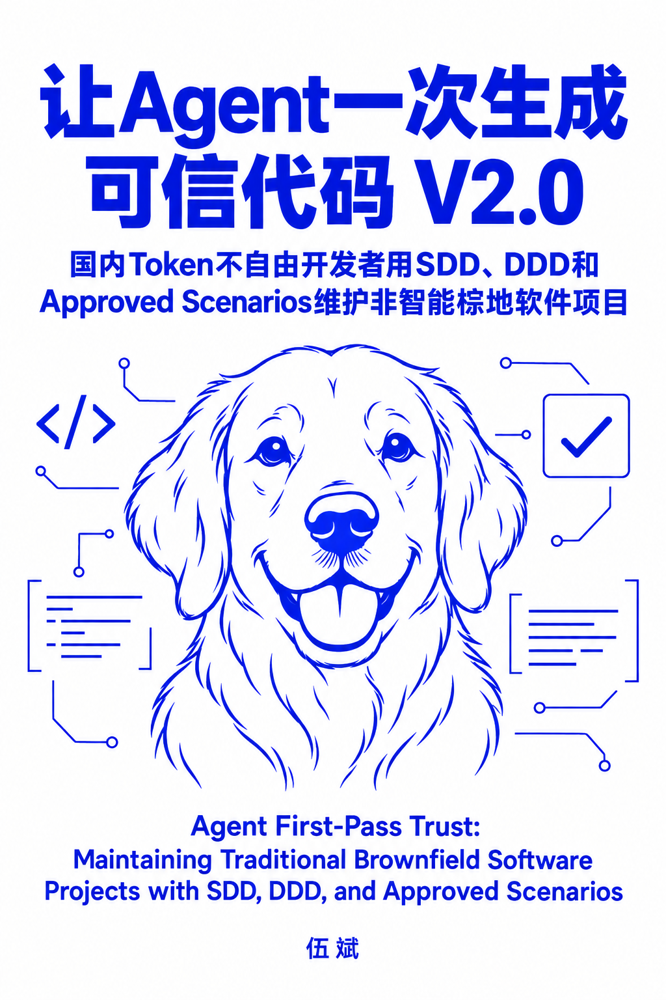

# 让Agent一次生成可信代码 V2.0：国内Token不自由开发者用SDD、DDD和Approved Scenarios维护非智能棕地软件项目

先问一个问题：**如何让 Agent 在有限的 token 预算下，第一次就生成可信的代码——不必靠反复来回试错去逼近正确答案？**

国内做 Agent 辅助编程的开发者，大多绕不开一个现实约束：token 不自由。国际大模型 API 访问受限、走中转遭“提示词中间人攻击”风险大、走本地私有化部署大模型成本高、企业内部又对调用量有配额——这些都意味着"多轮对话慢慢纠错"这条路走不通。可现实是，Agent 生成的代码常常"看着对、跑不对"：编译通过、逻辑读起来顺，但一提交测试就炸，或者悄悄改变了原有行为，甚至在[棕地项目](https://www.environmentalworks.com/what-is-a-brownfield-project/)（借用土木工程中的术语，指在老旧软件系统之上开发与部署新软件系统的项目）里悄悄破坏了看不见的既有契约。需要注意的是，这里说的"棕地项目"，并非所有"现存的软件系统"，仅指**需要长期维护的传统非智能软件**——并不包含正在开发中的有智能的 agent 系统。说白了，就是一个已经上线、有存量付费用户、有历史 API 契约的普通代码库。这种棕地项目恰恰是国内绝大多数开发者日常打交道的对象。棕地项目要维护、要兼容、要不破坏别人依赖的行为，Agent 一旦生成不可信代码，返工成本会成倍放大。

这就是本书要回答的唯一问题。

> 作者：伍斌，30 余年 IT 从业经验，曾在 Thoughtworks 任资深软件开发咨询师 8 年，专注用规范化的需求表达、测试驱动开发与 AI 编程工具的组合，帮助团队在棕地项目中安全、低成本地落地 AI Coding（完整介绍见下文"关于作者"）。

## 本书方法论：理解 → 设计 → 构建 → 评测，四元素闭环

回答"如何让 Agent 一次生成可信代码"这个问题，乍一看像是在喊一句口号，拆解开来，其实是一条可执行、可验证的四元素链路：

1. **理解**代码所承载的复杂业务逻辑——用 [DDD（Domain-Driven Design）](https://www.oreilly.com/library/view/learning-domain-driven-design/9781098100124/) 的 strategic design，把一个陌生棕地代码库拆成核心（core）、通用（generic）、支撑（supporting）子域，分清主次，再分析新需求会牵动哪些子域、哪些类。
2. **设计**面向验收测试的 spec——用 [Decision Table Testing（决策表测试法）](https://www.virtuosoqa.com/post/decision-table-testing) 从业务规则系统性地推导验收测试用例，保证不遗漏、不重复，不必靠直觉随手列几个例子凑数。
3. **构建**面向业务不变式的自动化验收测试——用 [Approved Scenarios](https://lexler.github.io/augmented-coding-patterns/patterns/approved-scenarios/) 模式（结合 TDD 的红绿重构节奏）针对不变的业务事实，把每一条验收测试用例落地为一份产品经理也能读懂的、Agent 真正执行的 markdown fixture，解决"Agent 生成的测试和生产代码都不可信"的问题。
4. **评测**自动化验收测试确实保护了生产代码——用 [Fault Injection Testing](https://www.geeksforgeeks.org/software-engineering/fault-injection-testing-software-engineering/)（故障注入测试）在生产代码里精心注入与每条测试保护意图语义对应的故障，验证测试确实会变红、报错信息确实对应，排除"测试形同虚设"的可能。

在 AI Coding 时代维护棕地项目，无论是开发新需求，还是修 bug，都离不开上述四个基本要素。

这条链路背后有一条共同的方法论：**理解、设计、构建、评测这四步探索未知或复杂问题的每一步开头，都用"假设体检+追问"风格的提示词来与 Agent 澄清诉求**——列出隐含假设、列出缺失信息、指出常见错误、只问最关键的问题——再给出带推荐理由的方案，拒绝上来就甩出一个看似权威、实则谁都能套用的通用答案。本书第 2～5 章的实操过程会反复示范这套"假设体检+追问"风格的提示词，这也是本书希望读者在自己的实践中养成的工作习惯。

本书以 [Apache Commons CSV](https://github.com/apache/commons-csv) 为唯一贯穿案例，用同一个新需求走完理解、设计、构建、评测四个环节。这个新需求是给 `CSVFormat.Builder` 新增 `setRequiredHeaders(String...)`，以便在解析时一旦发现 CSV 表头缺少这些列，就在读第一条记录之前抛出一个清楚说明缺了哪些列的错误，而并非等业务代码调用 `record.get("currency")` 时才报错。

## 30秒判断：这本书适合你吗？

**你适合读这本书，如果你：**

- 已经在用 Agent（如 Claude Code、Codex CLI 、OpenCode v2 、Pi、CodeBuddy 、Mimo 、Trae CN IDE等）写代码，并且已经踩过"Agent 生成的代码看着对、跑不对"这类坑；
- 日常维护的是一个**需要长期维护的传统非智能软件**——已经上线、有存量用户、有历史契约的普通代码库（公司内部系统、客户交付项目都算），而并非在开发 agent 系统本身；
- 国内 token 不自由，需要在有限调用预算下把 Agent 用出确定性结果，又用不起或不方便用国际闭源工具链。

**你可以放心读，即使你：**

- 还不太懂 DDD，也很少写自动化测试——本书并非 DDD 或测试教程，不要求你提前掌握这些；你会在一个真实棕地需求里，边做边学到足以约束 Agent 的最小必要概念与操作。

**你可能需要先做点准备，如果你：**

- 还没实际用过 Agent 辅助编程工具——建议先上手体验一段时间，再来看本书会更有共鸣。

**实操环境要求：**

本书不绑定任何特定工具和模型。全书每章结尾给出的提示词，发给你自己常用的、国内外口碑良好的任意 AI Coding Agent 搭配任意大模型都能跑通——例如 Claude Code 搭配 Opus 5.5、Codex CLI 搭配 GPT 6.1 Sol、OpenCode V2 搭配 GLM 5.3、Pi 搭配 DeepSeek v4 pro、CodeBuddy 搭配 GLM 5.3 等。全书实操以 **OpenCode v2 + DeepSeek V4.1 Flash** 为锚点组合（不需要国际信用卡、不依赖受限的国际网络访问，对国内 token 不自由的读者更现实）；实际撰写过程中的实战环节，主要使用了 **Claude Code 搭配 Sonnet 5** 。

## 目录

### [第一章 Agent 生成代码为什么不可信：读者的困境与四元素方法论](ch01/README.md#ch1-toc)

- 国内 token 不自由的 Agent Coding 开发者的棕地困境
- 本书方法论：理解 → 设计 → 构建 → 评测
- 动手练习：先凭直觉写下你觉得会踩的坑

### [第二章 理解代码所承载的复杂业务逻辑](ch02/README.md#ch2-toc)

- 用 DDD 的 strategic design 快速理解陌生代码库并分清主次
- 识别核心、支撑与通用子域
- 新需求实现的影响分析

### [第三章 设计面向验收测试的 spec](ch03/README.md#ch3-toc)

- 用 Decision Table 推导验收测试以便不遗漏不重复
- 开放设计问题决策记录
- 决策表（识别条件 → 定义取值 → 计算规则数 → 识别动作 → 填充 → 化简 → 转为测试用例）

### [第四章 构建面向业务不变式的自动化验收测试](ch04/README.md#ch4-toc)

- 用 Approved Scenarios 方法解决 Agent 生成的代码不可信的问题
- 三种自动化验收测试实现方案对比（统一参数化 / 按决策表分组 / 动态测试+独立调试入口）
- 用单步调试的方法理解 approved scenarios 测试方法

### [第五章 评测自动化验收测试确实保护了生产代码](ch05/README.md#ch5-toc)

- 用故障注入验证测试没有形同虚设
- 三种故障注入测试实现方案对比（git 文本精准替换 / PITest 变异测试 / 自制 Java 故障注入器）
- 用单步调试和故障注入的方法理解 approved scenarios 测试方法

### [第六章 总结&#34;让 Agent 一次生成可信代码&#34;工程范式](ch06/README.md#ch6-toc)

- 方法论回顾
- 给 token 不自由开发者的行动清单
- 展望

每一章结尾都有一份可以直接复制给你自己 Agent 的完整动手练习提示词，鼓励你先自己跑一遍、再回头和本章的参考答案对比复盘，把"看懂"真正变成"做过"。

## 这本书与其他 AI Coding 资源有什么不同？

市面上大多数 AI Coding 内容讲的是"怎么写 prompt"，本书讲的是"怎么用一套工程流程（理解→设计→构建→评测）把 Agent 生成代码的可信度焊死"，并且全程用同一个真实棕地项目（Apache Commons CSV）贯穿一个新需求的完整实现过程，不靠零散的 demo 拼凑。本书还有两个区别于市面上同类资源的地方：一是全程给出的提示词适用于国内外口碑良好的 AI Coding Agent 搭配大模型的任意组合，不绑定特定工具链；二是每章都设计了"动手练习"环节，邀请读者在自己的环境里真跑一遍提示词，再与书里的参考答案对比复盘，不只是看提示词和产出摘要这么简单。

**如果这本开放电子书对你有帮助，请给它点个星⭐️！**

## 关于作者

伍斌，AI辅助软件开发咨询师、技术培训讲师、技术作者、实操踩坑大叔、视频号"AI辅助软件开发伍斌"博主，专注于用规范化的需求表达、测试驱动开发与AI编程工具的组合，帮助团队在棕地项目中安全、低成本地落地AI Coding。GitHub：[@wubin28](https://github.com/wubin28)。

拥有 30 余年 IT 从业经验，曾于 **2014–2022 年在 Thoughtworks 任资深软件开发咨询师 8 年**，长期服务金融与保险等行业客户，聚焦敏捷工程效能提升、TDD、遗留代码改造与工程实践落地。近两年专注于 **AI 辅助软件开发咨询与培训**，围绕 Harness Engineering、Spec-Driven Development、Code Review 功能转移、团队技能资产沉淀等主题，为多家企业提供咨询与实战内训。

在技术传播方面，已出版 AI 编程相关著作 **《氛围编程：AI 编程像聊天一样简单》**，并著有 **《驯服烂代码》**；曾受邀在 **QECon 全球软件质量与效能大会**、**全球产品经理大会**、**中国软件大会** 等行业会议发表演讲。教育背景为 **北京邮电大学软件工程硕士**、**北京工业大学计算机应用学士**。

## 给 v1.0 老读者：v2.0 核心升级

> 如果你读过本书 v1.0（《让AI一次生成可信代码：国内Token不自由开发者用Codex、Superpowers、EARS、SDD和TDD维护棕地开源项目》），这里说明 v2.0 带来了什么变化，方便你判断值不值得重新读一遍；如果你是第一次接触本书，这节可以跳过。

- **方法论从"四步通用流程"升级为"理解 → 设计 → 构建 → 评测"四个更系统化的环节**：v1.0 的"拆需求 → 出 spec → TDD 实现 → 频繁跑测试"是一条通用工程流程；v2.0 把每一步都换成了一套有明确方法论支撑、可独立验证效果的具体技法——用 DDD strategic design 理解代码、用 Decision Table Testing 设计验收测试、用 Approved Scenarios + TDD 构建自动化测试、用 Fault Injection Testing 评测这些测试是否形同虚设。每一步都给出了"没有它会怎样""独特优势是什么"的具体论证，不再停留在流程口号上。
- **工具链从"绑定 Codex + Superpowers"变为完全不绑定任何工具和模型**：v1.0 的实操深度依赖 Codex 和 Superpowers 这一套特定组合；v2.0 的每一条提示词**都不依赖任何 Skill 或特定工具链**，换成你自己常用的、国内外口碑良好的任意 AI Coding Agent 搭配任意大模型都能跑通，国内 token 不自由的读者不必再迁就某一家工具。
- **新增"动手练习"机制，每章结尾都有一份可以直接复制给你自己 Agent 的完整提示词**：v1.0 更偏向"展示提示词和产出摘要"；v2.0 把每章分散的提示词合并打磨成一份带占位符说明的完整可执行提示词，放在章末，鼓励你先自己跑一遍、再回头和本章的参考答案对比复盘，把"看懂"真正变成"做过"。
- **案例从"三个场景各自展开"收拢成"一个需求、贯穿四个环节"**：v1.0 用三个场景（开发新功能/修复缺陷/偿还技术债）分别演示四步法；v2.0 聚焦一个真实的 `commons-csv` 新需求，让理解、设计、构建、评测四个环节在同一个需求上逐层深入，每一步的产出都是下一步的直接输入，更接近真实棕地项目里"从拿到需求到交付可信代码"的完整链路。
- **读者画像从"棕地开源项目"扩展到"任何需要长期维护的非智能棕地软件"**：不再局限于开源项目，只要你维护的是一个已经上线、有历史契约的普通代码库（公司内部系统、客户交付项目都算），这套方法论都适用。
- **"假设体检 + 追问"的工作习惯贯穿全书**：每当遇到需要探索或裁决的开放问题，书里都先做一次假设体检、给出带理由的方案，而并非直接甩出一个看似权威的通用答案——这是 v2.0 新加入的方法论，也希望你能带进自己的工作习惯里。

## 版权许可协议

[让Agent一次生成可信代码：国内Token不自由开发者用SDD、DDD和Approved Scenarios维护非智能棕地软件项目](https://github.com/wubin28/first-pass-trust) © 2026 by [伍斌](https://github.com/wubin28) is licensed under [CC BY-NC-ND 4.0](https://creativecommons.org/licenses/by-nc-nd/4.0/)

本书采用知识共享署名-非商业性使用-禁止演绎 4.0 国际许可协议（CC BY-NC-ND 4.0）进行许可。

该协议允许你分享本书，但有以下严格限制：

- **署名（BY）**：分享时必须注明伍斌为原作者，不得隐瞒或更改此信息。
- **非商业性使用（NC）**：本书仅限非商业用途，不得用于盈利或商业项目。
- **禁止演绎（ND）**：你可以分享本书的原始版本，但不得改编、修改或重新创作。

这个协议具体意味着：

- 可以分享，但不得更改：你可以在网上分享本书，但必须保持原样，不得修改任何内容。
- 禁止商业用途：本书不得用于任何商业环境，如广告、出版物或付费项目。
- 保护原作完整性：此协议帮助原作者维护作品的完整性和原创性，防止他人进行二次创作或商业利用。

简而言之，CC BY-NC-ND 4.0 是一个相对严格的协议：允许自由分享本书，但禁止任何形式的改编或商业利用。本书版权由作者保留。

## 常见问题

### 1. 这本书完成了吗？

本书正在持续撰写中，会定期更新章节，欢迎持续关注本仓库。

### 2. 我如何为这本书做出贡献？

欢迎各种贡献！如果你发现错误、有改进想法，或想补充案例，请在本GitHub仓库提交PR或开启一个issue。

### 3. 这本书有其他语言版本吗？

目前只有中文版。如果你有兴趣翻译成其他语言，欢迎在本仓库开启issue联系作者。

---

感谢关注《让Agent一次生成可信代码》。希望这本书能帮你在棕地项目里，把 Agent Coding 的第一次生成，真正变成可信的一次生成。
