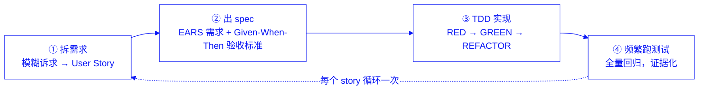

# 第一章 AI 生成代码为什么不可信：三个场景的破局方法论

## 1.1 国内 token 不自由开发者的棕地困境

如果你在国内用 AI 写代码，大概率遇到过这样的约束：国际大模型 API 访问受限，走中转或本地代理成本不低，企业内部对调用量又有配额限制。这些约束合在一起，指向一个现实——**多轮对话慢慢纠错这条路走不通**。国外很多"AI 编程最佳实践"默认你可以无限制地和模型来回对话，生成代码不满意就换个说法再问一次，直到模型"蒙对"为止。但当每一次调用都有成本、有配额，这种试错式的工作方式就变成了一种奢侈。

更棘手的是项目本身的性质。绿地项目（Greenfield Project）从零开始，没有历史包袱，AI 生成的代码就算推倒重来，代价也有限。但现实中的大多数工作发生在**[棕地项目（Brownfield Project）]((https://engineering.futureuniversity.com/BOOKS%20FOR%20IT/Software-Engineering-9th-Edition-by-Ian-Sommerville.pdf))**——已经上线运行、有存量用户、有其他模块依赖的代码库。棕地项目的代码里藏着大量"看不见的契约"：某个方法的空值处理方式、某个类的线程安全假设、某个 API 的向后兼容承诺。这些契约往往没有写在文档里，只活在测试用例和调用方的假设中。

AI 生成代码最危险的地方不是"编译不过"——这种错误立刻会暴露。真正危险的是**编译通过、逻辑读起来也顺，但悄悄改变了原有行为**。这种代码在棕地项目里是定时炸弹：它可能过了 code review，过了手工验证，直到某个边缘场景在生产环境触发，才暴露出问题。而一旦返工，代价往往是最初生成成本的数倍——包括重新调用 AI 的 token 成本，也包括排查问题、修复问题、重新验证的人力成本。

对国内 token 不自由的开发者来说，这两个约束叠加在一起：**没有本钱靠多轮试错去逼近正确答案，又必须在充满隐性契约的棕地代码里工作**。这正是本书要解决的问题：如何让 AI 在有限的 token 预算下，第一次生成就是可信的，而不是靠事后反复纠正。

## 1.2 一条方法论：拆需求 → 出 spec → TDD 实现 → 频繁跑测试

要在有限预算下追求"一次生成可信"，核心思路是把"信任"从一句主观判断（"这段代码看起来没问题"）变成一条可执行、可验证的工程流程。本书贯穿全书的方法论由四个环节组成：

**第一步：拆需求。** 把一个模糊的诉求拆成边界清楚、可以独立验证的小颗粒需求。这一步借鉴的是敏捷开发中的 [User Story](https://martinfowler.com/bliki/UserStory.html) 思想——用"作为谁，我想要什么，以便得到什么价值"的形式，把一个大需求切成若干个满足 INVEST 原则（独立、可协商、有价值、可估算、够小、可测试）的小故事。颗粒度不够小，后面的每一步都会跟着模糊。

**第二步：出 spec。** 每个 user story 需要被翻译成 AI 和人都能评审的结构化契约，而不是停留在一段自然语言描述里。本书采用 [EARS（Easy Approach to Requirements Syntax）](https://alistairmavin.com/ears/) 语法来表达需求——用 While / When / Where / If-Then 等少量关键词，把前置条件、触发事件和系统响应按固定顺序组织起来，消除自然语言天然的歧义。每条 EARS 需求，再配上以 Given-When-Then 形式表达的验收标准（acceptance criteria），覆盖 happy path 和 sad path，确保这条需求"何时算通过、何时算失败"是清楚的、可测试的。

**第三步：TDD 实现。** 有了结构清楚的 spec，才轮到 AI 动手写代码。[TDD（Test-Driven Development）](https://martinfowler.com/bliki/TestDrivenDevelopment.html) 的节奏是：先把 spec 中的验收标准写成一个失败的测试（RED），再让 AI 写出刚好能让测试通过的最小实现（GREEN），最后在测试保护下清理重复代码（REFACTOR）。这一步把"信任"焊死在每一行代码上——不是事后靠人工通读代码去猜测 AI 有没有写错，而是每一行实现代码的存在理由，都是"为了让某个已知会失败的测试变绿"。

**第四步：频繁跑测试。** 每完成一个 user story 的开发、修复一个缺陷、或偿还一笔技术债，都全量跑一次自动化测试套件。这一步把"这段代码是对的"这句话，从一句主观断言变成一份可复现的证据——测试通过与否不取决于谁看代码看得仔细,而取决于一次可以在任何机器上重放的验证。

四步环环相扣：拆需求给出边界，spec 给出可验证的契约，TDD 把契约变成受测试保护的代码，频繁跑测试把"信任"变成可重复的证据。少了任何一步，链条都会断——没有拆需求，spec 会臃肿模糊；没有 spec，TDD 无从下笔；没有频繁跑测试，重构和新增功能随时可能悄悄破坏旧行为。

这条方法论不是抽象口号，本书会在第三、四、五章分别用它处理三种最常见的真实工作场景：开发新功能、修复缺陷、偿还技术债。三个场景共用同一条四步链路，但每一步的侧重点不同——下面三节先给出概览，具体操作细节留到对应章节展开。

## 1.3 场景一：用 TDD 开发新功能

开发新功能不等于在空白画布上作画——本书讨论的场景是**在棕地项目 commons-csv 上新增功能**：代码库里虽然还没有这个新功能本身，但已经有大量与它相邻、可能被它影响的既有代码（比如新特性要接入的 `CSVFormat` 配置项、要复用的 `Lexer` 解析逻辑）。这个场景里，四步法的第一步"拆需求"就要多做一件事——**分析棕地项目原有的与新特性相关的代码的依赖关系**，摸清新功能会触碰到哪些既有类、哪些既有测试，避免边界划错。摸清依赖关系之后，四步法的侧重点落在**第二步"出 spec"**：把新功能的行为边界用 EARS 需求和 Given-When-Then 验收标准写精确，AI 在第三步"TDD 实现"时可以自由发挥的空间就越小、跑偏或误伤既有代码的可能性就越低。

本书第三章会以 commons-csv 的一个具体新特性——`Strict Header Schema Validation Mode`——完整走一遍这个场景：从用 EARS 表达 user story，到用 `superpowers:brainstorming` 生成验收标准，到人工评审 spec，再到用 `superpowers:test-driven-development` 落地实现，最后做一轮 Code Review。

## 1.4 场景二：用 TDD 修复缺陷

修复缺陷和开发新功能的根本区别在于：缺陷场景下，代码库里**已经存在一个错误行为**，而这个错误行为往往也已经被某些调用方间接依赖。这个场景里，四步法的侧重点落在**第三步"TDD 实现"的起手式**——在改动任何实现代码之前，必须先写一个能够稳定复现这个缺陷的失败测试。这个测试既是"缺陷确实存在"的证据，也是"修复确实生效"的验证标准，还顺带成为这个缺陷未来不会回归的回归测试。

本书第四章会在 commons-csv 中挑一个真实缺陷，完整走一遍"发现缺陷 → 写复现测试 → 修复 → Code Review"的流程。

## 1.5 场景三：用 TDD 偿还技术债

技术债场景和前两个场景都不同：这里既没有全新的行为要实现，也没有一个明确的"错误"要修复——代码在功能上是对的，只是内部结构不够好（重复、耦合过紧、难以扩展）。这个场景里，四步法的侧重点在**第一步"拆需求"之前的额外一步：先把现有行为固化成测试**。在改动任何一行实现代码之前，必须先有一套能完整覆盖当前行为的测试套件作为安全网，之后的每一次重构都在这张网的保护下进行，重构过程中行为保持不变、只有内部结构在变化。

本书第五章会在 commons-csv 中识别一处真实的技术债，用 `superpowers:writing-plans` 拆分重构步骤，再用 TDD 的节奏完成偿还，最后做一轮 Code Review。

## 1.6 本书的实操锚点：以 Apache Commons CSV 为唯一贯穿案例

方法论讲得再清楚，脱离真实代码库就只是空中楼阁。本书选择 [Apache Commons CSV](https://github.com/apache/commons-csv) 作为唯一的贯穿案例，用同一个项目走完开发新功能、修复缺陷、偿还技术债三个场景。

选择它的理由有三点：

- **是真实棕地项目，但体量适中。** Commons CSV 是 Apache 基金会维护的开源库，提供 CSV 文件的读写能力，被广泛用于生产环境。它有真实的历史包袱、真实的既有测试套件、真实的向后兼容承诺——具备本书第 1.1 节所说的"棕地风险"，但核心源码只有十余个类。根据 [tokei](https://github.com/XAMPPRocky/tokei) 工具统计，commons-csv 开源代码库共有 1.6 万行 Java 代码，一个人可以在合理时间内建立起完整的心智模型，不会被体量拖垮学习曲线。
- **抽象清晰，适合做需求拆解和 spec 表达的教学案例。** 它的核心类职责划分明确：`CSVFormat` 负责描述"一种 CSV 方言"（分隔符、引号规则、是否含表头等配置）；`CSVParser` 负责把输入流解析成一条条 `CSVRecord`；`CSVPrinter` 负责把数据写出为符合格式的 CSV 文本；`Lexer` 与 `Token` 是解析过程中的词法层。这种清晰的职责边界，正好方便在后续章节里把一个新特性、一个缺陷、一笔技术债，精确落到某一个类或某几个类上，而不必牵动整个代码库。
- **规则密集，天然适合 EARS。** CSV 格式本身充满"在什么条件下、遇到什么输入、该有什么行为"的规则（如何处理引号内的分隔符、如何处理转义字符、表头重复了该怎么办），这类规则正是 EARS 语法（1.2 节）最擅长表达的需求类型，也是本书第三章要开发的 `Strict Header Schema Validation Mode` 特性的土壤。

从第二章开始，本书会先用 Codex + Superpowers 建立起对 commons-csv 核心抽象的理解，再依次在第三、四、五章用这个方法论处理三个真实场景。后续每一份配套代码，都会标注其在 [本书代码仓库](https://github.com/wubin28/first-pass-trust) 中的具体位置，方便对照查找和运行。
