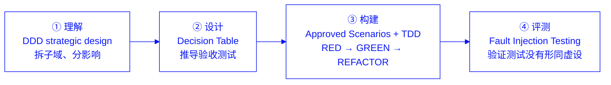

# 第一章 Agent 生成代码为什么不可信：读者的困境与四元素方法论

在动手实操之前，先问自己一个问题：**如果让 Agent 直接在 `commons-csv` 代码库上实现一个 `required headers` 新需求（解析 CSV 时，一旦发现表头缺少某些约定好的固定列，就在读到第一条记录之前抛出一个清楚说明"缺了哪些列"的错误），你觉得会踩哪些坑？**

先别急着翻后面的章节找答案。本章末尾的"动手练习"会请你先凭直觉写下几个关键词，再在第 2～5 章里逐一验证自己的直觉对不对——这是全书唯一一处"练习先于方法论"的设计,目的是让你在读方法论之前,先对"Agent 一次生成代码会在哪里栽跟头"建立一次真实的代入感,而并非把后面四章的方法论当成一套抽象的理论来被动接受。

## 1.1 国内 token 不自由的 Agent Coding 开发者的棕地困境

为什么国内 token 不自由的开发者，真正怕的并非 Agent 代码写得烂——真正让人心惊的，是它"写得看着对"？如果你在国内用 Agent 写代码，大概率遇到过这样的约束：国际大模型 API 访问受限，走中转或本地代理成本不低，企业内部对调用量又有配额限制。这些约束合在一起，指向一个现实——**多轮对话慢慢纠错这条路走不通**。国外很多"AI 编程最佳实践"默认你可以无限制地和模型来回对话，生成代码不满意就换个说法再问一次，直到模型"蒙对"为止。但当每一次调用都有成本、有配额，这种试错式的工作方式就变成了一种奢侈。

更棘手的是你要维护的软件本身的性质。本书讨论的读者画像，谈不上是"正在开发 agent 系统的人"，说白了，就是**用 Agent 作为工具，去维护一个需要长期维护的传统非智能软件**的人——这个软件不限定于开源项目，可能是公司内部系统、客户交付的项目、或者任何已经上线运行、有存量用户、有其他模块依赖的代码库。这类项目有一个共同特征：代码里藏着大量"看不见的契约"——某个方法的空值处理方式、某个类的线程安全假设、某个 API 的向后兼容承诺。这些契约往往没有写在文档里，只活在测试用例和调用方的假设中。工程上把这类项目称为[棕地项目（Brownfield Project）](https://engineering.futureuniversity.com/BOOKS%20FOR%20IT/Software-Engineering-9th-Edition-by-Ian-Sommerville.pdf)，与从零开始、没有历史包袱的绿地项目（Greenfield Project）相对。

Agent 生成代码最危险的地方并非"编译不过"——这种错误立刻会暴露。真正危险的是**编译通过、逻辑读起来也顺，但悄悄改变了原有行为**。这种代码在棕地项目里是定时炸弹：它可能过了 code review，过了手工验证，直到某个边缘场景在生产环境触发，才暴露出问题。而一旦返工，代价往往是最初生成成本的数倍——包括重新调用 Agent 的 token 成本，也包括排查问题、修复问题、重新验证的人力成本。

对国内 token 不自由的开发者来说，这两个约束叠加在一起：**没有本钱靠多轮试错去逼近正确答案，又必须在充满隐性契约的棕地代码里工作**。这正是本书要解决的问题：如何让 Agent 在有限的 token 预算下，第一次生成就是可信的，而不靠事后反复纠正。

## 1.2 本书方法论：理解代码所承载的复杂业务逻辑 → 设计面向验收测试的 spec → 构建面向业务不变式的自动化验收测试 → 评测自动化验收测试确实保护了生产代码

在有限预算下追求"一次生成可信"，有没有一条可复用的链路撑得住？核心思路是把"信任"从一句主观判断（"这段代码看起来没问题"）变成一条可执行、可验证的工程流程。本书贯穿全书的方法论由四个环节组成：

**第一步：理解代码所承载的复杂业务逻辑。** 在让 Agent 改动任何一行代码之前，先要看得懂这个棕地项目现有的代码在做什么、新需求会牵动哪些既有逻辑。这一步借鉴的是 [DDD（Domain-Driven Design）](https://www.oreilly.com/library/view/learning-domain-driven-design/9781098100124/) 的 strategic design——把代码库当作一个业务域来看，拆分出核心（core）、通用（generic）、支撑（supporting）子域，分清楚哪部分是"牵一发而动全身"的核心业务逻辑，哪部分是"随便换一个现成方案都行"的边角配置，再据此分析新需求究竟会牵动哪些子域、哪些类。颗粒度不够清楚，后面的每一步都会跟着模糊。

**第二步：设计面向验收测试的 spec。** 理解了新需求会牵动的业务逻辑之后，需要把这些逻辑翻译成 Agent 和人都能理解的、系统性覆盖全部组合的验收测试集合，而并非停留在"我觉得应该测这几种情况"的直觉列举。本书采用 [Decision Table Testing（决策表测试法）](https://www.geeksforgeeks.org/software-testing/what-is-decision-table-testing/) 来做这件事——系统性地识别条件、定义条件取值、计算规则数、识别动作、填充并化简决策表，最后把每条规则转成一个验收测试用例。这一步解决的是"AI 生成的测试用例能不能全面覆盖新需求的业务、有没有遗漏和重复"这个问题。

**第三步：构建面向业务不变式的自动化验收测试。** 有了决策表推导出的验收测试用例清单，才轮到 Agent 把它们落地成真正可执行的自动化测试。本书采用 **Approved Scenarios** 模式，结合 TDD（Test-Driven Development）的红/绿/重构节奏来做这件事：每个验收测试用例对应一份人类可读的 markdown fixture 文件，这份 fixture 同时是"评审材料"和"测试真正读取并执行的唯一输入"，并非两份互相脱节、手工保持同步的东西；每新增一条验收测试，先确认它在当前代码下会失败（红），再让 Agent 在生产代码里做最小改动让它通过（绿）。这一步解决的是"Agent 生成的测试和生产代码都不可信"这个核心问题——产品经理或评审者不需要读懂断言代码，只需要评审一份结构清晰的 markdown 文件。

**第四步：评测自动化验收测试确实保护了生产代码。** 测试跑绿了，不代表测试真的在"保护"对应的生产代码——它也可能是一个形同虚设的空测试，无论生产代码怎么改都不会变红。本书采用 **Fault Injection Testing（故障注入测试）** 来验证这件事：在生产代码里人为、有针对性地引入一个与某条测试"保护意图"语义对应的故障，验证该测试确实变红、报错信息确实对应这段生产代码的行为；然后撤销故障，确认测试恢复变绿。"变红→报错对应→变绿"这个闭环如果成立，才能证明这条测试确实在保护对应的生产代码，而不只是摆设。

四步环环相扣：理解给出业务边界，设计给出系统性的验收标准，构建把验收标准变成受测试保护的代码，评测把"这些测试真的有用"变成可重复的证据。少了任何一步，链条都会断——没有理解，决策表的条件会找错地方；没有设计，构建阶段容易遗漏或重复测试场景；没有评测，再多的测试也无法排除"形同虚设"的可能。

```mermaid
%%{init: {'theme':'base', 'themeVariables': {'primaryColor':'#FFFFFF','primaryTextColor':'#0A17F5','primaryBorderColor':'#0A17F5','lineColor':'#0A17F5','secondaryColor':'#FFFFFF','tertiaryColor':'#FFFFFF','background':'#FFFFFF'}}}%%
flowchart LR
    A["① 理解<br/>DDD strategic design<br/>拆子域、分影响"] --> B["② 设计<br/>Decision Table<br/>推导验收测试"]
    B --> C["③ 构建<br/>Approved Scenarios + TDD<br/>RED → GREEN → REFACTOR"]
    C --> D["④ 评测<br/>Fault Injection Testing<br/>验证测试没有形同虚设"]

    style A fill:#FFFFFF,stroke:#0A17F5,color:#0A17F5
    style B fill:#FFFFFF,stroke:#0A17F5,color:#0A17F5
    style C fill:#FFFFFF,stroke:#0A17F5,color:#0A17F5
    style D fill:#FFFFFF,stroke:#0A17F5,color:#0A17F5
```

这条方法论并非抽象口号，本书会在第二至第五章用同一个新需求、同一套真实实操过程逐一展开，并邀请你在自己的 Agent 环境里亲手跑一遍提示词，再和书里展示的参考答案对比复盘。

## 1.3 本书的实操锚点：Apache Commons CSV + OpenCode + DeepSeek V4.1 Flash

方法论怎么落到一个真实、体量适中的棕地项目上？方法论讲得再清楚，脱离真实代码库就只是空中楼阁。本书选择 [Apache Commons CSV](https://github.com/apache/commons-csv) 作为唯一的贯穿案例，用同一个新需求——给 `CSVFormat.Builder` 新增 `setRequiredHeaders(String...)`，让解析器在表头缺少约定好的固定列时，于读到第一条记录之前就抛出清楚说明"缺了哪些列"的错误——走完理解、设计、构建、评测四个环节。

选择 commons-csv 的理由有三点：

- **是真实棕地项目，但体量适中。** Commons CSV 是 Apache 基金会维护的开源库，提供 CSV 文件的读写能力，被广泛用于生产环境。它有真实的历史包袱、真实的既有测试套件、真实的向后兼容承诺，但核心源码只有十余个类，一个人可以在合理时间内建立起完整的心智模型，不会被体量拖垮学习曲线。
- **抽象清晰，适合做子域拆分和决策表推导的教学案例。** 它的核心类职责划分明确：`CSVFormat` 负责描述"一种 CSV 方言"、`CSVParser` 负责把输入流解析成记录并支持按名访问、`CSVPrinter` 负责把数据写出为符合格式的 CSV 文本、`Lexer` 与 `Token` 是解析过程中的词法层。这种清晰的职责边界，方便把一个新需求精确落到某个子域、某几个类上，而不必牵动整个代码库——第二章会详细展开这张子域地图。
- **规则密集，天然适合决策表推导。** CSV 格式本身充满"在什么条件下、遇到什么输入、该有什么行为"的规则（表头缺列该怎么报错、大小写该不该敏感、和已有的重复/空列名校验该怎么交互），这类规则正是决策表测试法最擅长系统性梳理的需求类型。

工具链上，本书以 **OpenCode + DeepSeek V4.1 Flash** 为实操锚点——这个组合不需要国际信用卡、不依赖受限的国际网络访问，对国内 token 不自由的读者更现实。但再次强调：本书讨论的方法不绑定特定工具和大模型，换成你自己常用的、国内外口碑良好的 AI Coding Agent 搭配大模型（如 Claude Code 搭配 Opus 5.5、Codex CLI 搭配 GPT 6.1 Sol、OpenCode V2 搭配 GLM 5.3、Pi 搭配 DeepSeek v4 pro、CodeBuddy 搭配 GLM 5.3 等），书中的提示词和方法论都应该能跑通——这正是"动手练习"环节希望你亲自验证的事。

---

## 动手练习（第1章）

在翻到第二章之前，请先花两三分钟，凭直觉写下：**如果让 Agent 直接在 `commons-csv` 代码库上实现本章开头描述的 `required headers` 新需求（不先做任何分析，直接让 Agent 一次性生成生产代码和测试），你觉得会踩哪些坑？**

不需要写成完整的句子，列几个关键词就够，比如（这只是示例，并非提示答案，请先写下你自己的直觉）：

- 校验逻辑应该插在哪个方法、哪个时机？
- 报错信息该是什么格式、该复用现有异常类型还是新建一个？
- 大小写、重复列名、空列名这些既有配置会不会和新校验打架？
- Agent 生成的测试会不会只是把实现代码的逻辑抄一遍断言，测试和代码一起错都不会被发现？
- 怎么知道这些测试是否真的在保护这段新代码，而并非看起来绿但形同虚设？

写下你的关键词后，带着这份直觉继续往下读——第二章到第五章会逐一验证这些直觉，你会在读到对应章节时，清楚地看到自己猜对了哪里、又在哪里低估了问题的复杂度。
