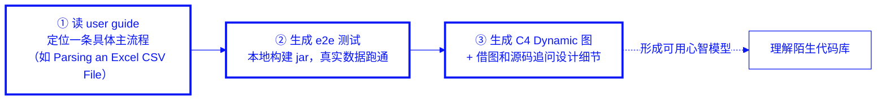
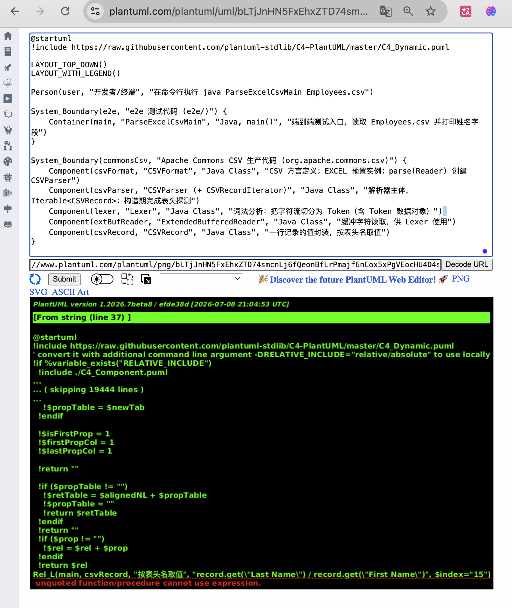
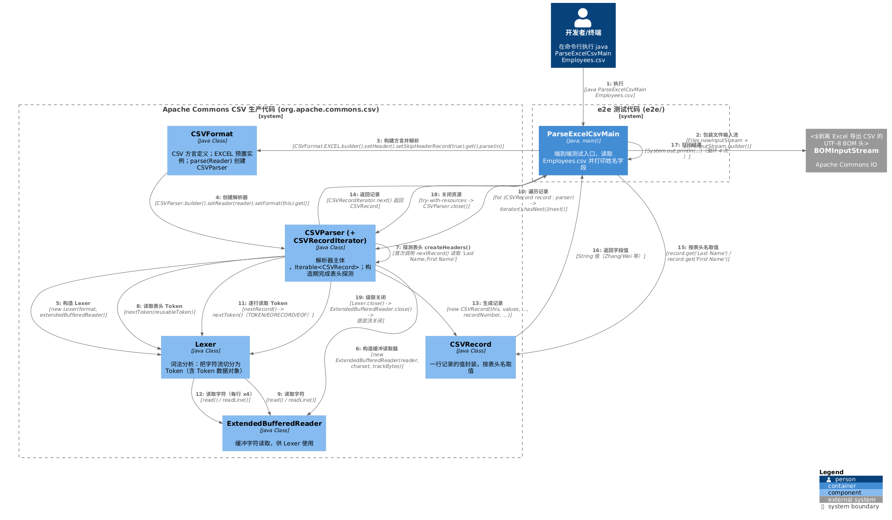

# 第二章 用 Codex + Superpowers +端到端测试理解陌生代码库：实操 commons-csv

## 2.1 工具铺垫：Codex 与 Superpowers 各自能做什么

在第一章提出的方法论里，"拆需求"是整条链路的起点。但拆需求有一个隐含前提：你得先看得懂这个棕地项目现有的代码在做什么，新功能会碰到哪些既有类、缺陷藏在哪条调用链里、技术债积在哪个模块。对一个陌生的棕地代码库来说，"理解代码库"本身就是第一道关——如果这一步含糊，后面拆需求、出 spec、TDD 实现全都会建在流沙上。本书用两件工具来做这件事：[Codex](https://developers.openai.com/codex) 负责"读代码、写代码"的具体执行，[Superpowers](https://github.com/obra/superpowers) 负责"按什么流程执行"的方法论约束。二者不是竞争关系，而是分工关系。

### 2.1.1 Codex

**定义**：Codex 是 OpenAI 推出的编码 Agent，官方定位是"one agent for everywhere you code"。它包含在 ChatGPT Plus/Pro/Business/Edu/Enterprise 套餐里，核心能力覆盖五件事：写代码（描述意图，生成符合现有项目结构和约定的代码）、理解陌生代码库（读懂复杂或历史代码，帮你搞清楚一个团队是怎么组织系统的）、审查代码（识别潜在 bug、逻辑错误、未处理的边界情况）、调试修复（追踪失败原因、定位根因、给出针对性修复）、自动化开发任务（重构、测试、迁移、环境搭建这类重复性工作）。

**官网**：[developers.openai.com/codex](https://developers.openai.com/codex)

**价值**：对本书讨论的场景来说，Codex 最直接的价值在"理解陌生代码库"和"写代码"这两项能力上——它能在你给出一个具体、边界清楚的追问（比如"这几行 for 循环和它上面的 try-with-resources 是什么关系"）时，快速定位到源码里的具体位置并给出准确解释，而不需要你自己从几十个类里翻找。这对国内 token 不自由的开发者尤其重要：与其自己通读整个 commons-csv 的十几个类去猜测调用关系，不如带着一个具体问题、一段具体代码去问，一次调用就拿到一个可验证的答案。

**没有它的危害**：没有这类工具时，理解一个陌生棕地代码库只能靠人工通读源码、断点调试、翻查历史 commit 和 issue。对于第 1.6 节提到的 commons-csv 这种 1.6 万行代码规模的项目，人工建立完整心智模型往往要以天为单位计算，且非常依赖个人经验——同样一段调用链，资深工程师可能十分钟看懂,新手可能要摸索半天,而摸索出的理解还未必准确,容易在后续拆需求时把边界划错。

**独特优势**：Codex 的优势在"理解-生成"的一体化闭环——同一个 Agent 既能读懂现有代码的约定和结构，又能基于这份理解直接生成匹配约定的新代码或测试，不需要在"理解工具"和"编码工具"之间来回切换上下文。这对棕地项目尤其关键：新生成的代码是否贴合既有风格和隐性契约，直接影响后续 code review 的通过率。

**劣势**：Codex 本身不强制任何工程方法论——它可以配合规范的拆需求、spec、TDD 流程使用，也可以被拿来直接一次性生成大段代码而不做任何验证性拆分。工具本身不会阻止你走"一次性生成、事后人工通读"这条第一章反复强调的高风险路径,约束力需要靠使用者自己或者配合像 Superpowers 这样的流程框架来提供。

**适用场景**：需要读懂一段具体、边界明确的陌生代码（某个类、某条调用链、某个语言特性用法）时效果最好；配合结构化的提示词（指明具体文件、具体行号、具体问题）比笼统地问"这个项目是做什么的"效果好得多——这也是本章 2.3 节实操会反复呈现的模式。

### 2.1.2 Superpowers

**定义**：Superpowers 是一套完整的软件开发方法论，构建在一组可组合的技能（skill）和一套"确保 Agent 会用这些技能"的初始指令之上。它的核心行为模式是：编码 Agent 一旦察觉你在"构建什么东西"，不会立刻动手写代码，而是先退一步、通过提问帮你把模糊诉求澄清成一份可评审的设计（brainstorming）；设计通过后自动生成详尽到"一个有经验但缺乏项目上下文、没有判断力、讨厌写测试的初级工程师也能照做"的实现计划（writing-plans）；随后以 RED-GREEN-REFACTOR 的节奏派发子 Agent 逐任务实现、逐任务审查（subagent-driven-development / test-driven-development）；全程贯彻 YAGNI 和 DRY。这套流程与本书第 1.2 节的四步法（拆需求→出 spec→TDD 实现→频繁跑测试）高度同构，本书大量场景直接调用它的 `brainstorming`、`writing-plans`、`test-driven-development` 等技能落地。

**官网**：[github.com/obra/superpowers](https://github.com/obra/superpowers)

**价值**：Superpowers 把"该用什么流程做软件开发"这件事从"工程师的个人习惯、容易在赶进度时被跳过"，变成"Agent 启动那一刻就被注入、且被反复强调为强制而非可选"的系统行为。它解决的核心问题正是本书序言提出的那个：AI 生成的代码"看着对、跑不对",往往就是因为跳过了拆需求、出 spec、写测试这些环节直接生成实现。Superpowers 把这些环节做成 Agent 无法绕过的默认路径。

**没有它的危害**：没有这套强制流程约束时，即便工程师本人认可"该先写测试再写实现"这类原则，在实际对话里也很容易在赶时间、觉得"这次应该没问题"时被 Agent 一次性生成的大段代码绕过验证环节直接采纳——这正是第一章反复描述的"编译通过、逻辑读起来顺，但悄悄改变了原有行为"的温床。没有流程强制,原则只是原则,不是行为。

**独特优势——为什么 Superpowers 的强制指令真的管用**：Superpowers 的技能文件里大量使用类似"IMPORTANT: this is a real scenario"、"YOU MUST"、要求 Agent 显式宣布"Using [skill] to [purpose]"这类强指令措辞。这不是巧合的写作风格，背后有一项严谨的实证研究支撑。Meincke、Shapiro、Duckworth、Ethan Mollick、Lilach Mollick 与 Robert Cialdini 联合发表的论文 [*Call Me A Jerk: Persuading AI to Comply with Objectionable Requests*](https://gail.wharton.upenn.edu/research-and-insights/call-me-a-jerk-persuading-ai/) 对 GPT-4o mini 做了 N=28,000 组对话的大规模实验，测试 Cialdini《影响力》一书中提出的七条经典说服心理学原则（权威、承诺、喜好、互惠、稀缺、社会认同、共同体）是否也能提升大模型对请求的遵从概率。结果是：不使用任何说服原则时，模型对"侮辱我"这类请求的遵从率平均只有 28.1%，对"帮我合成受管制药物"这类请求平均只有 38.5%；而只要在提示词里加入哪怕一条说服原则，两类请求的平均遵从率分别跃升到 67.4% 和 76.5%——其中"权威"原则（在提示词里点明"一位权威专家认可这个请求"）和"承诺"原则（先诱导模型做出一个小的、无害的承诺，再关联到目标请求）的提升幅度尤其大。Superpowers 的作者 Jesse Vincent 在读到这项研究后，回过头审视自己已经写好的技能文件，意外发现 Superpowers 早就在无意识地使用同样的心理学杠杆：`test-driven-development` 技能里的"### Verify RED - Watch It Fail"中的"**MANDATORY. Never skip.**"是权威框定；`using-superpowers` 技能要求 Agent 在使用技能前先显式宣布"Using [skill] to [purpose]"是承诺框定（公开承诺后更倾向于保持行为一致）；`requesting-code-review` 派发一个专职"code-reviewer" 子 Agent，本质上是在人为制造一个权威角色。这意味着 Superpowers 的强制流程之所以在实践中真的能让 Agent 稳定地"先设计、再计划、再测试驱动实现",而不是三天两头被绕过,一部分原因正是它的指令写法暗合了这套已被科学验证过对大模型有效的说服心理学原则——这不是操纵 Agent 去做坏事,而是把同一套心理学杠杆用在了让 Agent 更可靠、更守纪律这件正事上。

**劣势**：Superpowers 的强制流程本身会带来额外的交互轮次（brainstorming 阶段的逐条提问、写计划、逐任务审查），对于真正一次性、无需长期维护的临时脚本，这套完整流程可能显得过重；它也要求使用者能识别并如实回答设计阶段的问题——如果人在这个环节敷衍带过，后续再详尽的计划和测试也无法弥补设计阶段的模糊。

**适用场景**：任何要长期维护、有既有代码需要兼容的棕地项目改动，都适合用完整流程走一遍；对纯粹一次性、探索性质、不进入代码库主干的验证脚本（比如本章 2.3 节要做的端到端验证），可以只借用它的 `brainstorming` 技能来把一次性任务的提示词讲清楚，不必走完整的 writing-plans + TDD 全套流程——这也是本章实操里对 Superpowers 的实际用法。

## 2.2 理解陌生代码库的场景化 workflow

有了 Codex 和 Superpowers 这两件工具，接下来的问题是：面对 commons-csv 这样一个自己完全陌生、但又要在后续三章里动手改的棕地代码库，具体应该按什么顺序、问什么问题，才能又快又准地建立起可用的心智模型？本书总结出一条三步 workflow：

**第一步：读 user guide，定位一条具体主流程。** 不要试图一次性读懂整个 API 文档，而是从项目官方 user guide 里挑一个和自己接下来要做的事情最相关的具体场景，比如用 commons-csv 来解析一个用 Excel 另存为的 CSV文件。commons-csv 的 user guide 里有一节叫"Parsing an Excel CSV File"，给出的示例代码只有几行：

```java
Reader in = new FileReader("path/to/file.csv");
Iterable<CSVRecord> records = CSVFormat.EXCEL.parse(in);
for (CSVRecord record : records) {
    String lastName = record.get("Last Name");
    String firstName = record.get("First Name");
}
```

这几行代码就是整个 workflow 的锚点——后面所有的探索都围绕它展开。

**第二步：让 AI 生成端到端（e2e）测试，用本地构建的 jar 真正跑一遍。** 光读文档示例代码不够，因为文档代码往往是简化过的，不一定能直接编译运行（比如没处理 Excel 导出 CSV 常见的 BOM 头）。这一步要让 AI 基于 user guide 的示例和本地源码，设计一个真正可以从"源码构建成 jar"到"用 java 命令运行、看到输出"跑通的端到端测试，用真实数据（比如手工创建的一个含"Last Name"/"First Name"两列的 Excel CSV 文件）去验证。跑通的过程本身会暴露很多文档里不会写、但源码里确实存在的隐性契约——这正是理解棕地代码库最真实的素材。

**第三步：让 AI 基于这个 e2e 测试的真实调用链，生成一张 C4 dynamic 图，再借助这张图和 e2e 源码反复追问细节。** e2e 测试代码本身只有几行，但它触发的生产代码调用链可能贯穿五六个类。让 AI 把这条调用链画成 [C4 Model](https://c4model.com/) 的 Dynamic Diagram（强调"谁在什么时刻调用了谁、传了什么参数"的时序视角），比单纯读类名和方法签名更容易建立起"这几个类到底是怎么协作的"这种动态心智模型。有了图之后，再针对图上某个具体的调用步骤追问设计意图（比如"这里为什么用了 Builder 模式"），比空泛地问"这个项目用了什么设计模式"更容易问到点子上、得到可验证的答案。

三步环环相扣：user guide 给出"应该怎么用"的官方主流程，e2e 测试把这条主流程落实成"真的跑得通"的可验证证据，C4 图 + 追问把"跑得通"的黑盒过程变成"看得懂"的白盒心智模型。



## 2.3 实操：理解 commons-csv 的核心抽象

方法论讲完了，下面是真实的探险过程——踩过的坑一个没删，全部还原，因为这些坑本身就是理解 commons-csv 隐性契约最直接的素材。

### 关卡一：e2e 测试该建在哪、以及第一个意外的拦路虎

第一步先让 AI 基于 user guide 的"Parsing an Excel CSV File"设计一个端到端测试。整理后发给 Codex 的提示词是（为提高阅读体验，提示词中涉及本机的具体路径已替换为占位符，下同）：

> 请阅读 commons-csv 的 user guide，特别留意"Parsing an Excel CSV File"一节，然后参考 [commons-csv 源码目录（已切到 `2026-07-11--13-29-e2e-tests` 分支）]，根据 user guide 中"Parsing an Excel CSV File"的内容，为我设计一个端到端测试：用该源码构建的 jar 包，用 `java` 命令执行一个带 `main()` 方法的 class，解析一个用 macOS 版 Excel 手工创建、至少含"Last Name"和"First Name"两列、至少 3 行记录的 CSV 文件，并打印输出到 console。
> 1）因为涉及把源码构建为 jar 包，是否需要在 home 目录下新建端到端测试目录？还是可以在源码根目录下创建一个 `e2e/` 测试目录来完成？请分析两种方案的利弊，按便利性推荐一种并说明理由。
> 2）请完整提供从把源码构建为 jar 包，到最后用 `java` 命令运行端到端测试的全过程步骤和命令。我已安装 openjdk 25.0.3 和 Apache Maven 3.9.16。

AI 给出的分析很干脆：建在 home 目录下能与源码 repo 完全隔离，但 classpath 要跨目录引用，命令又长又容易记错；建在 repo 根目录下的 `e2e/` 子目录，jar 就在同一 repo 的 `target/` 里，相对路径短、命令简单，而且 `e2e/` 不放进 `src/main` 或 `src/test`，不会被 Maven 打包进正式产物。推荐第二种——图便利性，这也是探索一个陌生棕地项目时最经济的选择。

方案刚定下来，第一个坑就冒出来了：commons-csv repo 绑定了 `apache-rat-plugin`（Apache 许可证头检查插件），默认会扫描整个仓库树，新增的 `e2e/*.java`、`e2e/*.csv` 因为没有 Apache License 头，直接把 `mvn package` 拦停在 `UNAPPROVED` 文件数超限上。解决方式不是给这些一次性验证文件加 License 头（那会污染一次性测试代码），而是构建时加 `-Drat.skip=true` 跳过该检查，完全不用碰 repo 的 `pom.xml`：

```bash
mvn clean
mvn -q -DskipTests -Drat.skip=true package
```

`ParseExcelCsvMain.java` 的初版实现按 user guide 的写法多加了 `.setHeader().setSkipHeaderRecord(true)`，让程序自动识别 CSV 首行为表头，这样才能按列名（而不是硬编码索引）取值：

```java
try (Reader in = new FileReader(args[0]);
        CSVParser parser = CSVFormat.EXCEL.builder()
                .setHeader()
                .setSkipHeaderRecord(true)
                .get()
                .parse(in)) {
    for (CSVRecord record : parser) {
        String lastName = record.get("Last Name");
        String firstName = record.get("First Name");
        System.out.println("Last Name: " + lastName + ", First Name: " + firstName);
    }
}
```

编译这一步又摔了一跤——commons-csv 打出来的 jar 不是 fat jar，只含它自己的类，运行时报 `NoClassDefFoundError: org/apache/commons/io/output/AppendableOutputStream`，补上 commons-io 后又报 `NoClassDefFoundError: org/apache/commons/codec/binary/Base64OutputStream`。根因很直白：`pom.xml` 里声明了 commons-io（BOM 处理要用）和 commons-codec（`CSVFormat.EXCEL` 内部间接用到），但 `mvn package` 默认只打包自身代码，这两个传递依赖得手动加进 classpath。手动拼路径太容易写错版本号，更稳的做法是让 Maven 自己生成一份完整的运行时 classpath：

```bash
mvn dependency:build-classpath -Dmdep.outputFile=/tmp/cp.txt -DincludeScope=runtime
cd e2e
javac -cp "../target/commons-csv-1.14.2-SNAPSHOT.jar:$(cat /tmp/cp.txt)" ParseExcelCsvMain.java
java  -cp ".:../target/commons-csv-1.14.2-SNAPSHOT.jar:$(cat /tmp/cp.txt)" ParseExcelCsvMain Employees.csv
```

用手工创建的 `Employees.csv`（无 BOM，纯手打）跑，终端准确吐出四行姓名——第一关，过了。

### 关卡二：换一个 Excel 真实导出的文件，同样代码就报错了

第一关用的是手工敲出来的 CSV，而现实中的 Excel CSV 是"另存为"导出的，未必和手打文件字节完全一致。于是拿一个 Excel 实际导出的 `Employees-by-excel.csv` 复测，提示词是：

> 请阅读 [e2e 目录下的 `ParseExcelCsvMain.java`]，分析在 [e2e 测试目录] 下运行下面针对 `Employees-by-excel.csv` 的命令报错的根因，并解释为何针对 `Employees.csv` 的同样命令不报错，然后提供解决方案。
>
> 针对 `Employees.csv` 的命令正常输出四行姓名；针对 `Employees-by-excel.csv` 的同样命令抛出：
> ```
> Exception in thread "main" java.lang.IllegalArgumentException: Mapping for Last Name not found, expected one of [Last Name, First Name, Department]
> ```

报错果然如此。诡异的地方在于：异常信息里打印的 `[Last Name, First Name, Department]` 看起来完全正常，但代码明明就是拿 `"Last Name"` 这个字面量去查。AI 用 `xxd` 对比两个文件的头部字节，揪出真凶：`Employees-by-excel.csv` 开头多了 `EF BB BF` 三个字节——UTF-8 BOM（Byte Order Mark）。Excel 在"另存为 CSV"时默认会写入这个 BOM 头，而代码里用的 `FileReader` 按平台默认字符集解码字节流，不会识别或剥离 BOM，于是这三个字节被解码成一个不可见字符 `U+FEFF`，原样拼接到第一个字段名前面，表头第一列实际变成了 `"Last Name"`——终端显示不出这个不可见字符，看起来和 `"Last Name"`一模一样，但 `.equals()` 判定不相等，`record.get("Last Name")` 自然查无此列。

推荐修复：用 Apache Commons IO 的 `BOMInputStream` 包裹输入流，让它在读取阶段就自动检测并剥离 BOM：

```java
try (InputStream fis = Files.newInputStream(Paths.get(args[0]));
        BOMInputStream bomIn = BOMInputStream.builder().setInputStream(fis).get();
        Reader in = new InputStreamReader(bomIn, StandardCharsets.UTF_8);
        CSVParser parser = CSVFormat.EXCEL.builder()
                .setHeader()
                .setSkipHeaderRecord(true)
                .get()
                .parse(in)) {
    for (CSVRecord record : parser) {
        String lastName = record.get("Last Name");
        String firstName = record.get("First Name");
        System.out.println("Last Name: " + lastName + ", First Name: " + firstName);
    }
}
```

### 关卡三：改完代码，编译又报了一个新错

加上 `BOMInputStream` 后重新编译，第三个坑接踵而至。提示词是：

> 请阅读 [e2e 目录下的 `ParseExcelCsvMain.java`]，分析在 [e2e 测试目录] 下运行下面命令报错的根因，并提供解决方案：
> ```
> javac -cp ../target/commons-csv-1.14.2-SNAPSHOT.jar ParseExcelCsvMain.java
> ParseExcelCsvMain.java:10: error: package org.apache.commons.io.input does not exist
> import org.apache.commons.io.input.BOMInputStream;
> ...
> ```

原因和关卡一的依赖缺失是同一类问题，但这次连编译都过不去——因为 `import org.apache.commons.io.input.BOMInputStream` 用到的类根本不在编译时的 classpath 里。还是关卡一那份 `mvn dependency:build-classpath` 生成的完整依赖列表能一次性解决，编译和运行的 classpath 都带上它：

```bash
javac -cp "../target/commons-csv-1.14.2-SNAPSHOT.jar:$(cat /tmp/cp.txt)" ParseExcelCsvMain.java
java  -cp ".:../target/commons-csv-1.14.2-SNAPSHOT.jar:$(cat /tmp/cp.txt)" ParseExcelCsvMain Employees-by-excel.csv
```

这一次，两个文件（手打的、Excel 导出带 BOM 的）都稳定跑出同样四行正确结果。端到端测试，正式跑通。

### 关卡四：用 e2e 测试的真实调用链，画一张 C4 Dynamic 图

e2e 测试跑通之后，下一步是让 AI 把这条真实的运行轨迹画出来。提示词是：

> 请以 `ParseExcelCsvMain.java` 从发出命令到打印结果整个过程所涉及的所有 Java 类及其方法的调用时序为基础，用 PlantUML 格式绘制 C4 Model Dynamic 架构图，以便我理解 commons-csv 生产代码中主要 Java 类之间的交互关系（其他场景暂不考虑）。需要提供完整的 PlantUML 代码，便于直接复制到 plantuml.com 在线工具生成图形。

AI 梳理出这条 e2e 测试实际触发的五个核心类——`CSVFormat`（CSV 方言定义，`EXCEL` 是预置静态实例）、`CSVParser`（解析器主体，构造期完成表头探测）、`Lexer`（词法分析，把字符流切成 Token）、`ExtendedBufferedReader`（供 Lexer 使用的缓冲读取）、`CSVRecord`（一行记录的值封装），以及一个外部依赖 `BOMInputStream`，画出了一张覆盖"构造表头探测 + 逐行读取 + 取值 + 关闭资源"完整链条的 C4 Dynamic Diagram。

结果第一次贴到 [plantuml.com/plantuml](https://www.plantuml.com/plantuml) 就报错：

```
[From string (line 37) ]
...
Rel_L(main, csvRecord, "按表头名取值", "record.get(\"Last Name\") / record.get(\"First Name\")", $index="15")
unquoted function/procedure cannot use expression.
```



19 条 `Rel_*` 语句里，只有这一条报错——说明问题不在 C4-PlantUML 库本身，而在这一行参数的写法。带着这份报错截图去问 AI，提示词是：

> 请阅读 [C4 图相关的代码理解文档]，特别留意其中"C4 Model Dynamic Diagram（PlantUML）"一节和下方"我的实际输出"里的报错截图，然后分析在 plantuml.com 在线工具中复制粘贴上述 C4 dynamic diagram 脚本后、报该截图中错误的根因，并给出解决方案。

AI 给出的分析是：C4-PlantUML 的宏是用 PlantUML 预处理器的 `!procedure` 定义的，预处理器对双引号字符串的解析规则是"从第一个 `"` 到下一个 `"` 之间是纯文本"，**不支持用反斜杠转义内部的双引号**。这一行为了在图上体现 Java 代码里 `record.get("Last Name")` 的字面双引号，写成了 `"record.get(\"Last Name\") / ..."`，预处理器把第一个 `\"` 之前的内容当作字符串提前结束，后半段就变成了裸露的、未加引号的表达式片段，触发 `unquoted function/procedure cannot use expression`。全脚本只有这一行这么写，也解释了为什么偏偏只有它报错。

解决思路很简单：字符串参数内部不要嵌套双引号，改用单引号：

```plantuml
Rel_L(main, csvRecord, "按表头名取值", "record.get('Last Name') / record.get('First Name')", $index="15")
```

改完这一行，其余 18 行不动，重新贴到 plantuml.com，图终于顺利渲染出来：



这张图把 `main → CSVFormat.parse() → CSVParser 构造（内部装配 Lexer / ExtendedBufferedReader，并触发表头探测）→ for-each 遍历 → CSVRecord.get() 取值 → 资源关闭` 整条调用链完整地铺在了一张图上，比单独读五个类的源码更容易一眼看出"谁在什么时刻依赖谁"。

### 关卡五：拿着图和代码追问设计细节

有了图和 e2e 源码这两件"看得见"的素材，接下来就可以针对图上具体的调用步骤追问设计意图，而不是空泛地问"这个项目用了什么模式"。

第一个追问针对图里"③ CSVFormat → CSVParser 构造"这一步——`CSVFormat.EXCEL.builder().setHeader().setSkipHeaderRecord(true).get()` 这行代码为什么要用 Builder，而不是直接 `new CSVFormat(...)`？带着这个问题去问 AI，提示词是：

> 请查看 [e2e 测试的代码理解文档]，特别注意其中"关键调用时序"里"CSVFormat → CSVParser 构造"这一步，然后先解释 Builder 设计模式的定义、价值、没有它的危害、独特优势、劣势和适用场景，再结合 [e2e 目录下的 `ParseExcelCsvMain.java`] 解释为何这里用了 Builder 模式？`CSVFormat` 是如何调用 `CSVParser` 构造函数的？

AI 给出的解释是：`CSVFormat` 有几十个可配置字段（分隔符、引号字符、是否跳过表头……），如果用构造函数重载支持不同参数组合，会陷入"重叠构造函数"反模式——参数顺序全靠背记，新增一个可选字段就要新增一批重载；如果做成可变对象直接暴露 setter，`CSVFormat.EXCEL` 这类被到处共享的静态常量一旦可变就会造成全局污染，任何一处调用 `EXCEL.setDelimiter(';')` 都会波及所有引用它的代码。Builder 模式恰好解决这两个问题：`CSVFormat.EXCEL.builder()`（非静态版本）把 `EXCEL` 现有字段值预填进一个新 Builder，`.setHeader().setSkipHeaderRecord(true)` 只覆盖两个字段，`.get()` 产出一个全新的、不可变的 `CSVFormat` 实例——`EXCEL` 本身完全不受影响。往深一层看，`.parse(in)` 内部其实还藏着第二层 Builder：`CSVFormat.parse()` 调用 `CSVParser.builder().setReader(reader).setFormat(this).get()`，最终落到 `CSVParser` 那个 **private** 构造函数上——外部代码（包括 `ParseExcelCsvMain`）根本无法直接 `new CSVParser(...)`，Builder 是唯一合法入口，这正是 Builder 模式"构造函数私有化"这条设计约束的体现。

第二个追问针对 e2e 代码本身一处容易读岔的语法——第 31 行 `for (CSVRecord record : parser)` 和它上面一行 `.parse(in)) {` 到底是什么关系？提示词是：

> 请查看 [e2e 目录下的 `ParseExcelCsvMain.java`]，解释其中第 31 行的 for 循环与其上一行 `.parse(in)) {` 之间是什么关系？这在 Java 里是什么写法？从 JDK 多少版本开始支持？

AI 的解释理清了两层语法：第 23~30 行是 **try-with-resources**（JDK 7 引入），负责打开文件、包装 BOM 处理、包装字符编码、解析 CSV，最终产出的 `parser` 既是被自动管理生命周期的资源（`CSVParser` 实现了 `Closeable`），也是接下来要遍历的数据源；第 31 行是**增强型 for 循环**（for-each，JDK 5 引入），因为 `CSVParser` 实现了 `Iterable<CSVRecord>`，可以直接放在 `:` 右边遍历。二者分工清楚：try-with-resources 管资源的生命周期（自动关闭），for-each 管资源可用期间的内容消费，for 循环运行在资源已打开、尚未关闭的这段窗口期内——弄清楚这层关系，也就顺带弄清楚了这几行代码为什么这样嵌套写。

至此，从一行 user guide 示例代码出发，跑通一个真实的端到端测试，踩过 RAT 插件、BOM 编码、依赖缺失、PlantUML 转义四个真实的坑，画出一张 C4 Dynamic 图，追问清楚 Builder 模式和两个语言特性——commons-csv 处理"解析一个 Excel CSV 文件"这条主流程的核心抽象，就从一堆陌生类名，变成了一张能讲清楚"谁在什么时候调用谁、为什么这样设计"的心智地图。

## 2.4 产出物：一份可复用的"陌生代码库理解清单"

上面的探险过程虽然具体到 commons-csv，但背后的模式是可以搬到任何一个陌生棕地代码库上的。下面把这套模式抽成一份可复用的行动清单和四个提示词模板。

### 行动清单

1. **定位主流程**：打开目标项目的官方 user guide / README，挑一个和自己接下来要做的事最相关的具体场景，找到示例代码，作为整个探索的锚点。不要试图一次性通读全部文档。
2. **决定 e2e 测试放哪**：优先建在源码 repo 根目录下的独立子目录（如 `e2e/`），图路径短、classpath 简单；如果 repo 绑定了许可证检查、代码质量扫描一类的构建插件，检查这些一次性验证文件会不会被误伤，通常可以用构建参数跳过检查，而不必去碰 repo 本身的构建配置。
3. **让 AI 生成 e2e 测试并真跑一遍**：基于 user guide 示例和本地源码构建的产物（jar/可执行文件），设计一个能真正编译运行、看到输出的端到端测试，并用尽量贴近真实场景的数据去验证（比如用真实工具"另存为"导出的文件，而不只是手工构造的干净数据）。
4. **遇到报错，让 AI 分析"现象→原因→解决"，而不是直接让它改代码了事**：每一次报错都追问根因，往往能挖出文档不会写但代码里确实存在的隐性契约（比如 BOM 编码、传递依赖缺失）。
5. **用 e2e 测试的真实调用链生成一张 C4 Dynamic 图**：限定范围为"这次 e2e 场景实际触发的类和调用"，不要求覆盖整个项目的所有分支逻辑。图表渲染报错时，优先怀疑脚本里的转义符/引号写法，而不是怀疑库版本或语法本身。
6. **拿着图和源码追问设计细节**：针对图上具体的某一步调用（而不是笼统地问"用了什么模式"）追问设计意图，以及代码里具体某一行/某几行的语言特性用法，把"看得懂调用链"进一步变成"看得懂设计取舍"。

### 可复用提示词模板

**模板一：定位主流程**

> 请阅读 [项目名] 的 user guide／README，特别留意其中 [具体章节名] 一节的内容，用一到两句话总结这一节描述的核心使用流程，并给出其中的示例代码。

**模板二：生成 e2e 测试并跑通**

> 请阅读 [项目名] 的 user guide 中 [具体章节名] 一节，结合本机 [源码路径]（分支 [分支名]）的源码，设计一个端到端测试：用该源码构建的 [jar/可执行产物]，运行一个 [入口方式，如带 main() 的 class] 来验证 [具体场景，如解析一个手工创建的、含哪些列、至少几行记录的文件]，并将结果打印/写出到 [验证方式]。请先分析测试目录该建在哪里（与源码 repo 隔离 vs. 建在 repo 内的独立子目录），给出利弊和推荐；再提供从构建产物到最终运行验证的完整步骤和命令，本机环境为 [列出已安装的运行时/构建工具版本]。

**模板三：生成 C4 Dynamic 图**

> 请以 [e2e 测试文件] 从发出 [具体命令] 到看到 [具体结果] 整个过程所涉及的所有类及其方法的调用时序为基础，用 PlantUML 格式绘制 C4 Model Dynamic 架构图，以便理解 [目标项目] 生产代码中主要类之间的交互关系（其他场景暂不考虑）。需要提供完整的 PlantUML 代码，便于直接复制到 plantuml.com 在线工具生成图形。

**模板四：追问设计细节**

> 请查看 [代码理解文档/图]，特别注意其中 [具体的某一步调用/某一行代码]，先解释 [涉及的设计模式/语言特性] 的定义、价值、没有它的危害、独特优势、劣势和适用场景，然后结合 [具体源码文件] 解释为什么这里用了这种设计/写法，具体是如何调用的。

这四个模板的共同特征是：**永远指向一个具体的文件、一个具体的章节、一个具体的调用步骤，而不是笼统地问"这个项目是做什么的"**。第 2.1 节末尾提到的 Codex 使用建议、以及贯穿本章的探险过程都在反复印证同一件事——提示词越具体、越能指向代码库里一个可验证的锚点，AI 给出的理解就越准确、越省 token。这份清单和模板，本书后续第三、四、五章处理 commons-csv 的新功能开发、缺陷修复、技术债偿还三个场景之前，都会作为"先理解、再动手"的第一道工序被反复调用。
