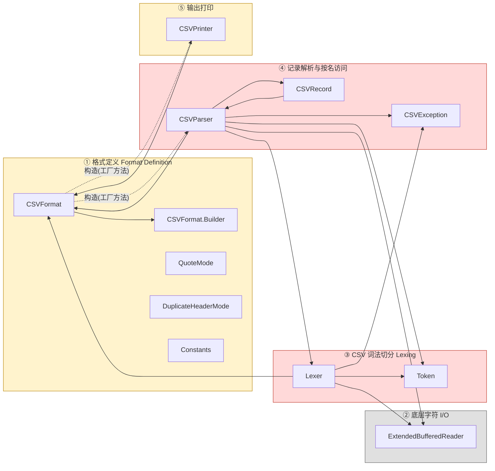
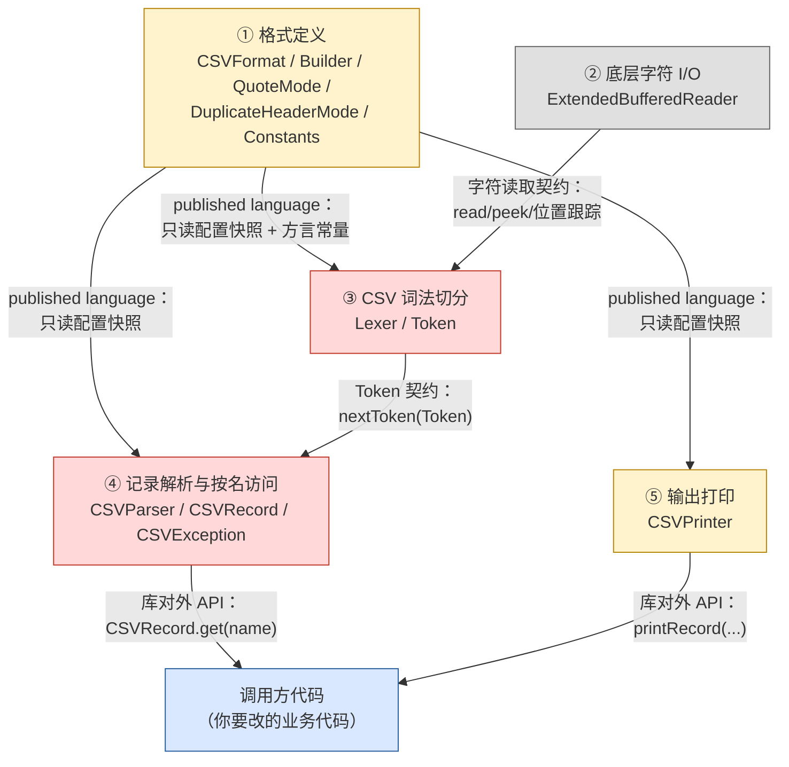
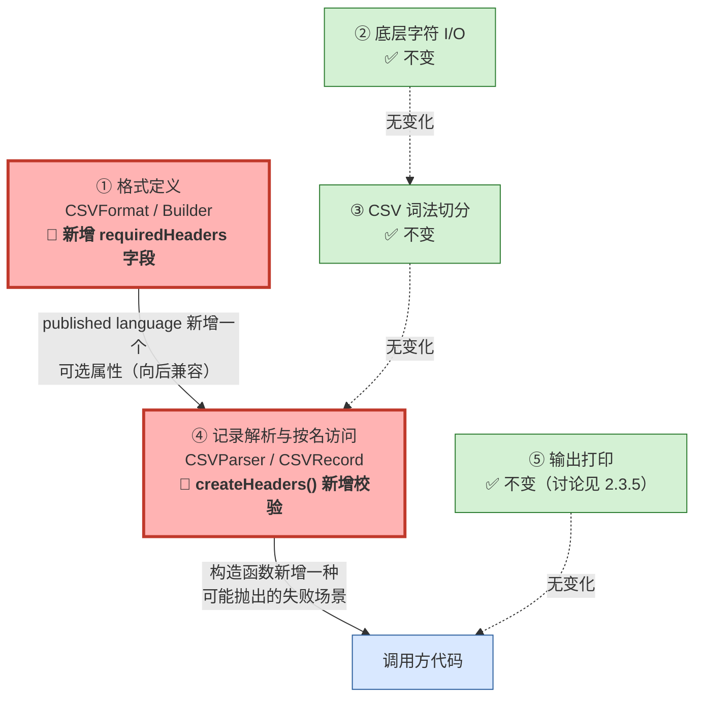
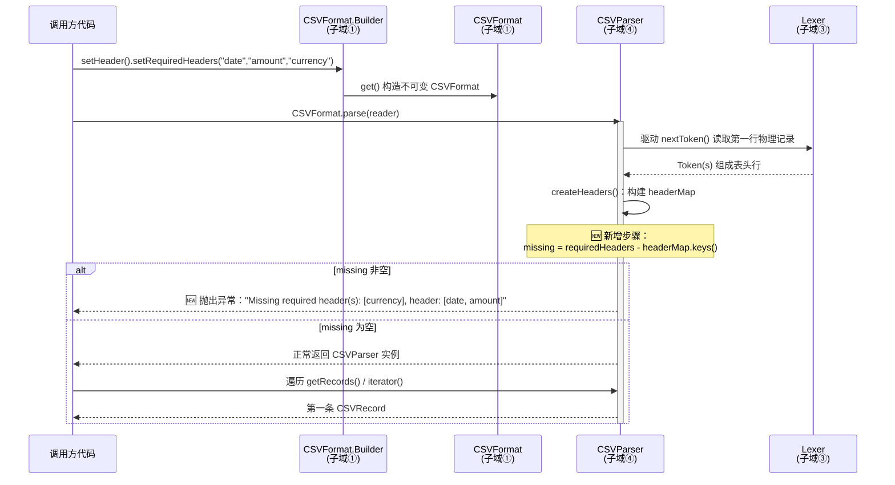

<a id="ch2-top"></a>

# 第二章 理解代码所承载的复杂业务逻辑

你接手了 `commons-csv` 这个陌生代码库，这个代码库需要你长期维护。最近你需要添加 `required headers` 新需求，你会如何在 Agent 的帮助下快速理解这个项目的软件架构，以便顺利添加新需求？

本章会用 DDD（Domain-Driven Design）的 strategic design 方法，带你走一遍"理解陌生棕地代码库、分清主次、分析新需求影响范围"的完整过程。从本章开始，每一章讲解之后都会给出可以直接复制给你自己的 Agent 的提示词——建议你可以先浏览本章概要，然后复制本章结尾处的提示词给你的 Agent ，自己动手跑一遍，再回来和本章展示的内容对比复盘，看看自己的产出和下面的分析有什么差异、为什么会有差异。

> [!TIP]
> **TL;DR · 读完本章你会：**
> - 学会用 DDD strategic design 把一个陌生棕地代码库拆成 core / generic / supporting 子域，分清哪里值得细读、哪里扫一眼接口就够；
> - 看到这套方法套在 `commons-csv` 上的真实判定结果——词法切分、记录解析是 core，格式定义、输出打印是 supporting，字符 I/O 是 generic；
> - 学会识别"代码行数大≠业务逻辑复杂"这个最容易踩的坑；
> - 看到 `required headers` 新需求如何被精确定位到该落脚的子域和类，而非凭直觉改动。

<a id="ch2-toc"></a>
**本章目录**：[2.1 用 strategic design 理解陌生代码库](#ch2-1) · [2.2 识别核心、支撑与通用子域](#ch2-2) · [2.3 新需求影响分析](#ch2-3) · [2.4 动手练习提示词](#ch2-exercise)

<a id="ch2-1"></a>

## 2.1 用 DDD 的 strategic design 快速理解陌生代码库并分清主次

<a id="ch2-def"></a>

#### 定义

Strategic Design 是 [《Learning Domain-Driven Design》](https://www.oreilly.com/library/view/learning-domain-driven-design/9781098100124/)（Vlad Khononov 著）第 1～4 章系统阐述的一套分析方法，核心是把一个业务域（business domain）拆解为若干子域（subdomain）——围绕同一批数据、同一批参与者、彼此紧密关联的一组用例集合——再根据"是否提供竞争优势""业务逻辑复杂度""波动性"三个维度，把每个子域归类为核心子域（core subdomain，公司区别于竞争对手的地方，必须自建、持续演进）、通用子域（generic subdomain，所有人都用同样方式做的事，应该买/用现成方案）或支撑子域（supporting subdomain，业务逻辑简单、没有竞争优势、但又没有现成方案可用，只能自建但不需要最优秀的人）。严格意义上的 strategic design 面向的是公司和团队，但这套分析工具同样可以类比映射到一个纯技术性的代码库上——把"库要解决的问题本身"当作业务域，把"这部分代码历史上改动、修 bug 的频率"当作波动性，借此快速建立对陌生代码库的心智模型。

<a id="ch2-value"></a>

#### 价值

对棕地项目维护者来说，strategic design 最直接的价值是把"这个代码库到底哪里重要、哪里不重要"这个判断,从"读代码读得越多、感觉越对"的模糊直觉，变成一套可追溯、可复用的分析方法——识别出哪些类是"牵一发而动全身"的核心业务逻辑，哪些类是"换一个现成方案也无所谓"的边角配置，再根据业务职责判断一个新需求真正会落在哪个子域、哪些类，而不会被"这个方法挂在哪个类的 API 上"这个表面现象误导。

<a id="ch2-risk"></a>

#### 没有它的危害

没有这套分析工具时，理解一个陌生棕地代码库往往只能靠"从 main 方法或者某个入口类开始，顺着调用链慢慢读下去"，容易把"代码行数多、方法名花哨"误判为"这里很重要"，或者反过来，漏掉一个代码行数很少但真正承载着核心业务规则的类。更危险的是，在拆分新需求的改动范围时，如果没有先划清子域边界，很容易把一个本该只改一两个类的小需求，稀里糊涂地改成牵动好几个不相关模块的大改动——这正是本书第 1.1 节说的"棕地项目返工代价成倍放大"的典型成因之一。

<a id="ch2-strength"></a>

#### 独特优势

strategic design 提供了一套**与代码行数无关、只看业务规则复杂度**的分类标准，这恰好是 Agent 辅助编程场景里最容易被忽视的一点——Agent 很擅长"读懂一段代码在语法上做了什么"，但不一定天然具备"这段代码在业务上有多重要"的判断力，而后者恰恰是人在评审 Agent 产出时最该把关的地方。用 strategic design 的框架去追问 Agent（"这个子域提供竞争优势吗？复杂度高不高？"），能逼着 Agent 给出有理由、可追溯的判断，而并非一句笼统的"这个类很重要"。

<a id="ch2-weakness"></a>

#### 主要劣势

strategic design 原本是为公司和团队设计的分析工具，用在一个单一团队维护的技术库上是一次"方法论改造"——子域之间的协作关系，严格意义上该用 Ch.4《Integrating Bounded Contexts》里"partnership / shared kernel / conformist / anticorruption layer / open-host service"这些描述**不同团队**整合关系的模式来说明，但技术库内部的子域往往生活在同一个 bounded context 里，这些模式在这里只能作比喻使用，不能按字面意义套用，使用时需要明确声明这一点，避免误导读者以为这是严格的教科书式用法。

<a id="ch2-fit"></a>

#### 适用场景

接手一个陌生的、体量中等（几十到大几百个类）、职责边界相对清晰的棕地代码库，需要在动手改动之前，先建立起"哪里是核心逻辑、哪里是边角配置"的心智模型；尤其适合在"一个新需求挂在某个支撑子域的 API 上，但真正的业务规则其实该落在核心子域里"这类容易被表面现象误导的场景。

<a id="ch2-nofit"></a>

#### 不适用场景

代码库体量极小（几个类就能全部读完）、或者本身就是一个"正在开发的小型 agent 系统"（这种情况下，"子域"这个分析单元本身意义不大，不如直接读代码）；此外，如果团队本身就是多团队协作、跨 bounded context 的大型系统，Ch.4 的整合模式应该按字面意义严格使用，而并非作为比喻。

<a id="ch2-2"></a>

## 2.2 识别核心、支撑与通用子域

在正式动手拆分 `commons-csv` 之前，先把三个分类标准说清楚：**核心子域**（core subdomain）指的是这个代码库"赖以立身"的那部分业务规则——它复杂、容易出错、且没有现成方案可以照搬，往往也是新需求真正要落脚的地方；**支撑子域**（supporting subdomain）指的是业务逻辑简单、更像是"数据录入/配置项"性质的部分——没有太多算法含量，但库的运转离不开它；**通用子域**（generic subdomain）指的是任何项目都会用同样方式解决的通用问题（比如字符读取、日志），业界早有成熟方案，不需要自己重新发明。

把这三类标签贴到一个陌生代码库上,能带来两个立竿见影的好处：一是帮你把有限的阅读精力花在刀刃上——核心子域值得逐行细读、搞清楚每条分支的业务含义，支撑和通用子域往往扫一眼接口签名就够了，不需要通读实现；二是帮你在评估一个新需求的改动范围时，快速判断"这个改动会不会牵动真正复杂的业务规则"，而不被"改动挂在哪个类的 API 上"这个表面现象带偏——2.2.3 节会用 `commons-csv` 的真实判定结果，具体示范这套标签怎么用。

### 2.2.1 把代码库看作业务域

把 `commons-csv` 当作一个业务域来看，需要先做一次类比映射——这是一次刻意的方法论改造，并非教科书原文：

| DDD 原始概念 | 在 commons-csv 上的类比 |
| --- | --- |
| 业务域（business domain） | "正确、健壮、可定制地读写 CSV 文本"这件事本身 |
| 核心子域的"竞争优势" | 能不能把别人不敢碰、容易出 bug 的脏活累活（怪异引号、转义、EOF、各种方言）做对、做稳 |
| 子域的"复杂度" | 业务规则/边界条件的复杂度，而并非代码行数（`CSVFormat.java` 有 3369 行，但大部分是数据项和文档，逻辑并不复杂——这是"复杂度要看业务逻辑而非体量"的一个活生生的例子）|
| 子域的"波动性" | 这部分代码历史上改动、修 bug 的频率 |
| "域专家" | RFC 4180 规范、各数据库/工具（Excel、MySQL、PostgreSQL、MongoDB、Informix）自己的 CSV 方言约定，以及 Apache Commons 维护者积累的边界条件知识 |

这个类比映射本身就是后面所有 core/generic/supporting 判断的起点——先承认"这是一次类比，并非字面意义上的 DDD"，后续的分析才站得住脚。

### 2.2.2 用来验证子域边界的端到端测试场景

子域边界应该对应一组内聚的用例集合，而并非凭直觉按文件名硬划。下面是针对 CSV 文件处理的典型端到端场景，用来交叉验证代码依赖关系得出的子域划分是否"讲得通"：

- **S1** 解析一个带表头的 CSV 文件，按列名读取每条记录（典型的对账/数据导入场景）。
- **S2** 解析一个不带表头的 CSV 文件，按列序号读取。
- **S3** 解析带有怪异语法的 CSV（字段内嵌引号、转义字符、注释行、空行、字段内带分隔符）——健壮性场景。
- **S4** 解析 Excel 导出的 CSV（locale 相关分隔符、宽松 EOF、尾部脏数据）。
- **S5** 按某种预定义方言把内存数据写成 CSV 文本。
- **S6** 以流式方式逐条处理一个很大的 CSV 文件，不一次性加载进内存。
- **S7** 解析时发现表头有重复列名或空列名，按配置的策略放行或报错。

本章要新增的 `required headers` 需求——"解析时发现表头缺少约定好的必需列，必须在读第一条记录前就报错"——正是第 8 个场景，留给 2.3 节专门分析。

这 7 个场景分别落在后面识别出的子域上：S1/S2/S6/S7 落在"记录解析与按名访问"；S3/S4 横跨"词法切分"与"记录解析"；S5 落在"输出打印"；S1～S7 全部都要先经过"格式定义"子域来描述方言。子域边界与真实使用场景对齐，而非凭空按文件名分的——这是验证子域划分是否可靠的关键一步，很多人跳过这一步直接凭直觉分类，容易把边界划错。

### 2.2.3 识别核心、支撑与通用子域

`commons-csv` 的 package 结构是扁平的单一 package，所以子域边界是在类簇/职责簇粒度上划的。实地核查源码后，得到以下五个子域：

| 子域 | 包含的类 | 职责一句话 |
| --- | --- | --- |
| ① 格式定义 Format Definition | `CSVFormat`、`CSVFormat.Builder`、`QuoteMode`、`DuplicateHeaderMode`、`Constants` | 描述"一份 CSV 长什么样"——分隔符、引号、转义符、表头、重复表头策略等约 25 项配置，外加 11 种预定义方言 |
| ② 底层字符 I/O | `ExtendedBufferedReader` | 带前瞻（peek）、BOM 剥离、位置跟踪的字符读取基础设施，完全不知道"CSV"是什么 |
| ③ CSV 词法切分 Lexing | `Lexer`、`Token` | 按分隔符/引号/转义符/注释符规则，把字符流切分成 Token——真正"读懂 CSV 语法"的地方 |
| ④ 记录解析与按名访问 | `CSVParser`、`CSVRecord`、`CSVException` | 驱动 Lexer 拉取 token 组装成记录，同时构建"列名→列序号"映射表，支持按名访问；重复/空列名怎么处理、大小写是否敏感，全部在这里判定 |
| ⑤ 输出打印 Output Printing | `CSVPrinter` | 把内存数据按格式规则写成 CSV 文本——子域④的逆操作，但逻辑简单得多 |

对照"竞争优势 / 复杂度 / 波动性 / 能否外包"四个维度逐一判定：

| 子域 | 判定 | 判定理由 |
| --- | --- | --- |
| ③ CSV 词法切分 | **Core** | 正确识别带引号字段、转义字符、注释行、怪异 EOF、各种方言的细微差异，是任何 CSV 库"好不好用、靠不靠谱"的分水岭，且不能外包——没有通用的"CSV 词法分析器"库可以简单接进来替代。 |
| ④ 记录解析与按名访问 | **Core** | 表头怎么解析、重复/空列名怎么判、大小写是否敏感、按名访问失败报什么错——这些直接决定库好不好调试、好不好排错，而且正是本次 `required headers` 新需求要改动的地方，印证了"高价值功能的扩展点总是落在核心子域"这条规律。 |
| ① 格式定义 | Supporting | 代码体量最大（3369 行），但本质上是"数据项 + 流式 setter + 11 个预置方言常量"——没有算法，没有不确定性，是"体量大但逻辑简单"的典型反例。 |
| ⑤ 输出打印 | Supporting | 机械地把内存数据套用格式规则写成文本，不需要处理"输入不可信"这种不确定性，复杂度远低于解析方向。 |
| ② 底层字符 I/O | Generic | 带前瞻的缓冲字符读取是一个已经被解决过无数次的问题，没有必要也没有能力在这里"创新"。 |

一个最容易踩的坑：**不要把子域①（格式定义）误判为 core，仅仅因为它文件最大、setter 方法最多**。代码体量和 Builder 模式、11 个预置常量这类"花活"会制造"这里很复杂"的错觉，但真正决定这个库好不好用的，是词法切分和记录解析两处——复杂度要看业务逻辑，并非看代码量。

### 2.2.4 可视化子域内部类之间的依赖关系


```mermaid
graph LR
    subgraph FMT["① 格式定义 Format Definition"]
        CSVFormat
        Builder1["CSVFormat.Builder"]
        QuoteMode
        DuplicateHeaderMode
        Constants
    end
    subgraph IO["② 底层字符 I/O"]
        ExtendedBufferedReader
    end
    subgraph LEX["③ CSV 词法切分 Lexing"]
        Lexer
        Token
    end
    subgraph PARSE["④ 记录解析与按名访问"]
        CSVParser
        CSVRecord
        CSVException
    end
    subgraph PRINT["⑤ 输出打印"]
        CSVPrinter
    end

    CSVFormat --> Builder1
    CSVFormat -. "构造(工厂方法)" .-> CSVParser
    CSVFormat -. "构造(工厂方法)" .-> CSVPrinter
    CSVParser --> CSVFormat
    CSVParser --> Lexer
    CSVParser --> ExtendedBufferedReader
    CSVParser --> Token
    CSVParser --> CSVRecord
    CSVParser --> CSVException
    CSVRecord --> CSVParser
    Lexer --> CSVFormat
    Lexer --> ExtendedBufferedReader
    Lexer --> Token
    Lexer --> CSVException
    CSVPrinter --> CSVFormat

    style FMT fill:#fff3cd,stroke:#b8860b
    style IO fill:#e0e0e0,stroke:#666
    style LEX fill:#ffd9d9,stroke:#c0392b
    style PARSE fill:#ffd9d9,stroke:#c0392b
    style PRINT fill:#fff3cd,stroke:#b8860b
```

红色 = 后面判定为 core 的子域；黄色 = supporting；灰色 = generic。虚线箭头表示"作为工厂方法被动构造"，并非结构性耦合——`CSVFormat` 并不持有对 `CSVParser`/`CSVPrinter` 的引用，只是它们的构造入口之一。

### 2.2.5 可视化子域之间的协作关系


```mermaid
graph TB
    FMT["① 格式定义<br/>CSVFormat / Builder / QuoteMode /<br/>DuplicateHeaderMode / Constants"]
    IO["② 底层字符 I/O<br/>ExtendedBufferedReader"]
    LEX["③ CSV 词法切分<br/>Lexer / Token"]
    PARSE["④ 记录解析与按名访问<br/>CSVParser / CSVRecord / CSVException"]
    PRINT["⑤ 输出打印<br/>CSVPrinter"]

    FMT -- "published language：<br/>只读配置快照 + 方言常量" --> LEX
    FMT -- "published language：<br/>只读配置快照" --> PARSE
    FMT -- "published language：<br/>只读配置快照" --> PRINT
    IO -- "字符读取契约：<br/>read/peek/位置跟踪" --> LEX
    LEX -- "Token 契约：<br/>nextToken(Token)" --> PARSE
    PARSE -- "库对外 API：<br/>CSVRecord.get(name)" --> USER["调用方代码<br/>（你要改的业务代码）"]
    PRINT -- "库对外 API：<br/>printRecord(...)" --> USER

    style FMT fill:#fff3cd,stroke:#b8860b
    style IO fill:#e0e0e0,stroke:#666
    style LEX fill:#ffd9d9,stroke:#c0392b
    style PARSE fill:#ffd9d9,stroke:#c0392b
    style PRINT fill:#fff3cd,stroke:#b8860b
    style USER fill:#d9e8ff,stroke:#2c5f9e
```

**重要澄清**：按 Ch.3/Ch.4 的严格定义，"partnership / shared kernel / conformist / anticorruption layer / open-host service" 描述的是**不同团队、不同 bounded context 之间**的整合关系。而 commons-csv 这 5 个子域实际上都生活在**同一个 bounded context**（同一个 Maven 模块、同一个维护团队、同一个发布版本号）里——这是刻意的单体设计。所以上图里的箭头，外人乍看像是团队间的"整合模式"，拆开来看，其实是**子域内部的调用契约**。但为了帮助建立直觉，可以这样类比着记：

- 子域①（格式定义）像是全局的**shared kernel**——④③⑤ 都依赖它的字段形状，一旦改了字段，三个子域都要重新编译/重新验证。
- 子域④依赖子域②③的方式类似**customer–supplier**里"customer 完全主导，supplier 没有自己的对外契约"——`Lexer`/`ExtendedBufferedReader` 的接口形状完全是为了服务 `CSVParser` 设计的。
- 子域④/⑤对外（面向库使用者）的 `CSVRecord.get(...)` / `printRecord(...)` 才是真正意义上的**open-host service**：这是 commons-csv 对全世界 Java 项目公开的"published language"，任何改动都要考虑向后兼容。

<a id="ch2-3"></a>

## 2.3 新需求实现的影响分析

有了上面这张子域地图，现在可以正式分析 `required headers` 需求原文：

> 我在维护 Apache Commons CSV。我们对账时，上游 CSV 应当包含若干固定列。我想给 `CSVFormat.Builder` 加一个 `setRequiredHeaders(String...)`：解析时一旦发现表头缺少这些列，就在读第一条记录之前抛出一个清楚说明缺了哪些列的错误，而不是等业务代码调用 `record.get("currency")` 时才报 `Mapping for currency not found`。

### 2.3.1 代码现状

表头相关的校验目前已经发生在三个地方，这是理解"新检查该插在哪"的关键背景：

| 校验内容 | 发生在哪个类/方法 | 时机 | 抛出什么 |
| --- | --- | --- | --- |
| 分隔符/引号/转义符/注释符是否互相冲突 | `CSVFormat.validate()`（私有） | `CSVFormat` 对象构造时 | `IllegalArgumentException` |
| 表头数组自身有没有重复名/空名（字面值） | `CSVFormat.validate()` | `CSVFormat` 对象构造时 | `IllegalArgumentException` |
| 表头数组解析自输入流后，真实列名有没有重复/空 | `CSVParser.createHeaders()` | `CSVParser` 构造函数内部，在第一条记录能被拿到之前 | `IllegalArgumentException("The header contains a duplicate name...")` 等 |
| 按列名取值时，该列名是否存在于 `headerMap` | `CSVRecord.get(String)` | 惰性——只有调用方真的执行了 `record.get("currency")` 才触发 | `IllegalArgumentException("Mapping for %s not found, expected one of %s", ...)` |

可以看到：**"缺列"这类问题，今天完全没有专门校验**——`CSVFormat.validate()` 只能校验"声明的表头形状本身"，因为它根本看不到输入数据；真正的缺列问题，只有在业务代码第一次按名取值时才会暴露，且报错信息完全不提"表头出了什么问题"，只说"这个名字找不到"——这正是需求描述里吐槽的体验。

### 2.3.2 需要改动哪些子域


```mermaid
graph TB
    FMT["① 格式定义<br/>CSVFormat / Builder<br/><b>🔧 新增 requiredHeaders 字段</b>"]
    IO["② 底层字符 I/O<br/>✅ 不变"]
    LEX["③ CSV 词法切分<br/>✅ 不变"]
    PARSE["④ 记录解析与按名访问<br/>CSVParser / CSVRecord<br/><b>🔧 createHeaders() 新增校验</b>"]
    PRINT["⑤ 输出打印<br/>✅ 不变（讨论见 2.3.5）"]

    FMT -- "published language 新增一个<br/>可选属性（向后兼容）" --> PARSE
    IO -.->|无变化| LEX
    LEX -.->|无变化| PARSE
    PARSE -- "构造函数新增一种<br/>可能抛出的失败场景" --> USER["调用方代码"]
    PRINT -.->|无变化| USER

    style FMT fill:#ffb3b3,stroke:#c0392b,stroke-width:3px
    style PARSE fill:#ffb3b3,stroke:#c0392b,stroke-width:3px
    style IO fill:#d4f1d4,stroke:#2e7d32
    style LEX fill:#d4f1d4,stroke:#2e7d32
    style PRINT fill:#d4f1d4,stroke:#2e7d32
    style USER fill:#d9e8ff,stroke:#2c5f9e
```

| 子域 | 本次是否触碰 | 说明 |
| --- | --- | --- |
| ① 格式定义 | **是** | 新增 `requiredHeaders` 配置项——典型的"在 supporting 子域里加一个新的数据字段"，没有算法复杂度。 |
| ② 底层字符 I/O | 否 | 这一层完全不知道"表头"这个概念，天然不受影响。 |
| ③ CSV 词法切分 | 否 | `Lexer`/`Token` 只负责切词，不关心列名语义——即使是 core 子域，也并非每个新业务需求都会牵动到它。 |
| ④ 记录解析与按名访问 | **是（改动集中在此）** | `createHeaders()` 正是"headerMap 已经建好、但还没返回给构造函数调用方"的唯一时间点——新增的"缺列即报错"逻辑在语义上和它旁边已有的"重复列名即报错""空列名即报错"逻辑是同一类业务规则。 |
| ⑤ 输出打印 | 否（留有开放问题，见 2.3.5） | 需求本身描述的是"解析"场景，并非"生成"场景。 |

**关键结论**：这次需求虽然名字叫"`CSVFormat.Builder` 加一个方法"，听起来像是子域①的改动，但**真正有业务规则含量的改动其实发生在子域④**——子域①只是新增了一个"运书单"（配置项），子域④才是真正"验货"的地方。不要只看 API 挂在哪个类上，要看校验逻辑该放在哪个子域。

### 2.3.3 需要改动哪些类

| 类 | 子域 | 是否改动 | 具体改动 | 性质 |
| --- | --- | --- | --- | --- |
| `CSVFormat.Builder` | ① | ✅ | 新增字段 `requiredHeaders` + 新方法 `setRequiredHeaders(String...)`（镜像现有 `setHeader(String...)` 的写法） | 纯新增，向后兼容 |
| `CSVFormat` | ① | ✅ | 新增只读字段 + getter；拷贝构造要带上这个字段；`validate()` 里最多做"数组本身非空元素"之类的形状校验 | 纯新增，向后兼容 |
| `CSVParser`（`createHeaders()`） | ④ | ✅ | 在 `headerMap` 构建完毕、返回之前，插入"缺失列检测"逻辑 | 新增校验分支，复用已有机制 |
| `CSVParser`（构造函数/Javadoc） | ④ | ⚠️ 契约变化 | 多了一种可能抛出异常的原因，Javadoc 需要补充说明 | 向后兼容但行为契约扩大了 |
| `CSVRecord` | ④ | ❌ 不改 | `get(String)` 逻辑不用动——required 列本来就保证存在于 `headerMap` | 不变 |
| `Lexer` / `Token` | ③ | ❌ 不改 | 不知道"表头"这个概念 | 不变 |
| `ExtendedBufferedReader` | ② | ❌ 不改 | 同上，更底层 | 不变 |
| `CSVPrinter` | ⑤ | ❌ 不改（见 2.3.5） | 需求范围是"解析"，并非"写出" | 不变 |

### 2.3.4 子域接口变化

和 2.2.5 一致的澄清：commons-csv 的子域①④本质上在同一个 bounded context、同一个团队里，下面这些箭头，字面意义上称不上"跨团队整合模式调整"，充其量只是借用 DDD Ch.4 的词汇，来描述"子域间调用契约"发生了什么变化：

- **子域①（supplier）→ 子域④（customer）**：子域①的 published language 新增了一个**可选**属性 `requiredHeaders`（默认不启用）。这是教科书式的**向后兼容的 open-host-service 式演进**——老的调用方完全不受影响，因为它们消费的字段集合没有减少，只是多了一个它们不关心的新字段。
- **子域④对外（面向库的最终使用者）**：`CSVParser` 的构造/`parse(...)` 系列工厂方法的"失败模式集合"扩大了一项——这是需要写进 Javadoc、写进 CHANGELOG 的契约变化，即使方法签名一字未改。**接口契约不只是方法签名，还包括"这个方法可能因为什么原因失败"**，这是本次分析最值得记住的一条经验。
- **子域②③**：完全在这次变更的影响范围之外。


```mermaid
sequenceDiagram
    participant Caller as 调用方代码
    participant Builder as CSVFormat.Builder<br/>(子域①)
    participant Format as CSVFormat<br/>(子域①)
    participant Parser as CSVParser<br/>(子域④)
    participant Lexer as Lexer<br/>(子域③)

    Caller->>Builder: setHeader().setRequiredHeaders("date","amount","currency")
    Builder->>Format: get() 构造不可变 CSVFormat
    Caller->>Parser: CSVFormat.parse(reader)
    activate Parser
    Parser->>Lexer: 驱动 nextToken() 读取第一行物理记录
    Lexer-->>Parser: Token(s) 组成表头行
    Parser->>Parser: createHeaders()：构建 headerMap
    Note over Parser: 🆕 新增步骤：<br/>missing = requiredHeaders - headerMap.keys()
    alt missing 非空
        Parser-->>Caller: 🆕 抛出异常："Missing required header(s): [currency], header: [date, amount]"
    else missing 为空
        Parser-->>Caller: 正常返回 CSVParser 实例
        Caller->>Parser: 遍历 getRecords() / iterator()
        Parser-->>Caller: 第一条 CSVRecord
    end
    deactivate Parser
```

这张序列图直观地展示了需求里"必须在读第一条记录之前抛出"这句话——因为 `createHeaders()` 是在 `CSVParser` 的构造函数里被**同步**调用的，调用方要拿到 `CSVParser` 实例本身就必须等这一步执行完。只要新校验插在 `createHeaders()` 返回之前，"先于第一条记录报错"这个约束就自动满足，不需要额外设计任何"预读一行再回退"之类的机制。

### 2.3.5 开放设计问题

下面这些问题，分析阶段故意不给"标准答案"——它们会在第三章用决策表的方法逐一裁决：

1. **异常类型**：复用 `IllegalArgumentException`（和现有重复/空表头错误保持风格一致），还是新增一个专门的异常类型，让调用方可以精确 `catch`？
2. **大小写敏感性**：`requiredHeaders` 的比较要不要尊重 `ignoreHeaderCase` 配置？
3. **与 `allowMissingColumnNames` / `DuplicateHeaderMode` 的交互**：如果某一列同时触发"重复列名"和"属于 required 列"，报错顺序和报错内容该怎么组织？
4. **是否该同时约束 `CSVPrinter`（写路径）**：需求原文只提到"解析"场景，但一个对称的 API 设计者可能会问"写的时候要不要对称校验"。
5. **`setHeader()` 两种模式的交互**：自动从首行解析表头 vs 手工指定表头，这两种模式下 `requiredHeaders` 的校验时机和校验对象是否完全一致？

| 维度 | 结论 |
| --- | --- |
| 牵动的子域 | ①格式定义（新增配置项，无算法复杂度）、④记录解析与按名访问（新增校验逻辑，这是真正的"业务逻辑落点"） |
| 不受影响的子域 | ②底层字符 I/O、③CSV 词法切分、⑤输出打印 |
| 子域间接口变化 | ①→④ 的 published language 新增一个可选、向后兼容的属性；④对外的"构造期可能失败的原因集合"扩大 |
| 对本章的意义 | 这是一个"需求挂在 supporting 子域的 API 上，但真正的业务规则要落在 core 子域里实现"的典型棕地改动案例，可以用来检验自己是否真正建立了子域边界的心智模型，而并非只会"在被要求改的那个类里加代码" |

<a id="ch2-exercise"></a>

## 2.4 动手练习提示词

为方便动手实操，这里把本章 2.1～2.3 节的“识别子域”和“分析新需求影响”相应的提示词合并成一份完整的提示词，便于你一次发给 Agent 后，同时获得下面的两份文档。提示词会先带你的 Agent 做一次"假设体检"，再按"追问"的方式和你对齐诉求，最后才真正动手做 DDD 分析。这正是全书反复强调的"假设体检+追问"工作习惯，在提示词层面的完整落地。建议你完整走一遍，而不是只看方法论讲解。

使用前请注意：

- 提示词要求 Agent **自己读源码、自己判断子域边界**，不会把本章 2.2/2.3 节的具体结论告诉它——这是故意的：先让你的 Agent 重新走一遍分析过程，再拿它的产出和本章内容对比，这样才有真实体验的效果。建议先完整跑完这份提示词、拿到产出之后，再回头翻 2.2/2.3 节对照。
- 提示词里有几处用尖括号标记的占位符，需要你替换成自己机器上的实际信息：`<current-director>`（你在 Agent 里设置的当前工作目录）、`<dialogs>.md`（保存你和 Agent 之间对话记录的文件路径，已备 Agent 因为 LLM 服务暂时不可用等种种原因中断时能切换到其他 Agent 继续）、`<path-of-doc-a-subdomins>.md` / `<path-of-doc-b-impact-analysis>.md`（两份产出文档要保存的文件路径）、`<COMMONS_CSV_SRC_DIR>`（你要分析的代码库源码目录路径，可以从 `https://github.com/apache/commons-csv` 克隆到本地）。
- 如果你用的大模型没有直接读取文件系统的能力（大多数网页版大模型是这样），提示词第 4.4 节已经说明了应对方法：先让它开口要文件内容，你再手工粘贴。

<details>
<summary>📋 点击展开/折叠完整提示词（可直接复制给 Agent）</summary>

提示词开始，请从这里往下全部复制

````
当前目录为

```
<current-director>
```

。请按照下面的要求完成任务，并在你每一次停下来等待我回复你的澄清问题时，将上一次追加前你我之间的完整对话（包括下面的Round 0）以markdown格式追加到

```
<dialogs>.md
```

文件（如果这个文件不存在，就新建）末尾，以便我在回复你的问题前仔细阅读。下面是要求：

## 1. Round 0（假设体检）

在开始设计树之前，先执行 Round 0（假设体检）。

1.1 列出我下面要求里没有明说、但你已默认成立的假设（逐条编号，形如：A1、A2、A3……）；
1.2 列出你还缺哪些关键信息，并说明每条信息会如何改变你的方案（逐条编号，形如：M1、M2、M3……）；
1.3 指出人们处理这类问题时最常犯的一个错误；
1.4 只提一个最关键的问题 —— 这个问题要能帮你搞清我的真实目标和具体处境，而不是最后给我一份谁都能套用的通用建议。这个问题的格式如下：

```
❓ **Q0** - **<问题标题>**: <问题正文，可能包含多个段落及选项>

➡️ <你的建议答案>
```

## 2. 推进设计树

Round 0 只问上述这一个问题，不要提前问别的。我回答后，你再按追问的常规轮次（frontier / 编号问题 / 推荐答案）推进设计树，直到前沿清空。

## 3. 追问

按下面追问的要求追问我的诉求：

---
名称: 追问
描述: 针对某项计划、决策或想法，对用户进行深入且严密的追问。适用于用户希望压力测试其思路，或使用了任何触发"追问"模式的关键词句时。
---

对用户进行持续、深入的追问，直到双方达成共识。将此过程构建为一棵**决策树**：每一项决策都会衍生出后续相关的决策分支。

按**轮次**推进这棵树的构建。**前沿（frontier）**指的是那些前提条件已确定的决策——即你可以**立即**提问、而无需猜测尚未获知答案的问题。在每一轮中，提出"前沿"上的所有问题：为每个问题编号并给出你的建议答案。随后等待用户回答，再进入下一轮。

每个问题的格式应如下所示：

```
❓ **Q1** - **<问题标题>**: <问题正文，可能包含多个段落及选项>

➡️ <你的建议答案>
```

用户在每一轮的回答都会重塑决策树：已确定的决策会将"前沿"向外推进，并解锁那些依赖于这些决策的问题。重新计算"前沿"并进行下一轮提问。如果某个问题的答案依赖于本轮中尚未确定的另一个问题，则该问题应归入**后续**轮次，而非当前轮次。

发掘**事实**是你的职责，绝非用户的职责。当"前沿"上的某个问题需要获取环境（如文件系统、工具等）中的事实信息时，应指派子代理（sub-agent，如果有的话）去查找；切勿向用户询问你自己就能查到的信息。不要因此停滞不前：正在进行的探索属于尚未确定的前提条件，因此只有依赖于该探索结果的后续问题才需要等待子代理的报告；你可以立即提出"前沿"上的其他问题。**决策**权在于用户：将每一项决策提交给用户，并等待其回应。

## 4. 我的诉求

你是一名资深 Java 架构师，同时也是一名 Domain-Driven Design（DDD）strategic design 教练。我是一名正在学习 DDD 的后端工程师，熟悉 Java，但没有系统学过 DDD。我需要你带我用 DDD strategic design 的方法，分析一个我不熟悉的开源代码库 **Apache Commons CSV**，帮我快速建立对它的心智模型，为后续做一次"棕地新增需求"练习做准备。

请严格按照下面的步骤和输出格式执行，不要跳步，不要先给结论再补过程。

## 4.1 任务目标

产出两份 Markdown 文档：

- **文档 A（子域识别）**：识别 commons-csv 代码库里的所有 subdomain，标注每个子域包含的 Java 类名、职责、对外接口、相互依赖关系，然后判断每个子域是 core / generic / supporting，并说明依赖关系与接口。请以markdown格式将上述文档 A 保存到以下文件中：

```
<path-of-doc-a-subdomins>.md
```

- **文档 B（新需求影响分析）**：假设要在这个代码库上新增一个具体需求（需求原文见 4.6 ），分析这个需求会牵动哪些子域、哪些类，子域之间的接口会发生什么变化。请以markdown格式将上述文档 B 保存到以下文件中：

```
<path-of-doc-b-impact-analysis>.md
```

这两份文档是用来帮我（以及其他和我一起培训的同学）熟悉这个陌生代码库的，所以**过程和依据比结论更重要**——请把"你是怎么判断出来的"写清楚，不要只给结论表格。

## 4.2 分析方法与必须遵守的几条原则

这些原则来自《Learning Domain-Driven Design》第 1–4 章，完整参考摘要附在本提示词 4.9 里，分析时请对照着用：

1. **把"库"当"业务域"的类比映射**：Apache Commons CSV 是一个 Java 库，不是一家公司，严格意义上没有"客户/竞争对手/盈利"。但为了借用 DDD 的分析工具，请做如下类比，并在文档 A 的开头用一张表格明确写出来（这是分析的前提假设，必须显式声明，不能藏在心里）：
   - 业务域 → "正确、健壮、可定制地读写 CSV 文本"这件事本身
   - 核心子域的"竞争优势" → 能不能把别人不敢碰、容易出 bug 的脏活累活做对、做稳
   - 子域的"复杂度" → **业务规则/边界条件的复杂度，而不是代码行数**（这一点极其重要，见下面的"常见错误"）
   - "域专家" → 相关的协议规范（如 RFC 4180）、各种下游工具（Excel/数据库导出工具等）自己的方言约定、以及该库维护者积累的边界条件知识
2. **子域边界要用"端到端场景"交叉验证**：先列出 6-8 个"在本机上处理 CSV 文件"的典型端到端场景（比如：解析带表头的文件按列名读取、解析不带表头的文件按序号读取、处理畸形输入如嵌套引号/转义/注释/空行、按某种方言把数据写成文件、流式处理大文件、表头重复或缺失时的行为等），再检查你划出来的每个子域是不是都能在这些场景里找到自己的位置。如果某个子域在所有场景里都从未被单独触及，说明边界划分可能有问题，需要重新考虑（参考 Ch.1 "subdomains as coherent use cases"）。
3. **子域划分的粒度**：先用 `find`/目录浏览等方式确认这个库的 package 结构是扁平的还是分层的。如果是扁平单一 package（大概率是这种情况），子域边界要在**类簇/职责簇**粒度上划分，不能用"每个 package 是一个子域"这种偷懒的方式。
4. **最容易犯的错误（务必主动避免）**：不要把"技术分层"误当成"业务子域"（例如看到类名里有 Parser/Lexer/Printer 这种技术词，就按这个词面意思分类），也不要把**代码行数/方法数量**当成"复杂度"或"核心程度"的判断依据——很多库里，某个类文件很大（几千行），但本质上只是一堆配置项加 setter，业务逻辑并不复杂；而真正复杂、决定产品好不好用的逻辑，可能藏在一个很小的类里。请在判断 core/generic/supporting 时，**明确讨论并排除**这个误区（哪怕最后结论是"这个类确实又大又核心"，也要说明你是怎么排除"体量大=核心"这个陷阱的，而不是因为体量大才下这个结论）。
5. **bounded context 和 subdomain 不是一回事**：commons-csv 大概率是单个 Maven 模块、单个维护团队、单个发布版本——也就是整个库可能只是**一个 bounded context**，里面装了好几个子域（这完全符合 Ch.3 的论述：一个 bounded context 可以装下多个子域）。如果是这种情况，在描述子域之间的接口时，请明确说明：Ch.4 里"partnership / shared kernel / conformist / anticorruption layer / open-host service / separate ways"这些模式字面上描述的是**跨团队、跨 bounded context**的整合关系；如果你分析的子域都在同一个 bounded context 里，这些词汇只能作为**类比/比喻**来描述子域间的调用契约，不能当成真实发生的团队间协作模式。请在文档里明确做这个澄清，不要含糊其辞地直接套用这些词。

## 4.3 判断 core / generic / supporting 的具体标准

请按下面四个维度逐一给出判断依据（对应 Ch.1 的分析框架），不要只写一句结论：

- **竞争优势类比**：这部分代码做对了，是不是这个库"选它而不选别的方案"的根本原因？
- **复杂度**：业务规则/边界条件复杂，还是本质上是数据录入/CRUD（存字段、读字段）？
- **波动性**：这部分历史上是不是改动最频繁、修 bug 最密集的地方？（如果你能访问 git log，可以实际查一下；如果不能，就基于代码本身的复杂度和注释里提到的"XX 版本修复了 XX 问题"之类的信息做合理推断，并说明这是推断不是实测）
- **能否外包/用现成方案替代**：如果是"已经被解决过无数次的通用问题"（比如缓冲读取、编码转换），判定为 generic；如果"没有现成方案，必须自己维护"，且这正是这个库的价值所在，判定为 core；如果"逻辑简单，但没有现成方案，必须自己写"，判定为 supporting。

## 4.4 需要你分析的源代码

请分析下面这个目录下的全部 `.java` 生产代码文件（不包括测试代码、benchmark 代码）：

```
<COMMONS_CSV_SRC_DIR>
```

- 如果你有读取本机文件系统的能力：请直接遍历并读取该目录下所有 `.java` 文件。
- 如果你**没有**读取文件系统的能力（大多数网页版大模型是这种情况）：请先回复我"请把这个目录下的 .java 文件内容依次粘贴给我，我会在收到全部文件后再开始分析"，然后等我把文件内容粘贴完（我会按文件名分段粘贴），并明确告诉你"全部文件已经粘贴完毕"后（如果我没有明确告诉你这句话，你需要问我全部文件是否已经粘贴完），你再开始分析。**不要在只看到部分文件的情况下就开始下结论**，尤其是依赖关系和接口分析必须基于看到全部文件之后的完整信息。

对每一个类，请至少记录：职责（一两句话说清楚它实际做什么，不是复述类名）、对外公开的 API（构造方法/静态工厂方法 + 最重要的 5-15 个公开方法，次要的 getter 可以归类概括）、关键内部状态（字段，数量多的话归类概括）、它依赖哪些同目录下的其他类（以及这些类反过来是否依赖它——用来判断依赖方向，画依赖图要用）。

## 4.5 文档 A（子域识别）输出格式模板

请严格按下面的章节结构输出，章节标题可以根据你的实际发现调整文字，但结构（章节数量和顺序）要保持一致：

```
# <库名>：Strategic Design 子域识别

## 0. 分析前提：把一个"库"当作一个"业务域"来看
（本提示词 4.2 中第 1 条中要求的类比映射表格，以及这个类比本身作为"假设"的声明）

## 1. 用来验证子域边界的端到端场景
（6-8 个端到端场景列表，以及"这些场景分别落在哪些子域上"的交叉验证说明）

## 2. 子域清单（含类名、职责、依赖、接口）
（先说明包结构是扁平还是分层，据此说明划分粒度；然后逐个子域列出：包含的类 / 职责 / 对外接口 / 内部依赖）

## 3. 类级依赖关系图
（一张 Mermaid graph，把所有类按子域分组放进 subgraph，箭头表示直接引用/调用/构造关系，并用颜色区分后面判定的 core/generic/supporting）

## 4. 子域层面的依赖关系与"接口"
（一张 Mermaid graph，子域粒度，箭头上标注"接口是什么"；并附上 4.2 中的第 5 条要求的 bounded context 澄清说明，以及用 Ch.4 词汇做类比的 2-3 条说明）

## 5. Core / Generic / Supporting 判定
（表格：子域 | 判定 | 判定理由——理由要覆盖 4.3 中的四个维度；并单独写一段说明你是如何避免"代码行数=复杂度"这个常见错误的）

## 6. 小结表：子域 × 类 × 判定一览
（一张汇总表格）
```

## 4.6 文档 B（新需求影响分析）要分析的需求

假设这个代码库要新增下面这个具体需求（这是一个真实的 Apache Commons CSV 维护者可能收到的需求）：

> 我在维护 Apache Commons CSV。我们对账时，上游 CSV 应当包含若干固定列。我想给 `CSVFormat.Builder` 加一个 `setRequiredHeaders(String...)`：解析时一旦发现表头缺少这些列，就在读第一条记录之前抛出一个清楚说明缺了哪些列的错误，而不是等业务代码调用 `record.get("currency")` 时才报 `Mapping for currency not found`。

在分析这个需求之前，请先**用实地读代码的方式**（不要凭空猜测）回答：

- 今天这个库里，表头相关的校验（重复列名、空列名、按名访问找不到列）分别发生在哪个类的哪个方法里？分别在什么时机触发？抛出什么异常？
- 这些现状信息，决定了新需求的校验逻辑应该插在哪里（哪个方法、哪个时间点）——请说明你的推理过程，而不是直接给答案。

## 4.7 文档 B 输出格式模板

```
# 新增 "<需求简述>" 需求：子域影响分析

## 1. 需求复述（用已识别子域的 ubiquitous language 对齐）
（把需求原文里的用户语言，翻译成文档 A 里已经定义好的子域术语）

## 2. 现状：表头相关的校验已经发生在哪里
（表格：校验内容 | 发生在哪个类/方法 | 时机 | 抛出什么——基于 4.6 要求的实地代码核查）

## 3. 哪些子域被触碰、哪些不被触碰
（一张 Mermaid graph 标注每个子域"改/不改"；一张表格：子域 | 判定(来自文档A) | 本次需求是否触碰 | 说明；并给出一段"关键结论"——通常会发现"需求挂在哪个类的 API 上"和"真正的业务规则该落在哪个子域"不是同一回事，请specifically检查并指出这一点）

## 4. 逐类改动清单
（表格：类 | 子域 | 是否改动 | 具体改动 | 性质（新增/契约变化/不变））

## 5. 子域接口变化
（用 Ch.4 的词汇描述子域间契约如何演进，同时重申"是否跨 bounded context"的澄清；配一张 Mermaid 时序图，展示从调用方设置配置到最终抛出错误或返回第一条记录的完整时序，标出新增的检查步骤插在哪一步）

## 6. 留给学员现场决定的开放设计问题
（列出 4-6 个这个需求在实现时会遇到的、没有唯一正确答案的设计抉择，比如：异常类型怎么选、大小写/别名怎么处理、和已有校验逻辑的先后顺序和报错信息怎么组织、是否要对称地处理"反向操作"（如果这个库同时有读和写两个方向）、新配置项在"自动探测"和"手工指定"两种模式下是否行为一致等——每个问题要说清楚"权衡点是什么"，不需要给出你自己倾向的答案）

## 7. 小结
（表格：维度 | 结论——至少包含"牵动的子域"、"不受影响的子域"、"子域间接口变化"、"对训练目标的意义"四行）
```

## 4.8 输出要求

- 全文用中文撰写（代码标识符、类名、方法名保留英文原文，用反引号包裹）。
- 两张 Mermaid 图（文档 A 各一张，文档 B 至少一张）必须是语法正确、可以直接渲染的 Mermaid 代码块，不要用纯文字描述代替图。
- 表格优先于大段文字——凡是能用表格表达的结构化信息（子域判定理由、改动清单、校验现状），都用表格。
- 不要在还没有读完全部 12 个（或实际数量）源文件之前，就开始输出文档 A 或文档 B 的任何章节。
- 如果你发现某个类的职责、依赖关系，在源码里找不到足够信息支撑你的判断，请在文档里明确标注"证据不足，推测如下：……"，不要编造不存在的方法名或字段名。

## 4.9 附录：DDD Strategic Design 参考摘要

以下内容是《Learning Domain-Driven Design》（Vlad Khononov 著）第 1–4 章要点的概括整理，是你完成上面任务需要用到的全部 DDD 背景知识，不需要额外查阅其他资料。

### 第 1 章《Analyzing Business Domains》要点

- **业务域**（business domain）：公司提供给客户的主要服务领域。公司要在业务域里成功，需要同时运作在多个**子域**（subdomain）——更细粒度的业务活动单元，彼此协作才能支撑整体业务。
- **核心子域（core subdomain）**：公司区别于竞争对手的地方——可能是发明新产品/服务，也可能是优化已有流程来降低成本。核心子域天然复杂（简单的东西很快会被竞争对手抄走），需要高准入门槛，要求公司自己投入最优秀的人、用最先进的工程手段**自建**，而且会持续演进（不存在"做完了"的核心子域）。判断一个子域是不是核心的小技巧：问自己"这个子域能不能单独拿出来做成一家公司，别人会不会为它单独付钱？"——能，就是核心子域。
- **通用子域（generic subdomain）**：所有公司都用同样方式在做的事情（比如身份认证）。同样复杂、同样难，但**不提供任何竞争优势**——已经有久经考验的现成方案，没必要自己发明，策略上应该"买/用开源方案"而不是自建。
- **支撑子域（supporting subdomain）**：业务逻辑简单（基本就是数据录入界面和 ETL/CRUD 操作），不提供竞争优势，但公司运转离不开它，又没有现成的通用方案可以直接用，所以只能自己写，可以外包或交给新人练手，不需要用最先进的工程技术。
- 三者对比（竞争优势 / 复杂度 / 波动性 / 实现策略）：

  | 类型 | 竞争优势 | 复杂度 | 波动性 | 实现策略 |
  | --- | --- | --- | --- | --- |
  | Core | 有 | 高 | 高 | 自建，最优秀的人 |
  | Generic | 无 | 高 | 低 | 买/用现成方案 |
  | Supporting | 无 | 低 | 低 | 自建/可外包 |

- **重要提醒**：核心子域不一定是"技术性"的（比如可能是珠宝设计这种和代码无关的事）；反过来，判断"软件相关的核心子域"时，要看**要实现的业务逻辑复杂度**——是像数据录入/CRUD 一样简单，还是需要实现复杂算法/被复杂业务规则和不变式编排的流程？前者是支撑子域的信号，后者才是核心子域的信号。**代码量大小不是判断标准**，业务逻辑的复杂度才是。
- **如何找子域边界**：从公司部门这种粗粒度单元开始，但往下细挖（distill），直到找到"一组围绕同一批数据、同一批参与者、彼此紧密关联的用例集合"——这就是子域的精确边界（"subdomains as coherent use cases"）。核心子域要尽量挖得精细（因为它最重要、最该聚焦投入）；支撑/通用子域如果继续往下挖不能带来新的设计决策信息，就可以停止。
- **域专家（domain experts）**：对业务领域了如指掌的人，通常是提出需求的人或软件的最终用户，不是分析师，也不是工程师。

### 第 2 章《Discovering Domain Knowledge》要点

- **ubiquitous language（通用语言）**：让所有相关方（域专家、工程师、产品等）用同一种语言描述业务领域，避免"翻译链"（业务知识 → 分析模型 → 需求 → 设计 → 代码，每一步都会失真）。
- 这门语言必须是**业务语言**，不含技术术语（不说"iframe 显示 HTML"，而说"广告位展示创意素材"）。
- 语言必须**一致**：每个术语只能有一个含义，不能有歧义或同义词并存。
- 这个语言只在**特定边界内**保持一致（这就引出了第 3 章的 bounded context）。

### 第 3 章《Managing Domain Complexity》要点

- 当同一个术语在不同部门/场景下有不同含义（比如"lead"在市场部和销售部的含义不同）时，不能强行用一个模型覆盖所有场景，而要把通用语言拆分成多个更小的语言，每个语言只在自己的**bounded context（边界上下文）**内保持一致。
- **bounded context 是被设计出来的，subdomain 是被发现出来的**：子域是业务本来就存在的结构（不管你写不写软件，业务都是按这些子域运作的）；bounded context 是工程师为了实现软件系统主动做的设计决策（怎么划分模型边界、怎么划分团队和物理部署单元）。
- 一个 bounded context 可以只对应一个子域，也可以装下好几个子域（这完全取决于设计决策，不是固定规则）。但不要把"一个内聚的功能"硬拆到多个 bounded context 里，否则会导致本该一起变化的东西被迫分别维护、分别发布。
- bounded context 同时是**模型边界**、**物理部署/技术栈边界**、和**团队所有权边界**（一个 bounded context 只能由一个团队负责，但一个团队可以负责多个 bounded context）。

### 第 4 章《Integrating Bounded Contexts》要点（仅在你分析的子域确实跨越了不同团队/不同 bounded context 时才按字面意义使用，否则只能作比喻）

- **cooperation（合作类，团队间沟通顺畅时用）**
  - *Partnership（伙伴关系）*：两个团队非正式地协调集成，谁改了接口就通知另一方，双方一起解决集成问题。
  - *Shared kernel（共享内核）*：多个 bounded context 共用同一份模型/代码，任何改动必须同步触发所有相关方的集成测试；适用场景之一是"同一个团队维护多个 bounded context，用共享内核明确划出一个本该一起管理的公共契约"。
- **customer–supplier（客户-供应商类，上下游团队可以独立成功，存在权力不对等）**
  - *Conformist（随从者）*：下游完全接受上游的模型，不做任何转换。
  - *Anticorruption layer（防腐层，ACL）*：下游不愿意接受上游模型，自己写一层转换，把上游模型翻译成适合自己的模型——适用于下游是核心子域、或上游模型很糟糕/变化频繁的情况。
  - *Open-host service（开放主机服务）*：上游主动把"对外发布的接口模型"和"内部实现模型"解耦，设计一套专门给消费者用的、稳定的"published language"，即使内部实现经常变，published language 也可以保持稳定或支持多版本并存平滑升级。
- **separate ways（分道扬镰，不集成，各自重复实现）**：当团队间沟通成本太高、或者要集成的是一个"集成成本比重复实现还贵"的通用子域（比如日志框架）时，宁可在各自的 bounded context 里各写一份，也不集成。**核心子域不应该用这个模式**，重复实现核心子域会违背"集中精力把核心子域做到最好"的战略。
- **context map（上下文地图）**：把所有 bounded context 和它们之间用的整合模式画成一张图，给出系统的高层设计、团队协作模式、以及潜在组织问题的洞察。
````

提示词结束，以上内容请整段复制给 Agent。

</details>

跑完整个流程后，把你的 Agent 产出的两份文档，和本章 2.2、2.3 节逐节对比——尤其关注 Round 0 阶段它对你的诉求提出了什么追问、有没有把"代码行数多"误判成"业务逻辑复杂"，以及"开放设计问题"这一节是否漏掉了某个需求原文没写清楚、但实际核查代码后才会发现的交互点（比如 2.3.5 第 5 条，很多人直接假设两种表头模式行为一致，却懒得去代码里确认）。下一章会把这些开放问题逐一裁决，并用决策表的方法推导出完整的验收测试用例。

---

⬅️ 上一章：[第一章 Agent 生成代码为什么不可信](../ch01/README.md#ch1-toc) ｜ ➡️ 下一章：[第三章 设计面向验收测试的 Spec](../ch03/README.md#ch3-top)
