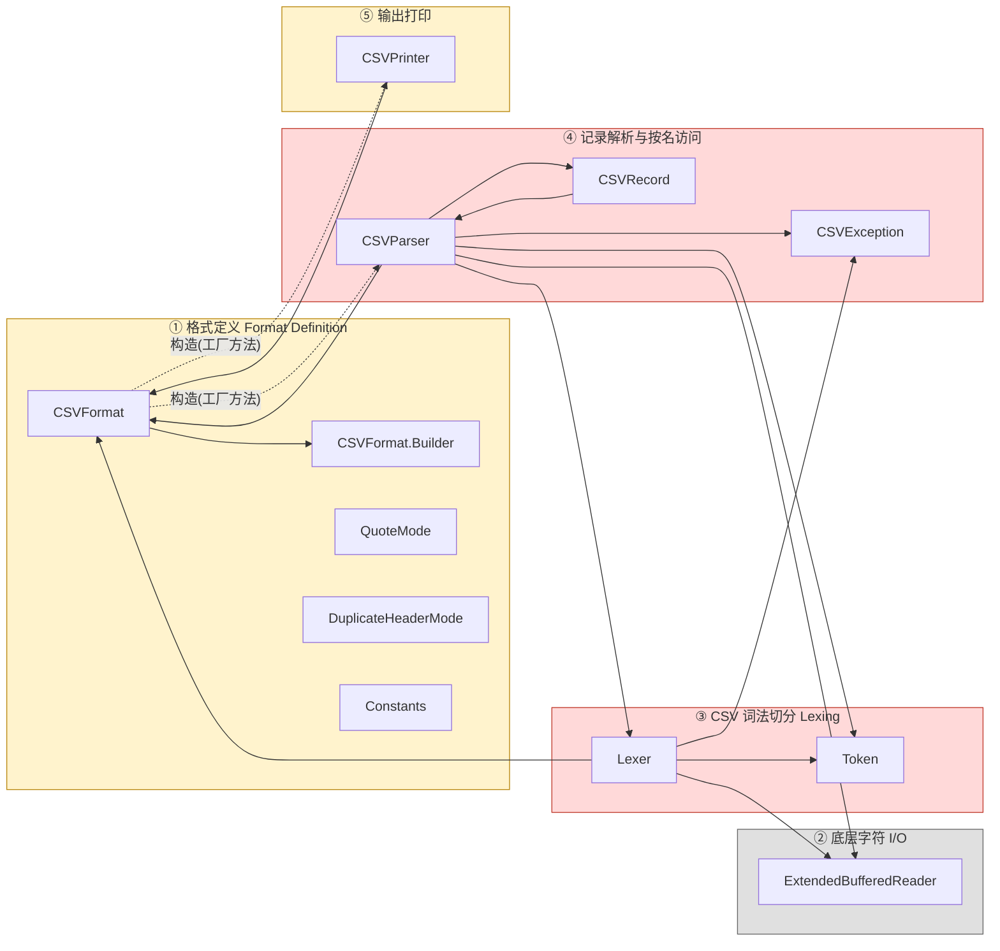
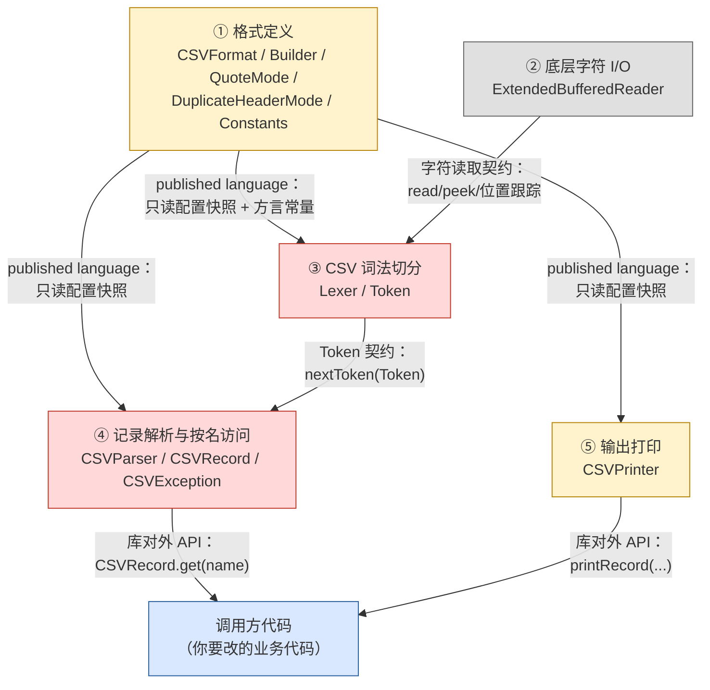
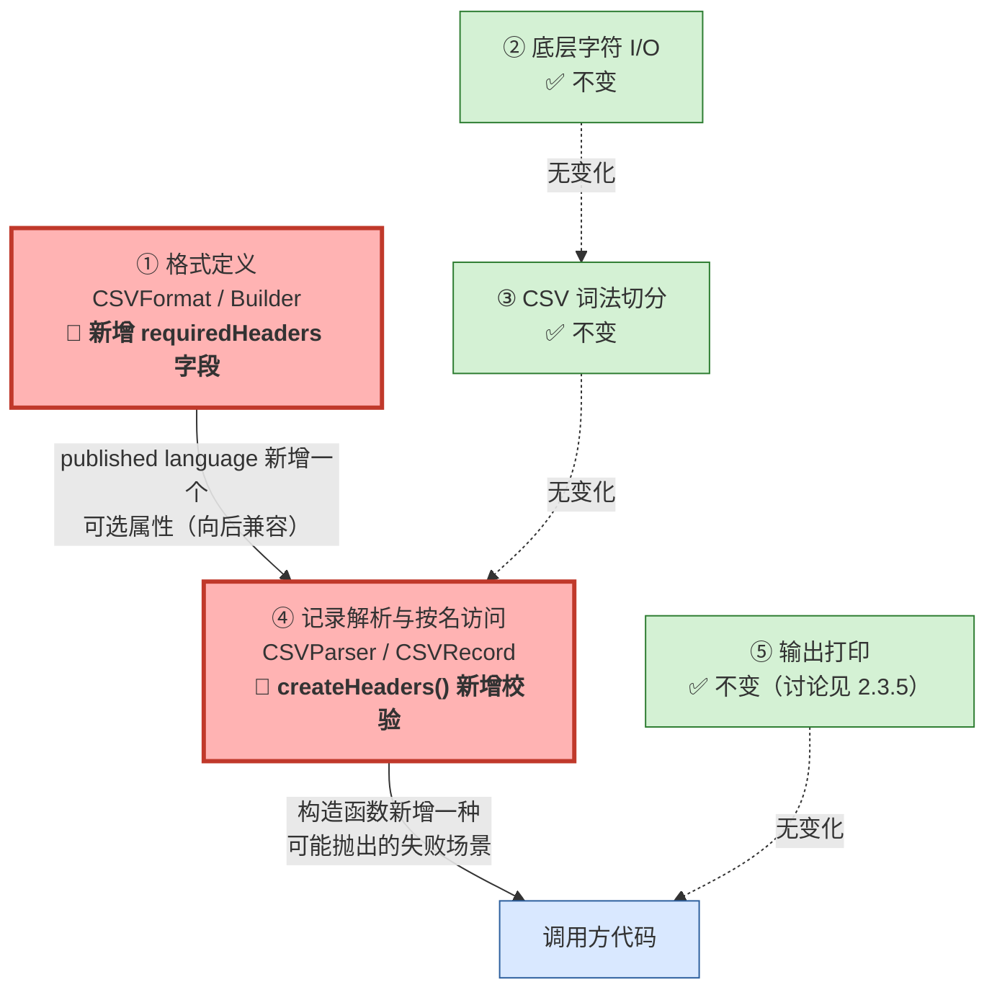
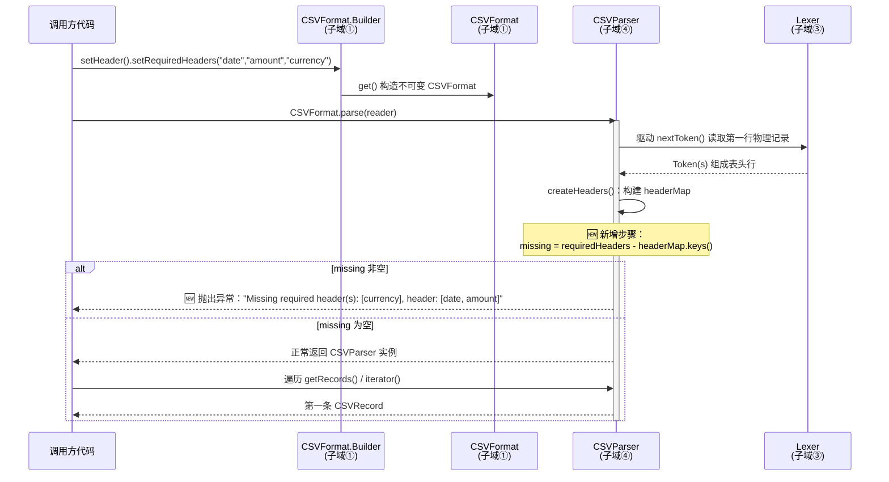

# 第二章 理解代码所承载的复杂业务逻辑

你接手了 `commons-csv` 这个陌生代码库，这个代码库需要你长期维护。最近你需要添加 `required headers` 新需求，你会如何在 Agent 的帮助下快速理解这个项目的软件架构，以便顺利添加新需求？

本章会用 DDD（Domain-Driven Design）的 strategic design 方法，带你走一遍"理解陌生棕地代码库、分清主次、分析新需求影响范围"的完整过程。每一节讲解之后都会给出可以直接复制给你自己的 Agent 的提示词——建议你先自己动手跑一遍，再回来和本章展示的内容对比复盘，看看自己的产出和下面的分析有什么差异、为什么会有差异。

## 2.1 用 DDD 的 strategic design 快速理解陌生代码库并分清主次

**定义**：Strategic Design 是 [《Learning Domain-Driven Design》](https://www.oreilly.com/library/view/learning-domain-driven-design/9781098100124/)（Vlad Khononov 著）第 1～4 章系统阐述的一套分析方法，核心是把一个业务域（business domain）拆解为若干子域（subdomain）——围绕同一批数据、同一批参与者、彼此紧密关联的一组用例集合——再根据"是否提供竞争优势""业务逻辑复杂度""波动性"三个维度，把每个子域归类为核心子域（core subdomain，公司区别于竞争对手的地方，必须自建、持续演进）、通用子域（generic subdomain，所有人都用同样方式做的事，应该买/用现成方案）或支撑子域（supporting subdomain，业务逻辑简单、没有竞争优势、但又没有现成方案可用，只能自建但不需要最优秀的人）。严格意义上的 strategic design 面向的是公司和团队，但这套分析工具同样可以类比映射到一个纯技术性的代码库上——把"库要解决的问题本身"当作业务域，把"这部分代码历史上改动、修 bug 的频率"当作波动性，借此快速建立对陌生代码库的心智模型。

**价值**：对棕地项目维护者来说，strategic design 最直接的价值是把"这个代码库到底哪里重要、哪里不重要"这个判断,从"读代码读得越多、感觉越对"的模糊直觉，变成一套可追溯、可复用的分析方法——识别出哪些类是"牵一发而动全身"的核心业务逻辑，哪些类是"换一个现成方案也无所谓"的边角配置，再据此判断一个新需求真正会落在哪个子域、哪些类，而不是被"这个方法挂在哪个类的 API 上"这个表面现象误导。

**没有它的危害**：没有这套分析工具时，理解一个陌生棕地代码库往往只能靠"从 main 方法或者某个入口类开始，顺着调用链慢慢读下去"，容易把"代码行数多、方法名花哨"误判为"这里很重要"，或者反过来，漏掉一个代码行数很少但真正承载着核心业务规则的类。更危险的是，在拆分新需求的改动范围时，如果没有先划清子域边界，很容易把一个本该只改一两个类的小需求，稀里糊涂地改成牵动好几个不相关模块的大改动——这正是本书第 1.1 节说的"棕地项目返工代价成倍放大"的典型成因之一。

**独特优势**：strategic design 提供了一套**与代码行数无关、只看业务规则复杂度**的分类标准，这恰好是 Agent 辅助编程场景里最容易被忽视的一点——Agent 很擅长"读懂一段代码在语法上做了什么"，但不一定天然具备"这段代码在业务上有多重要"的判断力，而后者恰恰是人在评审 Agent 产出时最该把关的地方。用 strategic design 的框架去追问 Agent（"这个子域提供竞争优势吗？复杂度高不高？"），能逼着 Agent 给出有理由、可追溯的判断，而不是一句笼统的"这个类很重要"。

**主要劣势**：strategic design 原本是为公司和团队设计的分析工具，用在一个单一团队维护的技术库上是一次"方法论改造"——子域之间的协作关系，严格意义上该用 Ch.4《Integrating Bounded Contexts》里"partnership / shared kernel / conformist / anticorruption layer / open-host service"这些描述**不同团队**整合关系的模式来说明，但技术库内部的子域往往生活在同一个 bounded context 里，这些模式在这里只能作比喻使用，不能按字面意义套用，使用时需要明确声明这一点，避免误导读者以为这是严格的教科书式用法。

**适用场景**：接手一个陌生的、体量中等（几十到大几百个类）、职责边界相对清晰的棕地代码库，需要在动手改动之前，先建立起"哪里是核心逻辑、哪里是边角配置"的心智模型；尤其适合在"一个新需求挂在某个支撑子域的 API 上，但真正的业务规则其实该落在核心子域里"这类容易被表面现象误导的场景。

**不适用场景**：代码库体量极小（几个类就能全部读完）、或者本身就是一个"正在开发的 agent 系统"（这种情况下，"子域"这个分析单元本身意义不大，不如直接读代码）；此外，如果团队本身就是多团队协作、跨 bounded context 的大型系统，Ch.4 的整合模式应该按字面意义严格使用，而不是作为比喻。

### 动手练习提示词（可直接复制给你自己的 Agent）

> 请把下面这段任务交给你的 Agent（例如 OpenCode + DeepSeek，或你自己常用的开源 agent 搭配国产大模型）：
>
> "你是一名资深软件架构师，请用 DDD strategic design 的方法分析 [你的目标代码库路径] 这个代码库。请先给出一个类比映射说明——把这个库要解决的问题本身当作业务域，再识别出代码库里的子域（围绕同一批数据、同一批参与者、彼此紧密关联的一组类簇），对每个子域分别判定是 core（提供竞争优势、业务逻辑复杂、需要自建）、generic（所有项目都用同样方式做、应该用现成方案）还是 supporting（业务逻辑简单、没有竞争优势、只能自建但不需要最优秀的人），并给出判定理由。最后画一张子域之间的依赖关系图（用 Mermaid 或 PlantUML），标注哪些子域会被哪些其他子域依赖。"

把你自己代码库的分析结果和下面 2.2 节用 commons-csv 做的示范对比一下——看看你的 Agent 有没有把"代码行数多"误判成"业务逻辑复杂"，这是最容易踩的坑。

## 2.2 识别核心、支撑与通用子域

### 2.2.1 把代码库看作业务域

把 `commons-csv` 当作一个业务域来看，需要先做一次类比映射——这是一次刻意的方法论改造，不是教科书原文：

| DDD 原始概念 | 在 commons-csv 上的类比 |
| --- | --- |
| 业务域（business domain） | "正确、健壮、可定制地读写 CSV 文本"这件事本身 |
| 核心子域的"竞争优势" | 能不能把别人不敢碰、容易出 bug 的脏活累活（怪异引号、转义、EOF、各种方言）做对、做稳 |
| 子域的"复杂度" | 业务规则/边界条件的复杂度，而不是代码行数（`CSVFormat.java` 有 3369 行，但大部分是数据项和文档，逻辑并不复杂——这是"复杂度要看业务逻辑而不是体量"的一个活生生的例子）|
| 子域的"波动性" | 这部分代码历史上改动、修 bug 的频率 |
| "域专家" | RFC 4180 规范、各数据库/工具（Excel、MySQL、PostgreSQL、MongoDB、Informix）自己的 CSV 方言约定，以及 Apache Commons 维护者积累的边界条件知识 |

这个类比映射本身就是后面所有 core/generic/supporting 判断的起点——先承认"这是一次类比，不是字面意义上的 DDD"，后续的分析才站得住脚。

### 2.2.2 用来验证子域边界的端到端测试场景

子域边界应该对应一组内聚的用例集合，而不是凭直觉按文件名硬划。下面是针对 CSV 文件处理的典型端到端场景，用来交叉验证代码依赖关系得出的子域划分是否"讲得通"：

- **S1** 解析一个带表头的 CSV 文件，按列名读取每条记录（典型的对账/数据导入场景）。
- **S2** 解析一个不带表头的 CSV 文件，按列序号读取。
- **S3** 解析带有怪异语法的 CSV（字段内嵌引号、转义字符、注释行、空行、字段内带分隔符）——健壮性场景。
- **S4** 解析 Excel 导出的 CSV（locale 相关分隔符、宽松 EOF、尾部脏数据）。
- **S5** 按某种预定义方言把内存数据写成 CSV 文本。
- **S6** 以流式方式逐条处理一个很大的 CSV 文件，不一次性加载进内存。
- **S7** 解析时发现表头有重复列名或空列名，按配置的策略放行或报错。

本章要新增的 `required headers` 需求——"解析时发现表头缺少约定好的必需列，必须在读第一条记录前就报错"——正是第 8 个场景，留给 2.3 节专门分析。

这 7 个场景分别落在后面识别出的子域上：S1/S2/S6/S7 落在"记录解析与按名访问"；S3/S4 横跨"词法切分"与"记录解析"；S5 落在"输出打印"；S1～S7 全部都要先经过"格式定义"子域来描述方言。子域边界与真实使用场景对齐，不是凭空按文件名分的——这是验证子域划分是否可靠的关键一步，很多人跳过这一步直接凭直觉分类，容易把边界划错。

### 2.2.3 识别核心、支持与通用子域

`commons-csv` 的 package 结构是扁平的单一 package，所以子域边界是在类簇/职责簇粒度上划的。实地核查源码后，得到以下五个子域：

| 子域 | 包含的类 | 职责一句话 |
| --- | --- | --- |
| ① 格式定义 Format Definition | `CSVFormat`、`CSVFormat.Builder`、`QuoteMode`、`DuplicateHeaderMode`、`Constants` | 描述"一份 CSV 长什么样"——分隔符、引号、转义符、表头、重复表头策略等约 25 项配置，外加 11 种预定义方言 |
| ② 底层字符 I/O | `ExtendedBufferedReader` | 带前瞻（peek）、BOM 剥离、位置跟踪的字符读取基础设施，完全不知道"CSV"是什么 |
| ③ CSV 词法切分 Lexing | `Lexer`、`Token` | 按分隔符/引号/转义符/注释符规则，把字符流切分成 Token——真正"读懂 CSV 语法"的地方 |
| ④ 记录解析与按名访问 | `CSVParser`、`CSVRecord`、`CSVException` | 驱动 Lexer 拉取 token 组装成记录，同时构建"列名→列序号"映射表，支持按名访问；重复/空列名怎么处理、大小写是否敏感，全部在这里判定 |
| ⑤ 输出打印 Output Printing | `CSVPrinter` | 把内存数据按格式规则写成 CSV 文本——子域④的逆操作，但逻辑简单得多 |

对照"竞争优势 / 复杂度 / 波动性 / 能否外包"四个维度逐一判定：

| 子域 | 判定 | 判定理由 |
| --- | --- | --- |
| ③ CSV 词法切分 | **Core** | 正确识别带引号字段、转义字符、注释行、怪异 EOF、各种方言的细微差异，是任何 CSV 库"好不好用、靠不靠谱"的分水岭，且不能外包——没有通用的"CSV 词法分析器"库可以简单接进来替代。 |
| ④ 记录解析与按名访问 | **Core** | 表头怎么解析、重复/空列名怎么判、大小写是否敏感、按名访问失败报什么错——这些直接决定库好不好调试、好不好排错，而且正是本次 `required headers` 新需求要改动的地方，印证了"高价值功能的扩展点总是落在核心子域"这条规律。 |
| ① 格式定义 | Supporting | 代码体量最大（3369 行），但本质上是"数据项 + 流式 setter + 11 个预置方言常量"——没有算法，没有不确定性，是"体量大但逻辑简单"的典型反例。 |
| ⑤ 输出打印 | Supporting | 机械地把内存数据套用格式规则写成文本，不需要处理"输入不可信"这种不确定性，复杂度远低于解析方向。 |
| ② 底层字符 I/O | Generic | 带前瞻的缓冲字符读取是一个已经被解决过无数次的问题，没有必要也没有能力在这里"创新"。 |

一个最容易踩的坑：**不要把子域①（格式定义）误判为 core，仅仅因为它文件最大、setter 方法最多**。代码体量和 Builder 模式、11 个预置常量这类"花活"会制造"这里很复杂"的错觉，但真正决定这个库好不好用的，是词法切分和记录解析两处——复杂度要看业务逻辑，不是看代码量。

### 2.2.4 可视化子域内部类之间的依赖关系

```mermaid
graph LR
    subgraph FMT["① 格式定义 Format Definition"]
        CSVFormat
        Builder1["CSVFormat.Builder"]
        QuoteMode
        DuplicateHeaderMode
        Constants
    end
    subgraph IO["② 底层字符 I/O"]
        ExtendedBufferedReader
    end
    subgraph LEX["③ CSV 词法切分 Lexing"]
        Lexer
        Token
    end
    subgraph PARSE["④ 记录解析与按名访问"]
        CSVParser
        CSVRecord
        CSVException
    end
    subgraph PRINT["⑤ 输出打印"]
        CSVPrinter
    end

    CSVFormat --> Builder1
    CSVFormat -. "构造(工厂方法)" .-> CSVParser
    CSVFormat -. "构造(工厂方法)" .-> CSVPrinter
    CSVParser --> CSVFormat
    CSVParser --> Lexer
    CSVParser --> ExtendedBufferedReader
    CSVParser --> Token
    CSVParser --> CSVRecord
    CSVParser --> CSVException
    CSVRecord --> CSVParser
    Lexer --> CSVFormat
    Lexer --> ExtendedBufferedReader
    Lexer --> Token
    Lexer --> CSVException
    CSVPrinter --> CSVFormat

    style FMT fill:#fff3cd,stroke:#b8860b
    style IO fill:#e0e0e0,stroke:#666
    style LEX fill:#ffd9d9,stroke:#c0392b
    style PARSE fill:#ffd9d9,stroke:#c0392b
    style PRINT fill:#fff3cd,stroke:#b8860b
```

红色 = 后面判定为 core 的子域；黄色 = supporting；灰色 = generic。虚线箭头表示"作为工厂方法被动构造"，不是结构性耦合——`CSVFormat` 并不持有对 `CSVParser`/`CSVPrinter` 的引用，只是它们的构造入口之一。

### 2.2.5 可视化子域之间的协作关系

```mermaid
graph TB
    FMT["① 格式定义<br/>CSVFormat / Builder / QuoteMode /<br/>DuplicateHeaderMode / Constants"]
    IO["② 底层字符 I/O<br/>ExtendedBufferedReader"]
    LEX["③ CSV 词法切分<br/>Lexer / Token"]
    PARSE["④ 记录解析与按名访问<br/>CSVParser / CSVRecord / CSVException"]
    PRINT["⑤ 输出打印<br/>CSVPrinter"]

    FMT -- "published language：<br/>只读配置快照 + 方言常量" --> LEX
    FMT -- "published language：<br/>只读配置快照" --> PARSE
    FMT -- "published language：<br/>只读配置快照" --> PRINT
    IO -- "字符读取契约：<br/>read/peek/位置跟踪" --> LEX
    LEX -- "Token 契约：<br/>nextToken(Token)" --> PARSE
    PARSE -- "库对外 API：<br/>CSVRecord.get(name)" --> USER["调用方代码<br/>（你要改的业务代码）"]
    PRINT -- "库对外 API：<br/>printRecord(...)" --> USER

    style FMT fill:#fff3cd,stroke:#b8860b
    style IO fill:#e0e0e0,stroke:#666
    style LEX fill:#ffd9d9,stroke:#c0392b
    style PARSE fill:#ffd9d9,stroke:#c0392b
    style PRINT fill:#fff3cd,stroke:#b8860b
    style USER fill:#d9e8ff,stroke:#2c5f9e
```

**重要澄清**：按 Ch.3/Ch.4 的严格定义，"partnership / shared kernel / conformist / anticorruption layer / open-host service" 描述的是**不同团队、不同 bounded context 之间**的整合关系。而 commons-csv 这 5 个子域实际上都生活在**同一个 bounded context**（同一个 Maven 模块、同一个维护团队、同一个发布版本号）里——这是刻意的单体设计。所以上图里的箭头，外人乍看像是团队间的"整合模式"，拆开来看，其实是**子域内部的调用契约**。但为了帮助建立直觉，可以这样类比着记：

- 子域①（格式定义）像是全局的**shared kernel**——④③⑤ 都依赖它的字段形状，一旦改了字段，三个子域都要重新编译/重新验证。
- 子域④依赖子域②③的方式类似**customer–supplier**里"customer 完全主导，supplier 没有自己的对外契约"——`Lexer`/`ExtendedBufferedReader` 的接口形状完全是为了服务 `CSVParser` 设计的。
- 子域④/⑤对外（面向库使用者）的 `CSVRecord.get(...)` / `printRecord(...)` 才是真正意义上的**open-host service**：这是 commons-csv 对全世界 Java 项目公开的"published language"，任何改动都要考虑向后兼容。

## 2.3 新需求实现的影响分析

有了上面这张子域地图，现在可以正式分析 `required headers` 需求：给 `CSVFormat.Builder` 加一个 `setRequiredHeaders(String...)`，解析时一旦发现表头缺少这些列，就在读第一条记录之前抛出一个清楚说明缺了哪些列的错误，而不是等业务代码调用 `record.get("currency")` 时才报一个语义含糊的"Mapping for currency not found"式的错误。

### 2.3.1 代码现状

表头相关的校验目前已经发生在三个地方，这是理解"新检查该插在哪"的关键背景：

| 校验内容 | 发生在哪个类/方法 | 时机 | 抛出什么 |
| --- | --- | --- | --- |
| 分隔符/引号/转义符/注释符是否互相冲突 | `CSVFormat.validate()`（私有） | `CSVFormat` 对象构造时 | `IllegalArgumentException` |
| 表头数组自身有没有重复名/空名（字面值） | `CSVFormat.validate()` | `CSVFormat` 对象构造时 | `IllegalArgumentException` |
| 表头数组解析自输入流后，真实列名有没有重复/空 | `CSVParser.createHeaders()` | `CSVParser` 构造函数内部，在第一条记录能被拿到之前 | `IllegalArgumentException("The header contains a duplicate name...")` 等 |
| 按列名取值时，该列名是否存在于 `headerMap` | `CSVRecord.get(String)` | 惰性——只有调用方真的执行了 `record.get("currency")` 才触发 | `IllegalArgumentException("Mapping for %s not found, expected one of %s", ...)` |

可以看到：**"缺列"这类问题，今天完全没有专门校验**——`CSVFormat.validate()` 只能校验"声明的表头形状本身"，因为它根本看不到输入数据；真正的缺列问题，只有在业务代码第一次按名取值时才会暴露，且报错信息完全不提"表头出了什么问题"，只说"这个名字找不到"——这正是需求描述里吐槽的体验。

### 2.3.2 需要改动哪些子域

```mermaid
graph TB
    FMT["① 格式定义<br/>CSVFormat / Builder<br/><b>🔧 新增 requiredHeaders 字段</b>"]
    IO["② 底层字符 I/O<br/>✅ 不变"]
    LEX["③ CSV 词法切分<br/>✅ 不变"]
    PARSE["④ 记录解析与按名访问<br/>CSVParser / CSVRecord<br/><b>🔧 createHeaders() 新增校验</b>"]
    PRINT["⑤ 输出打印<br/>✅ 不变（讨论见 2.3.5）"]

    FMT -- "published language 新增一个<br/>可选属性（向后兼容）" --> PARSE
    IO -.->|无变化| LEX
    LEX -.->|无变化| PARSE
    PARSE -- "构造函数新增一种<br/>可能抛出的失败场景" --> USER["调用方代码"]
    PRINT -.->|无变化| USER

    style FMT fill:#ffb3b3,stroke:#c0392b,stroke-width:3px
    style PARSE fill:#ffb3b3,stroke:#c0392b,stroke-width:3px
    style IO fill:#d4f1d4,stroke:#2e7d32
    style LEX fill:#d4f1d4,stroke:#2e7d32
    style PRINT fill:#d4f1d4,stroke:#2e7d32
    style USER fill:#d9e8ff,stroke:#2c5f9e
```

| 子域 | 本次是否触碰 | 说明 |
| --- | --- | --- |
| ① 格式定义 | **是** | 新增 `requiredHeaders` 配置项——典型的"在 supporting 子域里加一个新的数据字段"，没有算法复杂度。 |
| ② 底层字符 I/O | 否 | 这一层完全不知道"表头"这个概念，天然不受影响。 |
| ③ CSV 词法切分 | 否 | `Lexer`/`Token` 只负责切词，不关心列名语义——即使是 core 子域，也不是每个新业务需求都会牵动到它。 |
| ④ 记录解析与按名访问 | **是（改动集中在此）** | `createHeaders()` 正是"headerMap 已经建好、但还没返回给构造函数调用方"的唯一时间点——新增的"缺列即报错"逻辑在语义上和它旁边已有的"重复列名即报错""空列名即报错"逻辑是同一类业务规则。 |
| ⑤ 输出打印 | 否（留有开放问题，见 2.3.5） | 需求本身描述的是"解析"场景，不是"生成"场景。 |

**关键结论**：这次需求虽然名字叫"`CSVFormat.Builder` 加一个方法"，听起来像是子域①的改动，但**真正有业务规则含量的改动其实发生在子域④**——子域①只是新增了一个"运书单"（配置项），子域④才是真正"验货"的地方。不要只看 API 挂在哪个类上，要看校验逻辑该放在哪个子域。

### 2.3.3 需要改动哪些类

| 类 | 子域 | 是否改动 | 具体改动 | 性质 |
| --- | --- | --- | --- | --- |
| `CSVFormat.Builder` | ① | ✅ | 新增字段 `requiredHeaders` + 新方法 `setRequiredHeaders(String...)`（镜像现有 `setHeader(String...)` 的写法） | 纯新增，向后兼容 |
| `CSVFormat` | ① | ✅ | 新增只读字段 + getter；拷贝构造要带上这个字段；`validate()` 里最多做"数组本身非空元素"之类的形状校验 | 纯新增，向后兼容 |
| `CSVParser`（`createHeaders()`） | ④ | ✅ | 在 `headerMap` 构建完毕、返回之前，插入"缺失列检测"逻辑 | 新增校验分支，复用已有机制 |
| `CSVParser`（构造函数/Javadoc） | ④ | ⚠️ 契约变化 | 多了一种可能抛出异常的原因，Javadoc 需要补充说明 | 向后兼容但行为契约扩大了 |
| `CSVRecord` | ④ | ❌ 不改 | `get(String)` 逻辑不用动——required 列本来就保证存在于 `headerMap` | 不变 |
| `Lexer` / `Token` | ③ | ❌ 不改 | 不知道"表头"这个概念 | 不变 |
| `ExtendedBufferedReader` | ② | ❌ 不改 | 同上，更底层 | 不变 |
| `CSVPrinter` | ⑤ | ❌ 不改（见 2.3.5） | 需求范围是"解析"，不是"写出" | 不变 |

### 2.3.4 子域接口变化

和 2.2.5 一致的澄清：commons-csv 的子域①④本质上在同一个 bounded context、同一个团队里，下面这些箭头，字面意义上称不上"跨团队整合模式调整"，充其量只是借用 DDD Ch.4 的词汇，来描述"子域间调用契约"发生了什么变化：

- **子域①（supplier）→ 子域④（customer）**：子域①的 published language 新增了一个**可选**属性 `requiredHeaders`（默认不启用）。这是教科书式的**向后兼容的 open-host-service 式演进**——老的调用方完全不受影响，因为它们消费的字段集合没有减少，只是多了一个它们不关心的新字段。
- **子域④对外（面向库的最终使用者）**：`CSVParser` 的构造/`parse(...)` 系列工厂方法的"失败模式集合"扩大了一项——这是需要写进 Javadoc、写进 CHANGELOG 的契约变化，即使方法签名一字未改。**接口契约不只是方法签名，还包括"这个方法可能因为什么原因失败"**，这是本次分析最值得记住的一条经验。
- **子域②③**：完全在这次变更的影响范围之外。

```mermaid
sequenceDiagram
    participant Caller as 调用方代码
    participant Builder as CSVFormat.Builder<br/>(子域①)
    participant Format as CSVFormat<br/>(子域①)
    participant Parser as CSVParser<br/>(子域④)
    participant Lexer as Lexer<br/>(子域③)

    Caller->>Builder: setHeader().setRequiredHeaders("date","amount","currency")
    Builder->>Format: get() 构造不可变 CSVFormat
    Caller->>Parser: CSVFormat.parse(reader)
    activate Parser
    Parser->>Lexer: 驱动 nextToken() 读取第一行物理记录
    Lexer-->>Parser: Token(s) 组成表头行
    Parser->>Parser: createHeaders()：构建 headerMap
    Note over Parser: 🆕 新增步骤：<br/>missing = requiredHeaders - headerMap.keys()
    alt missing 非空
        Parser-->>Caller: 🆕 抛出异常："Missing required header(s): [currency], header: [date, amount]"
    else missing 为空
        Parser-->>Caller: 正常返回 CSVParser 实例
        Caller->>Parser: 遍历 getRecords() / iterator()
        Parser-->>Caller: 第一条 CSVRecord
    end
    deactivate Parser
```

这张序列图直观地展示了需求里"必须在读第一条记录之前抛出"这句话——因为 `createHeaders()` 是在 `CSVParser` 的构造函数里被**同步**调用的，调用方要拿到 `CSVParser` 实例本身就必须等这一步执行完。只要新校验插在 `createHeaders()` 返回之前，"先于第一条记录报错"这个约束就自动满足，不需要额外设计任何"预读一行再回退"之类的机制。

### 2.3.5 开放设计问题

下面这些问题，分析阶段故意不给"标准答案"——它们会在第三章用决策表的方法逐一裁决：

1. **异常类型**：复用 `IllegalArgumentException`（和现有重复/空表头错误保持风格一致），还是新增一个专门的异常类型，让调用方可以精确 `catch`？
2. **大小写敏感性**：`requiredHeaders` 的比较要不要尊重 `ignoreHeaderCase` 配置？
3. **与 `allowMissingColumnNames` / `DuplicateHeaderMode` 的交互**：如果某一列同时触发"重复列名"和"属于 required 列"，报错顺序和报错内容该怎么组织？
4. **是否该同时约束 `CSVPrinter`（写路径）**：需求原文只提到"解析"场景，但一个对称的 API 设计者可能会问"写的时候要不要对称校验"。
5. **`setHeader()` 两种模式的交互**：自动从首行解析表头 vs 手工指定表头，这两种模式下 `requiredHeaders` 的校验时机和校验对象是否完全一致？

| 维度 | 结论 |
| --- | --- |
| 牵动的子域 | ①格式定义（新增配置项，无算法复杂度）、④记录解析与按名访问（新增校验逻辑，这是真正的"业务逻辑落点"） |
| 不受影响的子域 | ②底层字符 I/O、③CSV 词法切分、⑤输出打印 |
| 子域间接口变化 | ①→④ 的 published language 新增一个可选、向后兼容的属性；④对外的"构造期可能失败的原因集合"扩大 |
| 对本章的意义 | 这是一个"需求挂在 supporting 子域的 API 上，但真正的业务规则要落在 core 子域里实现"的典型棕地改动案例，可以用来检验自己是否真正建立了子域边界的心智模型，而不是只会"在被要求改的那个类里加代码" |

### 动手练习提示词（影响分析）

> "请基于我们刚才识别出的子域地图，分析新增 [你的新需求描述] 会牵动哪些子域、哪些类、子域之间的接口会发生什么变化。请先复述需求、再核查现状（这个校验/行为目前发生在哪里），然后分析哪些子域被触碰、逐类列出改动清单，最后列出需求原文没有明说、需要我现场决定的开放设计问题——不要直接给出这些开放问题的答案，留给我在设计验收测试阶段再裁决。"

把你的产出和 2.3 节的分析对比——尤其关注"开放设计问题"这一节，看看你的 Agent 有没有漏掉某个需求原文没写清楚、但实际核查代码后才会发现的交互点（比如 2.3.5 第 5 条，很多人直接假设两种表头模式行为一致，却懒得去代码里确认）。下一章会把这些开放问题逐一裁决，并用决策表的方法推导出完整的验收测试用例。
