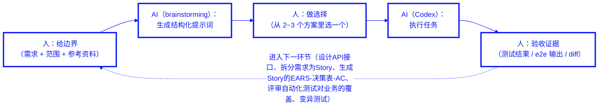
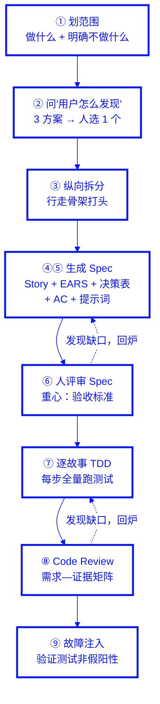

# 第三章 用 AI 拆分并用 Spec + TDD 开发新需求：`Strict Header Schema Validation Mode`

第二章解决的是"看得懂"的问题：从 user guide 的一行示例代码出发，跑通一个真实的端到端测试，画出一张 C4 Dynamic 图，把 commons-csv 处理"解析 Excel 导出 CSV"这条主流程的核心抽象，变成了一张能讲清楚"谁在什么时候调用谁"的心智地图。本章要解决的是"改得动"的问题：往这个已经看懂的棕地代码库里，加一个真正的新功能。

新功能叫 `Strict Header Schema Validation Mode`——严格表头 schema 校验模式。它不复杂，第一版只有三条规则。但正因为它不复杂，它才适合用来把第一章那条方法论链路（拆需求 → 出 spec → TDD 实现 → 频繁跑测试）完整地走一遍，并且把每一步的真实产出、真实的坑、真实的返工全部摊开。

本章有一条贯穿始终的主线，可以叫它**"用魔法打败魔法"**：整章几乎每一个环节，人都不直接写提示词，而是先用 `superpowers:brainstorming` 这个 skill 让 AI **生成一段提示词**，再把生成的提示词复制粘贴给 Codex **执行任务**。人在这个循环里只做三件事——**给边界、做选择、验收证据**。这个模式对国内 token 不自由的开发者尤其重要：提示词写得越结构化、越指向可验证的锚点，Codex 一次调用的命中率就越高，来回纠错的轮次就越少。而"把模糊诉求变成结构化提示词"这件事本身，恰恰是 AI 比人做得更快、更全面的事——那就交给 AI 去做，人只负责判断它做得对不对。



## 3.1 需求背景与范围

### 3.1.1 原始需求：三条规则，和五条"明确不做"

先把需求本身摆出来。`Strict Header Schema Validation Mode` 要解决的问题是：

> 当团队明确知道 CSV 输入应包含哪些列、是否允许额外列、以及列顺序是否重要时，应在解析初始化阶段就进行显式校验，而不是把问题拖到后续业务代码中。

这句话背后是一个非常常见的生产事故模式：CSV 文件从上游系统导出，业务代码按列名取值，某天上游少导了一列、或者调了列顺序，解析阶段一声不吭地过了，等到业务代码里 `record.get("Department")` 抛异常时，可能已经处理了几千行数据、写了一半的库。**校验做得越晚，代价越大**。

第一版只聚焦 3 类规则：

- `requiredHeaders`：声明的列必须出现在输入的表头中；
- `allowUnknownHeaders`：是否允许输入中出现声明之外的额外列；
- `enforceHeaderOrder`：声明的列是否必须按声明的顺序出现。

同时，**明确不做**这五件事：

- header alias / canonical name（表头别名与规范名）
- 列类型校验
- record 行级业务规则
- printer 侧 schema 输出
- 多套 schema profile

这五条"明确不做"，比那三条"要做"更重要。这是整章第一个、也是最容易被忽略的可信性杠杆：**给 AI 划范围的时候，"不做什么"必须和"做什么"写得一样具体**。如果只告诉 AI "实现严格表头校验"，它非常有可能顺手把大小写折叠、别名映射、类型推断一起给你实现了——每一项单独看都很"贴心"，合起来就是一个你没审过、没测过、也没打算维护的公开 API。棕地项目里，多出来的公开 API 是要背一辈子的技术债。

### 3.1.2 第一个问题不是"怎么实现"，而是"用户怎么发现"

需求清楚了，下一步很容易顺手就问 AI"这个功能怎么实现"。但这里有个更靠前的问题：**commons-csv 是一个开源框架，这三条规则是给框架的使用者用的。使用者怎么知道有这个能力？**

如果这个问题不先想清楚，实现出来的东西很可能是"技术上对、产品上没人会用"。所以第一个发给 Codex 的提示词，问的不是实现，而是发现路径和测试路径（为提高阅读体验，本章所有提示词中指向本机具体文件的路径全部省略，改为方括号占位符，下同）：

> 请阅读本书 README（特别留意"目录"中的"第三章"）以及第二章（特别留意其中的端到端测试）。我打算在第三章用 EARS + TDD 开发新需求 `Strict Header Schema Validation Mode`，其描述如下：[粘贴需求描述、三条规则 `requiredHeaders`/`allowUnknownHeaders`/`enforceHeaderOrder`，以及五条"明确不做"]。
>
> 请问：这些新需求该如何添加到第二章"读取 Excel 导出 CSV"的端到端测试中，以便我将来测试？并能方便 commons-csv 用户在使用框架前就了解这些规则？是把规则写进文档给用户看，还是有其他更方便的途径让用户知道？请提供 3 个解决方案及其优劣势供我选择，最后推荐一个并说明理由。

注意这段提示词的三个特征，它们会在本章反复出现：

1. **先给上下文锚点**（第二章的 e2e 测试），而不是凭空提问；
2. **把范围写死**（三条规则 + 五条"明确不做"原样粘贴）；
3. **要求 2~3 个方案 + 优劣势 + 推荐 + 理由**，而不是要一个答案。

第三点是"人做选择"这个环节的载体。AI 给一个答案，人只能接受或拒绝；AI 给三个方案和推荐理由，人才能真正做出有依据的选择——而且 AI 在被迫写出每个方案的劣势时，往往会自己暴露出你没想到的约束。

### 3.1.3 三个方案，和为什么选第三个

Codex 的回答开头一句就把问题重新框定了：**"不要只写文档。"** 文档是必要的解释层，但不应该成为用户发现严格模式的唯一入口。理由很实在：在 Java 生态里，用户通常是从现有代码的 `CSVFormat.EXCEL.builder()` 开始写的，IDE 的自动补全和类型名，是最早、也最贴近决策点的帮助——一个只写在文档里的功能，等于要求用户先知道它存在，才能去查它。

三个方案：

**方案一：只在 user guide 和 Javadoc 里说明。** 改动最小，不新增任何公开类型，适合还不确定 API 是否长期稳定的阶段；但用户在 IDE 里发现不了，三个独立配置没有清晰入口容易漏配，而且文档示例和实现会逐渐漂移。

**方案二：直接在 `CSVFormat.Builder` 上暴露三个 fluent 方法。** 最符合 commons-csv 现有的使用习惯，IDE 补全就是发现入口，第一版示例最短；但三个彼此关联的概念被摊到 `CSVFormat` 这个本已很大的配置面上，组合规则仍要查文档，调用点也看不出这三项设置共同构成了一个"合同"，将来 schema 能力一扩展，builder 会持续膨胀。

**方案三（推荐）：公开一个不可变的 `CSVHeaderSchema` 值对象，由 `CSVFormat.Builder` 用单个 `setHeaderSchema(...)` 显式接入。** 用户在 builder 上看见 `setHeaderSchema`，跳到类型里立刻看见三条规则是一个整体；schema 是"输入表头的合同"，`CSVFormat` 仍然只负责"解析格式"，边界清楚；将来要加诊断对象或 schema profile，不必再往 `CSVFormat.Builder` 里塞更多关联状态。代价是多了一个公开类型、一个 builder、一层对象创建，首版实现和 API review 成本高于方案二，最短示例也多几行。

选方案三。用它写出来的配置代码长这样：

```java
final CSVHeaderSchema employeeSchema = CSVHeaderSchema.builder()
        .setRequiredHeaders("Last Name", "First Name", "Department")
        .setAllowUnknownHeaders(false)
        .setEnforceHeaderOrder(true)
        .get();

final CSVFormat format = CSVFormat.EXCEL.builder()
        .setHeader()
        .setSkipHeaderRecord(true)
        .setHeaderSchema(employeeSchema)
        .get();

try (CSVParser parser = format.parse(in)) {
    // 只有 schema 通过后才会到达这里；随后才遍历 record。
}
```

Codex 把这个选择总结成一条**"四层发现路径"**：IDE 自动补全让用户在开始配置时**发现**能力 → 类型名和 Javadoc 让用户**理解**语义 → 异常信息让用户在出错时拿到**可操作的原因** → e2e 示例给出"对真实 Excel BOM CSV 确实跑得通"的**证据**。这四层里，只有第二层是文档。

顺带说一句：这段代码里的 `CSVHeaderSchema.builder()` 和 `setHeaderSchema` 在此刻**还不存在**——它们只是一份公开 API 的草图。这正是接下来 3.2 到 3.5 节要做的事：先用 User Story 固定"为什么要它"，再用 EARS 和验收标准把它的精确行为钉死，最后才用 TDD 让它长出来。

### 3.1.4 把校验时机和范围一起锁死

在方案三的回答里，Codex 还顺手把两件对后面每一步都起约束作用的事定了下来。

**第一件是校验时机**：校验必须发生在 `CSVFormat` 用 `Reader` 建立 `CSVParser`、**读到表头之后、把 parser 交给调用者之前**。失败时抛出一个能说明违反了哪一项规则的异常，而**不应该**等到 `for (CSVRecord record : parser)` 或 `record.get(...)` 才失败。这一条后来变成了四个 Story 共同的验收锚点——"失败必须发生在 `format.parse(in)`，记录循环一次都不能进"。

**第二件是三条规则的组合语义**，这是整个需求里唯一真正烧脑的地方：

| 规则 | 含义 |
| --- | --- |
| `requiredHeaders` | 每个声明的列名都必须出现在解析到的表头中。未设置 schema 或列表为空时，不额外要求任何列。 |
| `allowUnknownHeaders` | 为 `false` 时，输入中不得有不在 `requiredHeaders` 里的列；为 `true` 时允许它们存在。 |
| `enforceHeaderOrder` | 为 `false` 时，`requiredHeaders` 可按任意顺序出现；为 `true` 时必须按 `requiredHeaders` 的顺序出现。**若同时不允许未知列，实际表头必须与 `requiredHeaders` 完全相等；若允许未知列，未知列可以穿插，但已声明的列必须保持相对顺序。** |

加粗那句话，是本章后面所有麻烦的来源，也是所有价值的来源。"允许未知列穿插、但声明列保持相对顺序"——这句话用自然语言说出来还算清楚，但它有一个极容易踩的实现陷阱：**把"相对顺序"实现成"必须相邻"**。这个陷阱后面会以一条明确的评审判据出现（"若实现把'只要求声明列相对顺序'错误地做成'必须相邻'，应判定为不合格"）。一句自然语言里藏着的一个歧义，需要一整套 EARS + 决策表才能彻底消除——这正是下一节要讲的事。

至于第二章那个 e2e 怎么改：保留原有的 `ParseExcelCsvMain` 和两个成功样本不动，在同一个 `e2e/` 目录旁新增一个专用于严格模式的入口，并且**必须复用第二章那条输入链**：`Files.newInputStream` → `BOMInputStream` → UTF-8 `InputStreamReader`。这点很重要：新测试要验证的是 schema，不是偶然绕开了第二章已经发现的 BOM 问题。

## 3.2 用 EARS 精准表达 User Story

### 3.2.1 传统需求描述的弊端：看得见功能，看不见用户价值

回头看 3.1 节那三条规则：`requiredHeaders`、`allowUnknownHeaders`、`enforceHeaderOrder`。它们是标准的传统需求描述——一条一条列出系统该有什么功能，写得也算清楚。但它有一个致命的缺口：**看不到用户价值**。

"支持 `allowUnknownHeaders` 配置"这句话，回答了"系统能干什么"，但没有回答"谁会因此受益、受益什么、不做会怎样"。这个缺口在 AI 辅助开发里会被急剧放大，因为它直接导致三个后果：

**第一，无法排优先级。** 三条规则并列摆着，看不出先做哪条。如果 AI 一次性把三条全实现了，你就失去了"做完一条、发现价值不够、及时止损"的机会——而这恰恰是 token 不自由时最该保留的机会。

**第二，无法判断"做完了没有"。** "支持 `requiredHeaders`"什么时候算做完？编译通过算吗？有个 setter 算吗？没有用户价值做锚点，完成标准就只能靠人主观拍板——这正是第一章说的"AI 生成的代码看着对、跑不对"的温床。

**第三，容易被 AI 顺手扩大范围。** 一条纯功能描述没有"边界感"。"支持表头校验"这个功能点，天然地会往别名、大小写、类型校验上蔓延。而一句"以便我能采用严格表头校验**而不破坏已知正确的导入**"，则天然地把范围收在了"别把现有的搞坏"上。

补上这个缺口的工具，就是 User Story。

### 3.2.2 User Story

**定义**：User Story（用户故事）是对软件系统特性的一种非正式的、自然语言的描述，从最终用户或系统使用者的视角写成，可以记在索引卡、便利贴上，也可以记在管理软件里。它最常用的模板是所谓 Connextra 模板：

```
As a <role>, I want to <capability>, so that <receive benefit>
作为一个 <角色>，我希望 <能力>，以便 <获得价值>
```

从更本质的角度看，User Story 是一种**边界对象（boundary object）**——它不是给某一方看的文档，而是让业务方、用户和开发者能围着同一张卡片对话的媒介。

**来历**：1997 年，Kent Beck 在底特律的 Chrysler C3 项目上引入了用户故事。1998 年，Alistair Cockburn 造访该项目，留下了那句被引用了二十多年的话——**"A user story is a promise for a conversation."（用户故事是一次对话的承诺。）** 1999 年 Beck 在《Extreme Programming Explained》第一版里把它写进了极限编程的 planning game。2001 年，Ron Jeffries 提出了著名的 "Three Cs" 公式：**Card**（卡片，承载概念的物理载体）、**Conversation**（对话，干系人之间的口头交流）、**Confirmation**（确认，确保对话的目标达成）。同样是 2001 年，伦敦 Connextra 公司的 XP 团队定型了那个 "As a..., I want..., so that..." 的格式并分享给业界——这就是"Connextra 模板"名字的由来（Mike Cohn 说发明者是 Rachel Davies，而 Davies 本人把功劳归给整个团队）。2004 年，Mike Cohn 在《User Stories Applied》里把用户故事的原则推广到卡片之外，这本书被 Martin Fowler 视为该主题的标准参考。2014 年，Jeff Patton 发表了 user-story mapping（用户故事地图）技术，用系统化的方法解决"故事太多太碎、看不到全局"的问题。

**价值**：User Story 把需求的重心从"系统要有什么功能"挪到了"谁因此受益"。研究表明，并没有确凿证据显示用户故事本身能提升软件成功率或开发者生产率；它真正的价值在于**促进 sensemaking（意义建构）而不过度结构化问题**——而这一点被证明与项目成功相关。翻译成本章的语境：它让你在动手之前，被迫想清楚"这一步做完，用户手上多了什么他原来没有的东西"。

**没有它的危害**：就是 3.2.1 节那三条——排不了优先级、判不了完成、拦不住范围蔓延。在 AI 辅助开发里还要再加一条：**AI 会把纯功能描述实现成横向技术任务**。你说"支持表头 schema"，它很可能给你拆成"第一步做值对象、第二步改 builder、第三步改 parser、第四步补文档"——每一步单独完成都无法给使用者带来任何可观察的价值，四步全做完之前你拿不到任何可以验收的东西。这正是 3.3 节要重点对付的问题。

**独特优势**：User Story 的 "so that" 从句是一个**内建的范围过滤器**。任何一条"技术上很合理但说不出 so that 的改动"，都会在写故事的那一刻自己暴露出来。这个过滤器不需要任何工具、任何流程、任何评审会——写不出 so that，就是信号。

**劣势**：Wikipedia 词条把它的局限列得很直白，其中三条对本章尤其关键：

- **规模化困难（Scale-up problem）**：写在小卡片上的故事难以维护，在大项目和分布式团队里尤其麻烦。
- **模糊、非正式、不完整（Vague, informal and incomplete）**：故事卡被定位成"对话的开场白"。正因为非正式，它对多种解释都开放；正因为简短，它不会写出实现一个特性所需的全部细节。**因此故事不适合用来达成正式协议或书写法律合同。**
- **缺少非功能性需求**：性能、响应时间这类细节很少出现在故事里，相应的测试容易被漏掉。

第二条——**模糊、非正式、不完整**——就是本节要解决的核心问题。请回想 3.1.4 节那句"允许未知列穿插、但声明列保持相对顺序"。现在把它塞进一个用户故事里：

> **As a commons-csv user, I want to require declared headers to appear in my schema's order when order matters, so that positional assumptions remain safe while order-insensitive imports still work.**

这个故事把"为什么"说得很好——顺序敏感的消费者需要保护位置假设，顺序不敏感的导入不该被误伤。但它把"是什么"说得**根本不够**：`enforceHeaderOrder=true` 且 `allowUnknownHeaders=true` 时到底是"相对顺序"还是"必须相邻"？`enforceHeaderOrder=true` 且 `allowUnknownHeaders=false` 时是"顺序对就行"还是"列表必须完全相等"？这个故事一个字都没说。

Cockburn 那句"用户故事是一次对话的承诺"在这里显出了它的另一面：**承诺的是对话，不是精确。** 当对话的另一方是坐在你旁边的产品经理时，模糊是可以当场消除的；当对话的另一方是一个会照着字面意思、一次性生成几百行代码的 AI 时，模糊就是缺陷的入口。

**适用场景**：任何需要在动手前想清楚"用户价值是什么"、需要按价值排优先级、需要把大需求切成能独立交付的小增量的场景。它擅长回答"为什么做、为谁做、做完谁受益"，不擅长回答"精确的系统行为是什么"。

于是问题变成：**有没有一种写法，既保留自然语言的可读性，又能把系统行为写到没有歧义？**

### 3.2.3 EARS

**定义**：EARS（Easy Approach to Requirements Syntax，需求语法简易方法）是一种对文本需求进行"温和约束"的机制。它通过一套固定的句型结构和少量关键词，把自然语言需求规范化，使需求作者能写出高质量、结构一致的文本需求，同时保持自然语言对所有干系人的可读性。

从更学术的角度看，EARS 处于"完全自由的自然语言"和"严格形式化规范语言"之间的**中间地带**：保留自然语言，让所有干系人无需专业培训就能阅读和审查；同时施加足够的语法结构，消除最常见的需求缺陷。

**来历**：EARS 由 Alistair Mavin（常被称作 "Mav"）和他在 Rolls-Royce PLC 的同事共同开发。起因很具体：他们在分析某型喷气发动机控制系统的适航法规时，发现原始法规里混杂着高层目标、不同层级的隐式与显式需求、列表、指南和辅助信息，质量参差不齐。在提取和简化这些需求的过程中，Mavin 注意到**所有写得好的需求都遵循相似的底层结构**，并且发现当各个子句始终以相同顺序出现时，需求最容易阅读。这些规律经过反复打磨，演化成了 EARS。

该方法于 **2009 年**首次发表在 IEEE 国际需求工程会议（RE'09）上，此后被 Airbus、Bosch、Dyson、Honeywell、Intel、NASA、Rolls-Royce、Siemens 等蓝筹企业采用，并在中国、法国、德国、瑞典、英国、美国等多国高校开展教学。2019 年，原作者在 *IEEE Software* 上发表《Ten Years of EARS》回顾了十年来的采用与演进。

**Syntax**：EARS 需求的通用句型是：

> **While** \<可选的前置条件\>, **When** \<可选的触发事件\>, the \<系统名称\> **shall** \<系统响应\>

每条 EARS 需求必须包含：零个或多个前置条件、零个或一个触发事件、**恰好一个**系统名称、一个或多个系统响应。由关键词的有无组合出五种基本模式，外加一种复合模式：

| 模式 | 关键词 | 句型 | 例子 |
| --- | --- | --- | --- |
| **Ubiquitous**（普适） | 无 | The \<系统\> **shall** \<响应\> | 移动电话 **shall** 重量不超过 150 克。 |
| **Event-driven**（事件驱动） | **When** | **When** \<触发\>, the \<系统\> **shall** \<响应\> | **When** 用户选择"静音"时，笔记本电脑 **shall** 屏蔽所有音频输出。 |
| **State-driven**（状态驱动） | **While** | **While** \<前置条件\>, the \<系统\> **shall** \<响应\> | **While** ATM 中没有银行卡时，ATM **shall** 显示"请插入银行卡以开始"。 |
| **Optional feature**（可选特性） | **Where** | **Where** \<包含某特性\>, the \<系统\> **shall** \<响应\> | **Where** 汽车配备天窗时，该汽车 **shall** 在驾驶员车门上设置天窗控制面板。 |
| **Unwanted behaviour**（非期望行为） | **If / Then** | **If** \<触发\>, **then** the \<系统\> **shall** \<响应\> | **If** 用户输入了无效的信用卡号，**then** 网站 **shall** 显示"请重新输入信用卡信息"。 |
| **Complex**（复合） | 多个组合 | **While** \<前置\>, **When** \<触发\>, the \<系统\> **shall** \<响应\> | **While** 飞机在地面时，**When** 收到反推力指令时，发动机控制系统 **shall** 启用反推力。 |

**价值**：固定的子句顺序和关键词词汇，**强制作者明确写出触发条件、前置条件和预期响应**，消除自然语言固有的模糊性。同时它极其轻量：关键词贴近日常英语，培训开销极小，不需要任何专用工具——任何文本编辑器都能写。

**没有它的危害**：需求会退回到"读起来顺、想起来通、做起来各人各样"的状态。就本章的例子而言，没有 EARS，`enforceHeaderOrder` 与 `allowUnknownHeaders` 的四种组合就只能靠一句"未知列可穿插，但已声明的列必须保持相对顺序"来承载——而这句话至少可以被实现成三种不同的语义。AI 会在这三种里选一种，你要到 code review 甚至线上才知道它选了哪种。

**独特优势**：有两条对本书的读者特别重要。

第一是**可测性**。条件与响应的结构化分离，使得从需求直接推导测试用例变得简单直接：**前置条件和触发对应测试前提，系统响应对应断言**。一条 EARS 需求本身就是一个测试用例的骨架。这一点是 3.4 节"EARS → 决策表 → 验收标准 → TDD 提示词"这条流水线能跑起来的根本原因。

第二是**天生适合 AI 辅助的规格驱动开发（Spec-Driven Development, SDD）**。SDD 是一种以正式或半正式规格（而非随意提示词）驱动代码生成、测试和文档的方法论。在 SDD 工作流里，EARS 已经成为需求阶段的首选语法，原因就在于**它的约束性自然语言既可被人类阅读，也可被大语言模型解析**。Amazon 于 2025 年发布的智能体 IDE **Kiro** 已把 EARS 作为原生需求标注，其工作流分三阶段：`requirements.md`（开发者输入自然语言意图，Kiro 把它扩展成用户故事，每个故事的验收标准以 EARS 格式书写，显式捕获前置条件、触发事件和预期响应，覆盖开发者往往到实现阶段才会发现的边缘情况）→ `design.md`（生成含架构、时序图和技术栈决策的设计文档）→ `tasks.md`（分解为带依赖追踪的有序任务）。这个趋势反映的正是本书的核心论点：**与"氛围编码"式的自由提示词相比，EARS 格式的规格说明可显著降低 AI 代理做出不良假设的概率。**

顺带一提：本章 3.4 节的做法，和 Kiro 的三阶段工作流高度同构，只不过我们是用 `superpowers:brainstorming` + Codex 这套组合手工搭出来的——好处是它不绑定任何特定 IDE，坏处是每一步都得自己把提示词写对。这也正是"用魔法打败魔法"要解决的事。

**劣势**：

- **前置条件过多时句子冗长**：当一条需求包含超过三个前置条件时，单句 EARS 会变得笨重难读。本章 Story 4 就恰好撞上了这个上限——它有四个变量（`enforceHeaderOrder`、`allowUnknownHeaders`、声明列顺序、未知列穿插），四条 EARS 写下来已经在可读性的边缘。**这正是 3.4 节要额外引入决策表的原因**：EARS 官方建议超过三个前置条件时改用决策表或状态图补充说明，我们照做了。
- **不适合所有表达形式**：某些需求用数学公式、决策表或状态转换图表达更清晰。
- **对非功能性需求支持有限**：那些无法表达为条件行为的非功能需求（如"系统应采用微服务架构"这类架构约束），没有触发事件也没有前置状态，硬套 EARS 句型反而生硬。

**适用场景**：系统级和软件级的功能需求（明确涉及"在什么状态下 / 触发什么事件 / 系统如何响应"）；安全关键系统（航空、汽车、工业控制——EARS 就发源于此）；多国籍多语言团队（结构化模式降低语言障碍，对必须用英语写作但母语非英语的作者尤其有效——这一条对国内团队直接适用）；AI 辅助的规格驱动开发；以及需要直接推导测试用例的场景。

**不适用场景**：前置条件极多的复杂逻辑（改用决策表）；纯数学或算法性需求；纯架构约束类非功能需求；以及——**面向用户价值的敏捷故事**。

最后这条不适用场景，恰恰点出了本节的结论。

### 3.2.4 User Story 负责"为什么"，EARS 负责"是什么"

EARS 的资料里有一句话说得很清楚：**用户故事聚焦"用户价值"而非"系统行为"，两者定位不同，不宜混用；但 EARS 可作为用户故事验收标准的书写规范。**

这就是本章的用法。二者不是替代关系，而是分层关系：

| | User Story | EARS |
| --- | --- | --- |
| 回答的问题 | 为什么做？为谁做？做完谁受益？ | 系统在什么条件下、被什么触发、应该做什么？ |
| 格式 | As a..., I want..., so that... | While..., When..., the \<system\> shall... |
| 强项 | 用户价值、优先级、范围过滤 | 精确、无歧义、可直接推导测试 |
| 弱项 | 模糊、非正式、不完整 | 看不到用户价值；前置条件多时冗长 |
| 在本章的位置 | 3.3 节：拆分的单位 | 3.4 节：每个故事的验收标准 |

用 Story 4 来看这个分层的实际效果。上层是 User Story，负责说清楚为什么：

> **As a commons-csv user, I want to require declared headers to appear in my schema's order when order matters, so that positional assumptions remain safe while order-insensitive imports still work.**
>
> 作为 commons-csv 用户，我希望在顺序重要时要求声明的表头按 schema 的顺序出现，以便位置相关的假设保持安全，同时顺序不敏感的导入仍可工作。

下层是四条 EARS，负责把 3.1.4 节那句藏着歧义的话彻底钉死：

| ID | 中文 |
| --- | --- |
| S4-E1 | **当** `enforceHeaderOrder` 为 `true` 时，**如果**声明的表头未按声明顺序出现，parser **应当**在暴露任何 `CSVRecord` 前失败。 |
| S4-E2 | **当** `enforceHeaderOrder` 为 `false` 时，**如果**所有必填表头均存在但顺序不同，parser **应当**接受该表头行，但仍受其他已启用的 schema 规则约束。 |
| S4-E3 | **当** `enforceHeaderOrder` 和 `allowUnknownHeaders` **都**为 `true` 时，**如果**未知表头穿插在声明的表头之间，parser **应当**仅在声明的表头保持其声明的**相对顺序**时接受该行。 |
| S4-E4 | **当** `enforceHeaderOrder` 为 `true` 且 `allowUnknownHeaders` 为 `false` 时，parser **应当**仅在实际表头列表与声明的表头列表**完全相等**时接受该表头行。 |

对比一下：那句自然语言"未知列可以穿插，但已声明的列必须保持相对顺序"，在 S4-E3 里变成了一个有明确前置条件（两个 flag 都为 true）、明确触发（未知表头穿插）、明确系统响应（仅在保持相对顺序时接受）的句子；而它原本没说清的另一半——"如果不允许未知列呢？"——被 S4-E4 单独接住了，答案是"完全相等"。**四条 EARS 覆盖了四种组合，一个都没漏，而且每一条都能直接翻译成一个测试。**

这就是"用 EARS 精准表达 User Story"的含义：Story 给方向，EARS 给精度。

## 3.3 用 superpowers:brainstorming 把新需求纵向拆成 4 个 User Story

### 3.3.1 为什么不能按"值对象、builder、parser、文档"拆

需求清楚了、表达工具选好了，下一步是拆分。这里有一个几乎所有人（和几乎所有 AI）都会本能地走上去的岔路：**按技术层拆**。

```
第一步：实现 CSVHeaderSchema 值对象
第二步：改 CSVFormat.Builder 加 setHeaderSchema
第三步：改 CSVParser 加校验逻辑
第四步：补 Javadoc 和 user guide
```

这四步看起来井井有条，实际上是一条**横向切分（horizontal slicing）**——每一步都只完成了系统的一层，**单独完成任何一步，commons-csv 的使用者都拿不到任何可观察的价值**。第一步做完，你有一个没人调用的类；第三步做完之前，你连一行能跑的示例都写不出来。更要命的是，你要等到第四步做完，才第一次拿到"这东西到底对不对"的反馈——而那时候四步的代码已经全在树上了，出了问题只能整体回滚。

对 token 不自由的开发者来说，横向切分是最贵的切法：**它把所有的验证成本堆到最后一次性支付。**

正确的切法是**纵向切分（vertical slicing）**：每一刀切下去，都穿透所有技术层，交付一个虽小但完整、可运行、可演示、可测试的用户价值。落到本章，就是每个故事都隐含同一条完成边界：

1. **公开 API**（用户能从 IDE 补全和类型名发现它）；
2. **核心库自动化测试**（未来重构时的回归保护）；
3. **第二章的 Excel BOM CSV 黑盒 e2e**（证明公开 API、依赖、编码处理和 parser 真的串起来可用）；
4. **与该行为同源的 Javadoc / user guide 示例**（防止文档漂移）。

四样齐了，一个故事才算完。

### 3.3.2 让 AI 生成拆分方案

拆分这件事同样不自己拍脑袋，而是继续"给边界 → AI 出方案 → 人做选择"的循环。这次调用 `superpowers:brainstorming`：

> `$superpowers:brainstorming`
>
> 请阅读 e2e 测试视角下的新需求描述 [需求文档]，以及 e2e 测试视角下的新需求测试思路 [方案文档中"公开 `CSVHeaderSchema`，由 `CSVFormat.Builder` 显式接入（推荐）"一节]。
>
> 请帮我把这个新需求做**纵向拆分（vertical slicing）**[参考：拆分用户故事的指南]，拆成若干个 user story [参考：user story 的定义]，以便小步迭代完成整个新需求。请提供 3 个纵向拆分方案及其优劣势供我选择，最后推荐一个并说明推荐理由。每个方案都要用 "as a ..., I want to ..., so that ..." 格式给出 user story，并为每个 story 配一个**揭示用户价值**的标题。

有三个细节值得留意：

- **"纵向拆分"这四个字必须显式写出来**，并且附上参考资料。不写，AI 大概率给你横向切分——因为按技术层拆是训练语料里更常见的写法。
- **"揭示用户价值的标题"这个要求，是一个隐形的质量闸门**。一个横向技术任务是写不出揭示用户价值的标题的——"实现 CSVHeaderSchema 值对象"这个标题里没有任何用户价值。这个要求逼着 AI 自己筛掉横向切法。
- **仍然是 3 个方案 + 优劣势 + 推荐 + 理由**。

### 3.3.3 三个拆分方案

AI 回答的第一段，就把 3.3.1 节那条纪律主动复述了一遍，并且明确点出了不该做什么：

> 为保持每个故事都是纵向切片，下文每条故事都隐含同一完成边界：公开 API、核心库自动化测试、第二章的 Excel BOM CSV 黑盒 e2e，以及与该行为同源的 Javadoc / user guide 示例。**不要将 `CSVHeaderSchema` 值对象、`CSVFormat.Builder` 入口、parser 校验和文档分别拆成技术任务；单独完成它们无法给 commons-csv 使用者带来可观察价值。**

然后给出三个方案：

**方案一：按可独立验证的规则变化切分（推荐）。** 拆分模式是"业务规则变化"。每个故事保留真实 Excel BOM CSV 的完整端到端路径，只增加一个可观察的规则变化。优点是每条都是可运行、可演示、可测试的端到端价值；规则彼此可分别排优先级（做完"缺失列"后可以暂缓"额外列"或"顺序校验"）；故事规模均衡；和需求的三条规则一一对应，读者容易追踪需求、测试和实现之间的关系。缺点是前两条完成时严格模式的保护范围还不完整，而且"额外列"和"顺序"两个故事各自都需要成功、失败两类 e2e fixture。

**方案二：按严格程度阶梯切分。** 拆分模式是"简单 / 复杂"。先让 schema 可用，再逐步把"已知 CSV"升级为完整、可控的输入合同，最后一条是"为演进中的来源放宽合同"。优点是从"声明可用"到"最严格"的叙事直接，适合渐进式教学。缺点是第五条是对前面严格行为的**放宽**，优先级和独立性都不如按规则变化拆；而且"允许未知列"和"忽略顺序"被打包在同一条故事里，粒度不够小。

**方案三：按真实导入场景切分。** 拆分模式是"数据变化"。以不同团队会遇到的 CSV 合同为中心，每条故事交付一个可用的配置场景（"导入固定格式的员工 Excel CSV"、"阻止不完整的员工导入"……）。优点是贴近业务使用者和真实 fixture，e2e 样例容易理解和沟通，成功/失败样本天然可以进用户指南。缺点是**过度绑定 employee / payroll 这个示例，容易掩盖"这是 commons-csv 的通用公共 API"这个事实**；"禁止未知列"这个核心能力不如方案一显性，可能被遗漏或延后。

### 3.3.4 选中方案一：四个故事

选方案一，按 1 → 4 的顺序做。AI 给的推荐理由里有一句话，值得单独拎出来：

> 更重要的是，Product Owner 可以在任一增量后重新排优先级：若业务最在意漏列，可先停在故事 2；若上游经常加列，则优先故事 3；只有位置敏感的消费者才需要故事 4。这正符合"选择能让低价值工作被延后甚至舍弃的拆分"的原则。

**"能让低价值工作被延后甚至舍弃"**——这就是纵向切分对 token 不自由的开发者最直接的价值。四个故事：

| # | 标题（揭示用户价值） | User Story |
| --- | --- | --- |
| 1 | 以 schema 安全解析已知 Excel CSV | As a commons-csv user, I want to attach a declared employee header schema to `CSVFormat` and successfully parse a correct BOM-prefixed Excel CSV, **so that I can adopt strict header validation without breaking known-good imports.** |
| 2 | 在解析开始时发现缺失的必填列 | As a commons-csv user, I want parsing to fail before records are exposed when a declared required header is missing, **so that incomplete files cannot reach downstream business logic.** |
| 3 | 控制额外列是否可接受 | As a commons-csv user, I want to choose whether headers outside my declared schema are allowed, **so that I can either reject unexpected input contracts or tolerate source-system extensions.** |
| 4 | 控制声明列的顺序是否必须一致 | As a commons-csv user, I want to require declared headers to appear in my schema's order when order matters, **so that positional assumptions remain safe while order-insensitive imports still work.** |

留意 Story 1 那个 so that：**"采用严格表头校验而不破坏已知正确的导入"**。它交付的用户价值不是"多了个校验"，而是"你可以放心地打开这个开关"。它的最小 e2e 就是第二章那个已经跑通的 `Employees-by-excel.csv`——带 BOM、三列顺序正确——加上 schema 之后仍然成功读出既有的四条记录。

这是一个非常薄、但非常关键的切片：**它同时证明了公开 API、BOM 输入链和 schema 合同三者可以共同工作。** 用 Alistair Cockburn 的话说，这是一具"walking skeleton"（行走骨架）——它把整条路径先走通，后面三个故事才是在这条已经走通的路径上，每次只加一个可观察的规则变化。

## 3.4 用魔法打败魔法：让 AI 生成 EARS + 决策表 + 验收标准 + 提示词

这是本章的核心一节。

### 3.4.1 一段提示词，六份产出

到这一步，手上有四个用户故事。接下来要做的事，如果全靠人手工写，工作量是这样的：为每个故事写 EARS（Story 4 要写四条，还得保证四种组合不重不漏）、画决策表（Story 4 是五列）、写中英对照的 Gherkin 验收标准（happy path 和 sad path 各一份）、再为每个故事写一段能让 Codex 照着做 TDD 的提示词、外加一段做 code review 的提示词。四个故事乘六份产出，二十四份文档。

一个人认认真真写，一两天。写完还未必自洽——EARS 和决策表对不上、验收标准和 EARS 用词不一致、提示词里漏掉了范围约束，都是极常见的事。

所以这里不写。这里用 `superpowers:brainstorming` **一次性把二十四份产出全生成出来**：

> `$superpowers:brainstorming`
>
> 请阅读：
> - e2e 测试视角下的新需求描述 [需求文档]；
> - e2e 测试视角下的新需求测试思路 [方案文档中"公开 `CSVHeaderSchema`，由 `CSVFormat.Builder` 显式接入（推荐）"一节]；
> - 拆分后的用户故事 [拆分文档中"方案一：按可独立验证的规则变化切分（推荐）"一节]。
>
> 然后为**每个** user story 生成：1）英文标题（揭示用户价值）；2）"as a ..., I want to ..., so that ..." 格式的英文 user story 正文；3）中英对照的 EARS [参考：EARS 的定义与五种句型]；4）决策表 [参考：决策表测试的定义]；5）中英对照的 happy path 和 sad path 验收标准 [参考：验收标准的定义]；6）两段中英对照提示词，分别用 `superpowers:test-driven-development` 和 `superpowers:requesting-code-review` 实现该 story 并完成代码评审，以便复制粘贴给 Codex。要求：TDD 提示词中必须要求遵循上述 EARS、决策表、验收标准；并确保 [源码目录] 下所有自动化测试在新需求实现前后都运行成功。

这段提示词的第 6 点，就是"用魔法打败魔法"最字面的含义：**让 AI 写一段提示词，去驱动 AI 干活。**

### 3.4.2 产出样本：Story 4 的决策表

先看产出质量。挑最难的 Story 4。它的四条 EARS 已经在 3.2.4 节看过了，这里看 EARS 之外的那一半——决策表：

> 声明顺序：`[Last Name, First Name, Department]`。"相对顺序"忽略允许的未知表头。

| 条件 | R1 | R2 | R3 | R4 | R5 |
| --- | ---: | ---: | ---: | ---: | ---: |
| 所有声明列存在 | Y | Y | Y | Y | Y |
| 实际声明列顺序正确 | Y | N | N | Y | Y |
| 存在未知列 | N | N | N | N | Y |
| `enforceHeaderOrder` | true | true | false | true | true |
| `allowUnknownHeaders` | false | false | false | true | true |
| **动作** | | | | | |
| 接受 parser | ✓ | — | ✓ | ✓ | ✓ |
| 在 parser 创建时拒绝 | — | ✓ | — | — | — |
| 要求列表完全相等 | ✓ | ✓ | — | — | — |
| 允许未知列穿插 | — | — | — | — | ✓ |
| 要求声明列相对顺序 | ✓ | ✓ | — | ✓ | ✓ |

这张表干了 EARS 干不了的事。回忆 3.2.3 节 EARS 的劣势：**前置条件超过三个时，单句需求会变得笨重难读**，官方建议改用决策表或状态图补充。Story 4 恰好有四个变量，四条 EARS 已经在可读性边缘。决策表把这四个变量的组合摊成一张二维网格，一眼就能数出来：**五条规则，没有漏，也没有重。**

更重要的是最后两行。"要求列表完全相等"只在 R1/R2（不允许未知列）打勾，"允许未知列穿插"只在 R5 打勾，"要求声明列相对顺序"在 R1/R2/R4/R5 都打勾——**这三行加在一起，就把 3.1.4 节那个"把相对顺序实现成必须相邻"的陷阱，变成了一个可以逐格核对的事实表。** R5 那一列同时勾了"允许未知列穿插"和"要求声明列相对顺序"，它明明白白地说：这两件事**同时**成立，所以"相邻"是错的。

一句自然语言里的歧义，被一张五列的表格彻底解决了。

再看验收标准，同样是 Story 4，happy path 的第二条：

```gherkin
Given a BOM-prefixed employee CSV whose headers are Last Name, Office, First Name, Department
And a schema allowing unknown headers and enforcing header order
When format.parse(in) creates the parser
Then parsing succeeds because the declared headers retain their relative order
```

```gherkin
假如 一个带 BOM 的员工 CSV 的 header 为 Last Name、Office、First Name、Department
并且 一个 schema 允许未知 header 且强制 header 顺序
当 format.parse(in) 创建 parser
那么 解析成功，因为声明 header 保持相对顺序
```

`Office` 被**故意插在 `Last Name` 和 `First Name` 中间**——如果实现要求"相邻"，这条验收标准就会红。决策表的 R5 在这里变成了一个具体的、能跑的、能失败的测试场景。这就是 3.2.3 节说的 EARS 那条独特优势的兑现：**前置条件和触发对应测试前提（Given/When），系统响应对应断言（Then）。**

sad path 那条同样值得看：

```gherkin
假如 Employees-reordered.csv 的 header 为 First Name、Last Name、Department
并且 一个 schema 要求 Last Name、First Name、Department 且 enforceHeaderOrder 设为 true
当 通过 BOM 输入链调用 format.parse(in)
那么 它在暴露任何记录前的 parser 创建期间失败
并且 失败标识顺序违规，但无需锁死完整错误文案
```

最后一句是整份 spec 里最老练的一笔：**"失败标识顺序违规，但无需锁死完整错误文案"**。异常断言只检查稳定的结构化事实（违反了哪条规则、涉及哪个表头），不去锁死整段自然语言的错误信息——错误文案可以演进，测试不该因为改了句措辞就红。这条纪律后来在 3.7 节的评审里被反复引用。

### 3.4.3 最关键的产出：AI 写给 AI 的提示词

上面那些产出（EARS、决策表、验收标准）说到底还是"给人看的规格"。这段提示词真正的核心产出，是第 6 点——**AI 写出来的、准备喂给另一个 AI 的提示词**。看 Story 4 的 TDD 提示词（原文为中英双语，此处取中文版，并把本机路径替换成占位符）：

> 请只实现 [规格文档] 中的 Story 4。编辑前先阅读共同约束，以及 Story 4 的每条 EARS、决策表规则和中英对照验收标准。在 [源码目录] 中工作。
>
> 任何改动前，运行该目录下所有自动化测试并记录通过基线。调用 `superpowers:test-driven-development`。一次创建一个聚焦失败测试，观察目标失败后才写仅足以通过的最小代码。先覆盖强制顺序下声明列重排；再分别驱动 false 分支和"允许未知列时保持相对顺序"的场景。**未观察到对应失败测试前不得写生产代码。**
>
> 实现下列精确语义：强制顺序且禁止未知列时，实际表头必须与声明列表完全相等；允许未知列时它们可穿插，但声明列必须保持相对顺序；关闭强制时，只要其他已启用规则通过，声明列重排可以接受。添加核心测试和第二章 BOM Excel e2e（包括 `Employees-reordered.csv`）。**保持 Stories 1–3 与范围外约束。**
>
> 每个变绿/重构循环后运行相关测试，最后再次运行 [源码目录] 下所有自动化测试。**实现前后均须成功；报告命令及结果。**

拆开看这段提示词的骨架，会发现它有五段，每一段都在关一道闸门：

| 段落 | 作用 | 关的是哪道闸门 |
| --- | --- | --- |
| **① 范围** | "只实现 Story 4"、"先读共同约束和 Story 4 的 EARS/决策表/AC" | 防止 AI 顺手实现别的故事，或自己发明范围外的语义 |
| **② 基线** | "任何改动前，运行所有自动化测试并记录通过基线" | 没有基线，就无法证明"是我改坏的"还是"本来就坏的" |
| **③ TDD 纪律** | "调用 `test-driven-development` skill"、"一次一个聚焦失败测试"、"**未观察到对应失败测试前不得写生产代码**" | 防止 AI 先写实现再补测试——那样的测试只能证明"代码是这么写的"，不能证明"代码是对的" |
| **④ 精确语义** | 把三条组合语义原样重述一遍 | 即使 AI 没认真读规格文档，提示词本身也带着规格 |
| **⑤ 验证** | "每个变绿/重构循环后运行相关测试"、"最后再次全量运行"、"实现前后均须成功"、"**报告命令及结果**" | 把"这段代码是对的"从主观判断变成可复现的证据 |

第③段那句"未观察到对应失败测试前不得写生产代码"，是第二章 2.1.2 节讲过的 Superpowers 说服心理学杠杆的直接体现——它是一条**权威框定**的强指令。而第⑤段的"报告命令及结果"则是**承诺框定**：让 AI 先承诺要报告证据，它就更倾向于真的去跑那些命令，而不是编一个"测试都通过了"。

这五段结构，就是本章要提炼的提示词模式。3.9 节会把它做成模板。

### 3.4.4 为什么这个模式省 token

回到本书的核心约束：token 不自由。这个模式贵不贵？

表面上看，它多了一次调用——本来可以直接让 Codex "实现严格表头校验"，现在先花一次调用生成规格和提示词，再花一次调用执行。多了一倍。

但实际账不是这么算的。**直接让 Codex 实现，第一次生成的代码里，那四种 flag 组合它会自己挑一种实现**——挑对的概率不到四分之一（因为"相邻 vs 相对顺序"这个陷阱本身就是反直觉的）。挑错了，你要么在 code review 时发现（那时候四个故事的代码已经全在树上，改动面很大），要么在线上发现。无论哪种，返工的 token 成本都远超一次生成规格的成本。

更关键的是**规格是可复用的**。3.4 节生成的这一份文档，在后面被反复引用了至少五次：Story 1–4 的四次 TDD 实现各引用一次（"请只实现其中的 Story N"）、3.7 节的 code review 引用它作为评审清单、3.8 节的故障注入引用它作为映射基准。**一次生成，六次使用。** 平摊下来，它是本章最便宜的一次调用。

这就是"用魔法打败魔法"的经济学：**用一次结构化的生成，换掉多次非结构化的纠错。**

## 3.5 人工评审 spec：验收标准是评审重心

规格生成出来了，二十四份产出，读起来很专业。这时候有一个巨大的诱惑：**直接开干。**

请不要。这一节要说的事只有一件：**AI 生成的 spec 必须过人的眼，而验收标准是评审的重心。**

原因很直接。EARS、决策表、验收标准这三样里，EARS 是给人读的、决策表是给人核对的，**只有验收标准会变成测试**。测试是最终唯一能自动、反复、无情地把关的东西。验收标准写错了，测试就写错了；测试写错了，后面所有的"全量测试通过"都是自欺欺人。

### 3.5.1 评审清单：四问

**第一问：决策表的组合穷尽了吗？**

数一数变量个数，算一下理论组合数，再数一数表里的列数。Story 4 有四个变量，理论上要考虑的组合远不止五种，但决策表只列了五列——那么问：**剩下的组合去哪了？** 有些是被"所有声明列存在"这一行统一固定为 Y 而排除的（缺列属于 Story 2 的范围），有些是等价类合并的结果。这些"为什么可以不列"的理由，必须在评审时被说出来，而不是默认。

一个具体的检查动作：**每一列都问一句"这一列对应哪条 EARS？"**，每一条 EARS 都问一句"它对应哪几列？"。对不上的，就是缺口。

**第二问：每条验收标准都能直接变成一个会失败的测试吗？**

拿起每一条 Gherkin，问三个问题：Given 里的前提，我能构造出来吗（有没有对应的 fixture）？When 里的动作，是一个具体的、可调用的方法吗？Then 里的断言，是可观察的事实，还是需要人主观判断？

反例长这样：`Then 解析行为符合预期`——这句话没法写成断言。正例是本章那句：`Then 它在暴露任何记录前的 parser 创建期间失败`——"在暴露任何记录前"可以用一个计数器断言为 0，"parser 创建期间"可以用 `assertThrows` 包住 `format.parse(in)` 这一行。**可观察、可断言、能失败**，三条缺一不可。

**第三问：范围外的事，写死了吗？**

3.1.1 节那五条"明确不做"，在生成的 spec 里有没有原样出现？本章这份 spec 的"共同约束"里写着：

> 第一版不新增 header alias / canonical name、名称规范化或大小写折叠、列类型、record 行级业务规则、printer schema 输出、多 schema profile；既有重复 header 策略保持不变。

这段话必须逐条对照原始需求核一遍。**AI 在扩写规格时最容易犯的错，不是漏掉要做的，而是悄悄补上不该做的**——它会觉得"顺便支持一下大小写不敏感，用户会很开心"。

**第四问：术语唯一吗？**

同一个概念，在 EARS、决策表、验收标准、提示词里，是不是用了同一个词？本章这份 spec 的开头专门有一段术语声明：

> "声明列（declared headers）"指 `requiredHeaders`；"未知列（unknown headers）"指输入表头中不在该列表中的列。

这不是形式主义。当 spec 里同时出现"required headers"、"declared headers"、"schema headers"三种说法时，AI 读完会认为它们**可能是三个不同的东西**，然后在实现里体现出这种混乱。

### 3.5.2 这次实操跳过了这一步，代价是什么

坦白说：本章的实操，这一步被跳过了。规格生成出来之后，直接进入了 3.6 节的 TDD 实现。

代价在 3.7 节兑现——那里查出了一个 **Critical 级别的缺陷**：当用户开启 `CSVFormat.Builder#setIgnoreHeaderCase(true)` 时，顺序校验读的是 `headerMap.keySet()`，而这个 map 在 `ignoreHeaderCase` 打开时是一个**大小写不敏感的 `TreeMap`**——`TreeMap` 的迭代顺序是**字典序**，不是输入表头的物理顺序。结果是：一个顺序完全正确的表头 `Last Name,First Name,Department`，会被按字典序迭代成 `Department,First Name,Last Name`，然后在强制顺序模式下被**误判为顺序违规而拒绝**。反过来，表头匹配也变成了大小写不敏感的，这与规格里"精确的声明表头合同"直接冲突。

这个缺陷不是实现能力问题，是**规格缺口问题**。回头用第一问和第三问核一遍就知道：

- **第一问（组合穷尽）**：Story 4 的决策表有四个变量，但 `ignoreHeaderCase` 这个**既有的、会与新规则交互的配置项**，一列都没有。它是 commons-csv 早就存在的公开配置，新的 schema 校验必然要和它交互——这是棕地项目的典型特征：**新功能的组合空间，不只包括新功能自己的参数，还包括它会碰到的所有既有配置。**
- **第三问（范围外写死）**：spec 的共同约束里写了"不新增名称规范化或大小写折叠"。但"不新增"回答的是"我不主动做这件事"，没有回答"如果用户已经开着既有的 `ignoreHeaderCase`，schema 校验该怎么办"。**"不做"和"不受影响"是两件事**，这份 spec 只说了前者。

如果 3.5 这一步没被跳过，一个人拿着第一问和第三问逐条核对，很可能会问出那句关键的话：**"`ignoreHeaderCase` 已经存在，它和 `enforceHeaderOrder` 撞上会怎样？"** 问出这句话，决策表就会多两列，验收标准就会多两条，TDD 阶段就会有一个红灯先亮起来——而不是等到 3.7 节，由一个独立的评审 Agent 从生产代码里把它挖出来，再单独走一轮 `receiving-code-review` 去修。

**在 spec 阶段问一句话的成本，和在 code review 阶段修一个 Critical 的成本，差着一个数量级。**

### 3.5.3 下次：用魔法打败魔法，让 AI 来评审 spec

那么问题来了：既然这一步这么容易被跳过，怎么让它别被跳过？

答案还是这一章的主线——**下次在这里也"用魔法打败魔法"，即用 AI 辅助评审 spec**。这一步完全可以做成一段提示词，交给一个**独立的、没参与过生成**的 AI 会话去跑：

> 请阅读 [规格文档] 和 [原始需求文档]。你的任务不是实现它，而是**评审它**。请按下面四个维度逐条检查，每发现一个问题就给出：问题所在的具体位置、为什么它是问题、以及最小的修补建议：
>
> 1. **组合完整性**：列出每个 Story 决策表里的全部变量，算出理论组合数，逐条说明未列入的组合为何可以排除。**特别检查：目标代码库中是否存在会与本次新规则交互的既有公开配置项？如果有，它们与新规则的组合是否在决策表里出现过？**
> 2. **可测性**：逐条检查验收标准，指出哪些 Given 缺少可构造的 fixture、哪些 When 不是可调用的具体方法、哪些 Then 是无法断言的主观描述。
> 3. **范围守卫**：把原始需求里"明确不做"的每一条，与规格里的共同约束逐条比对。**对每一条"不做"，追问一句：它是"不主动新增"，还是"完全不受影响"？如果目标代码库里已经存在相关能力，规格是否说清了新规则遇到它时的行为？**
> 4. **术语一致性**：列出规格里指代同一概念的所有不同措辞，并给出统一建议。
>
> 请按 Critical / Important / Minor 分级报告，并明确指出哪些问题如果不修，会直接导致 AI 在实现阶段做出错误假设。

第 1 条和第 3 条里加粗的那两句追问，正是为了逮住 `ignoreHeaderCase` 这类缺陷而设计的：**它们把评审的视线从"规格自身是否自洽"，扩展到了"规格与既有代码库的交界处是否有黑洞"**——而棕地项目的缺陷，绝大多数就藏在这个交界处。第 3 条那句"它是'不主动新增'，还是'完全不受影响'？"更是直接命中了本次那个缺口的成因。

这一步值不值得多花一次调用？用 3.4.4 节的账算一下：一次 spec 评审调用，对比一次 Critical 缺陷的完整代价——`requesting-code-review` 派独立 Agent 读累计 diff、生成需求—证据矩阵、定位根因、写整改建议，再加一整轮 `receiving-code-review` 的 TDD 修复和多次全量回归。**前者是后者的零头。**

本章后面会诚实地把这个代价完整展示出来（3.7 节），因为**踩过的坑本身就是这本书最有价值的素材**。但读者不必陪着踩：在 3.4 和 3.6 之间，加一次 spec 评审。

## 3.6 用 superpowers:test-driven-development 逐个实现四个 Story

规格有了，四段 TDD 提示词也有了。这一节的工作方式非常机械：**打开 Codex，粘贴 Story N 的 TDD 提示词，等它跑完，验收证据，进入 Story N+1。** 人不写代码，也不写提示词——提示词是 3.4 节 AI 生成的。

下面是四个故事的真实过程，坑一个没删。

### 3.6.1 Story 1：走通骨架，和一个第二章的老朋友

Story 1 是那具"行走骨架"：给一个**已经能正确解析**的 BOM Excel CSV 加上 schema，让它**仍然**能正确解析。听起来什么都没干，实际上它要求 `CSVHeaderSchema`、`CSVFormat.Builder#setHeaderSchema`、`CSVParser` 的校验挂载点、以及第二章那条 BOM 输入链，四者同时到位。

Codex 的执行序列：

1. **先跑基线**：`mvn test`，结果是 **924 个测试通过、0 failures、0 errors、11 skipped**。这个数字后面会一路被追踪。
2. **先写红灯**：在 `CSVParserTest` 里加 `testAttachedHeaderSchemaAllowsKnownGoodHeaders()`，它用的是**尚不存在**的 `CSVHeaderSchema` 和 `CSVFormat.Builder#setHeaderSchema(CSVHeaderSchema)`。跑这个测试，**编译失败**——红灯。（编译失败也是合法的红灯：它精确地失败于"目标 API 缺失"这个原因。）
3. **最小实现变绿**：新增公开 final 类 `CSVHeaderSchema`，含构造器、三个访问器，用**防御性复制 + 不可修改 List** 保证不可变；在 `CSVFormat.Builder` 加 `setHeaderSchema(...)`，在 `CSVFormat` 加 `headerSchema` 字段和 `getHeaderSchema()`。这里有个容易漏的细节：**必须在 `Builder(CSVFormat)` 和 `CSVFormat(Builder)` 两个复制路径里都保留该字段**，否则 `CSVFormat#builder()` 一复制，schema 就丢了。绿灯。
4. **补不可变性测试**：`CSVHeaderSchemaTest#testSchemaIsImmutableAndAttachedToFormat()`——验证**修改传入的原始列表不会影响 schema**、`getRequiredHeaders()` 返回的列表不可修改、两个 flag 值正确、schema 能从 `CSVFormat#getHeaderSchema()` 取回。
5. **值相等性**：加 `testSchemasWithEqualValuesAreEqual()`，先跑，**观察到失败**（此时还是身份比较），再实现 `equals` / `hashCode`，绿。
6. **回归保护**：加 `CSVParserTest#testNoHeaderSchemaRetainsAutomaticHeaderBehaviour()`——不调用 `setHeaderSchema` 时，第二章那套 `.setHeader().setSkipHeaderRecord(true)` 的既有解析方式必须**原样工作**。这条对应 EARS 的 S1-E3，是整个新功能对棕地代码库的"不伤害承诺"。
7. **一个 AI 自己发现的坑**：Codex 注意到 `CSVFormat` 本身**是可序列化的**，而新加的字段类型 `CSVHeaderSchema` 还不可序列化——这会让 `CSVFormat` 的序列化在运行时炸掉。于是加 `testSchemaIsSerializableForCSVFormatCompatibility()`，先观察失败，再让 `CSVHeaderSchema` 实现 `Serializable` 并加 `serialVersionUID`，绿。**这个坑不在任何一条 EARS 里**，是 AI 读现有代码读出来的——这正是第二章说的 Codex "理解-生成一体化闭环"的价值：它读得懂 `CSVFormat` 的既有契约。
8. **e2e**：新增 `ParseExcelCsvWithSchemaMain#main(String[])` 和带 BOM 的 `Employees-by-excel.csv`，严格复用第二章那条链路：`Files.newInputStream` → `BOMInputStream.builder().setInputStream(...).get()` → `InputStreamReader(..., UTF_8)`。用本机构建的 jar 跑，输出 `records=4`。
9. **收尾全量**：`mvn -Drat.skip=true test` → **929 个测试通过**，0 failures，0 errors，11 skipped。

924 → 929，多了 5 个测试；e2e 输出 `records=4`。Story 1 交付。

那个 `-Drat.skip=true` 是第二章的老朋友：commons-csv 绑了 `apache-rat-plugin`（Apache 许可证头检查），`e2e/` 下那些一次性的 `.java` 和 `.csv` 没有 License 头，默认会把构建拦在 `UNAPPROVED` 文件数超限上。解决方式和第二章一样——构建参数跳过，不碰 repo 的 `pom.xml`。**这个决定在 3.7 节会被评审 Agent 拎出来算账**，那是后话。

手工跑一遍 e2e 的完整命令（macOS + iTerm2，OpenJDK 25 + Maven 3.9.16）：

```bash
cd [源码目录]

# 构建本次源码生成的 JAR。e2e/ 是一次性验证文件，没有 ASF License 头，故跳过 RAT。
mvn -q -DskipTests -Drat.skip=true package

# 生成运行时依赖 classpath（commons-csv 的 jar 不是 fat jar，第二章踩过这个坑）。
CP_FILE=/tmp/commons-csv-e2e-cp.txt
mvn -q dependency:build-classpath -Dmdep.outputFile="$CP_FILE" -DincludeScope=runtime
CP="$(cat "$CP_FILE")"

# 用刚才本机构建的 JAR 编译并运行 e2e main 类。
cd e2e
javac -cp "../target/commons-csv-1.14.2-SNAPSHOT.jar:$CP" ParseExcelCsvWithSchemaMain.java
java  -cp ".:../target/commons-csv-1.14.2-SNAPSHOT.jar:$CP" \
  ParseExcelCsvWithSchemaMain Employees-by-excel.csv
```

预期最后一行：

```text
records=4
```

### 3.6.2 Story 2：第一个真正的红灯

Story 2 要的是：缺了必填列，**在 `format.parse(in)` 就失败，记录循环一次都不能进**。

这次的红灯是教科书级的。Codex 先在 `CSVHeaderSchemaTest` 里加 `testMissingRequiredHeaderFailsDuringParserConstruction()`——用一个缺了 `Department` 的 CSV 调用 `CSVFormat#parse(Reader)`，断言**构造期**抛出 `IllegalArgumentException`，且异常文本包含稳定事实 `Department`。跑：

```
Expected java.lang.IllegalArgumentException to be thrown, but nothing was thrown.
```

**这就是 TDD 里最有价值的一行输出。** 它证明了两件事：第一，这个测试确实在测一个当前不存在的行为；第二，它失败的原因**正是**目标行为缺失，而不是编译错误、不是 fixture 路径写错、不是别的什么。Superpowers 的 `test-driven-development` skill 里那句 "### Verify RED - Watch It Fail" 后面跟着 "**MANDATORY. Never skip.**"，要的就是这一行。

变绿的实现极小：在 `CSVParser#createHeaders()` 返回 `Headers` 之前，调用一个新的私有方法 `validateRequiredHeaders(Map<String, Integer>)`。这个方法先读 `format.getHeaderSchema()`，**没有 schema 就直接返回**（保留旧行为，对应 S1-E3）；有 schema 就收集所有不在 header map 里的声明列，非空时抛 `IllegalArgumentException`，异常里带上缺失列表。

e2e 这边新增 `Employees-missing-department.csv`（带 BOM、故意没有 `Department`）和 `ParseExcelCsvMissingDepartmentMain.java`。这个入口有个巧妙的设计：它用一个**计数器**证明循环没进过——`for (CSVRecord record : parser)` 里的 `records` 计数最后必须为 `0`。输出：

```text
missing=Department records=0
```

`records=0` 这四个字符，就是"记录循环一次都没进"的可观察证据。

这里还有一个人与 AI 的交互值得记录。Codex 第一次跑 `mvn test` 时被 RAT 拦住，它没有自作主张改 `pom.xml`，而是**停下来问**：

> 是否批准最小设计，并在 Apache RAT 阻止普通 `mvn test` 后，是否使用 `mvn -Drat.skip=true test` 作为自动化测试命令？

回复是一个词：`approved.`

这就是"人做选择"这个环节的实际形态——**AI 遇到需要产品决策或工程约定的岔路口时停下来问，人一个词就能决策。** 这比事后发现它偷偷改了 `pom.xml` 要便宜得多。

全量：**930 个测试通过**，0 failures，0 errors，11 skipped，`BUILD SUCCESS`。929 → 930。

### 3.6.3 Story 3：一个开关的两个分支

Story 3 要的是 `allowUnknownHeaders` 的两个分支：`false` 时拒绝并标识未知列，`true` 时接受。

TDD 提示词里有一句关键约束：**"先写并观察一个聚焦失败测试：当 `allowUnknownHeaders` 为 `false` 时出现 `Office` header；仅随后写最小生产代码。继续以独立的 `true` 测试完成 red–green–refactor。"** 注意"**独立的** `true` 测试"——两个分支要分两轮红绿，不能一次写俩测试再一次实现俩分支。**一次一个红灯，是 TDD 最容易被偷懒省掉、也是最不该省的纪律。**

- 基线：930 通过。
- 红：`testAttachedHeaderSchemaRejectsUnknownHeaderWhenUnknownHeadersAreDisallowed()`——`format.parse(...)` 什么都没抛，失败。
- 绿：在 `validateRequiredHeaders` 里，**在 Story 2 的缺失列校验成功之后**，检查 `getAllowUnknownHeaders()`；为 `false` 时扫描解析到的表头，遇到未声明的就抛 `IllegalArgumentException("Unknown header: " + header)`。七行代码。
- 再来一轮：`testAttachedHeaderSchemaAllowsUnknownHeaderWhenUnknownHeadersAreAllowed()`，用同样的 `Office` 输入，验证能读到记录。
- e2e：`Employees-with-office.csv`（四条记录 + `Office` 列 + BOM）和 `ParseExcelCsvUnknownHeaderMain.java`，一个 main 跑两种模式：

```bash
java -cp "..." ParseExcelCsvUnknownHeaderMain Employees-with-office.csv false
# unknown-header=Office;records=0

java -cp "..." ParseExcelCsvUnknownHeaderMain Employees-with-office.csv true
# records=4
```

- 全量：**932 个测试通过**。930 → 932。

Codex 在这一步还留了一句很克制的话：它**没有重构**，理由是"这七行校验已经足够局部、避开了顺序逻辑、也没有值得提取的重复"。**该重构才重构，不为了走完流程而重构**——这是 YAGNI 在 refactor 阶段的体现。

### 3.6.4 Story 4：撞出一个回归，然后被全量测试当场抓住

Story 4 是最难的：四个变量、五条决策规则、四条 EARS。它也是本节最有价值的一段。

前半段很顺：

- 基线通过后，Codex **先提设计再动手**：在 `validateRequiredHeaders` 里做顺序校验；不允许未知列时要求**列表完全相等**；允许未知列时把声明列当作**有序子序列（ordered subsequence）**处理；关闭强制时保持顺序不敏感。然后问："请批准这个设计和用 `-Drat.skip=true` 作为通过基线。"回复：`approved`。
- **红 1**：`testReorderedDeclaredHeadersFailDuringParserConstructionWhenOrderIsEnforced` —— `Expected java.lang.IllegalArgumentException to be thrown, but nothing was thrown.`
- **绿 1**：`enforceHeaderOrder=true` 且 `allowUnknownHeaders=false` 时，实际表头列表与声明列表不等就抛 `IllegalArgumentException("Header order violation")`。
- 加 `testReorderedDeclaredHeadersAreAcceptedWhenOrderIsNotEnforced`——**它不用改任何生产代码就直接绿了**。这不是白写：它证明了"关闭强制"这个分支确实保持顺序不敏感，把一个隐含行为变成了显式的回归保护。
- **红 2**：`testReorderedDeclaredHeadersFailWhenUnknownHeadersAreAllowedAndOrderIsEnforced` —— 如期失败，原因是"**允许未知列**这件事，之前顺手把**允许声明列重排**也一起允许了"。这正是决策表 R4/R5 那两列要防的事。
- **绿 2**：为 `enforceHeaderOrder=true` + `allowUnknownHeaders=true` 这个分支加**有序子序列**校验——忽略未知列名，但要求每个声明列匹配下一个声明位置。这就是 3.4.2 节说的"相对顺序而非相邻"的实现落点。
- 加 `testUnknownHeadersMayBeInterspersedWhenDeclaredHeadersRetainTheirOrder`，`CSVHeaderSchemaTest` 全类 8 个测试通过。

然后，跑全量的时候，事情发生了：

> 全量运行暴露出一个 **Story 3 的回归**：`CSVParserTest#testAttachedHeaderSchemaRejectsUnknownHeaderWhenUnknownHeadersAreDisallowed` 失败了。**完全相等校验跑到了既有的未知列校验前面**，所以一个带 `Office` 列的输入不再报告 `Office`，而是先撞上了"列表不相等"这条。

看清楚发生了什么：Story 4 的新校验逻辑，**在语义上是对的**——`Office` 确实让实际列表不等于声明列表，拒绝没错。但它**把错误原因给换了**。Story 3 的规格明确要求"失败应标识意外 header（`Office`）"，现在异常里只剩"列表不相等"，用户拿到的诊断信息退化了。

这是一个非常典型的棕地回归：**不是功能坏了，是契约坏了。** 而且它极其隐蔽——如果只跑 Story 4 相关的测试，全绿；只有 Story 3 那条几十行外的老测试会红。

修复只有一行的位移：把"完全相等"这条检查**移到未知列循环之后**。Story 3 的回归测试和 Story 4 的 8 个核心测试同时通过。

**这一段就是"频繁跑测试"这条方法论的完整兑现。** 提示词里那句"最后再次运行所有自动化测试；实现前后均须成功"，在这里发挥了它全部的价值：如果 Codex 只跑了自己新写的测试就宣布完成，这个回归会一路溜到 code review，甚至溜到线上。**AI 不会因为"这次应该没问题"就跳过全量测试——只要提示词里写了它必须跑，并且必须报告命令和结果。**

Story 4 的 e2e 一次跑三个场景：

```bash
cd e2e
javac -cp "../target/commons-csv-1.14.2-SNAPSHOT.jar:$CP" ParseExcelCsvHeaderOrderMain.java

# AC-S4-S1：强制顺序时，重排的表头在记录暴露前被拒。
java -cp ".:../target/commons-csv-1.14.2-SNAPSHOT.jar:$CP" \
  ParseExcelCsvHeaderOrderMain Employees-reordered.csv false true true

# AC-S4-H1：关闭强制时，重排的声明列被接受。
java -cp ".:../target/commons-csv-1.14.2-SNAPSHOT.jar:$CP" \
  ParseExcelCsvHeaderOrderMain Employees-reordered.csv false false false

# AC-S4-H2：允许未知列穿插时，只要声明列保持相对顺序就接受。
java -cp ".:../target/commons-csv-1.14.2-SNAPSHOT.jar:$CP" \
  ParseExcelCsvHeaderOrderMain Employees-with-interspersed-office.csv true true false
```

依次输出：

```text
header-order-violation;records=0
records=4
records=4
```

第三行那个 `records=4`，用的是 `Employees-with-interspersed-office.csv`——`Office` 插在声明列中间。它跑绿，就是"没有把相对顺序实现成必须相邻"的证据。

四个故事的账：

| Story | 基线 → 收尾 | e2e 证据 |
| --- | --- | --- |
| 1 | 924 → 929 | `records=4` |
| 2 | 929 → 930 | `missing=Department records=0` |
| 3 | 930 → 932 | `unknown-header=Office;records=0` / `records=4` |
| 4 | 932 → 全绿 | `header-order-violation;records=0` / `records=4` / `records=4` |

每一格都是可复现的证据，不是"我觉得应该对了"。

## 3.7 用 Superpowers 做 Code Review：请求评审 + 接收评审

四个故事都绿了，e2e 都跑出了预期输出。可以合并了吗？

不能。这一节要证明的是：**"全量测试通过"和"这个实现是对的"，是两件不同的事。**

### 3.7.1 还是用魔法打败魔法：先让 AI 生成评审提示词

3.4 节其实已经为每个故事各生成了一段 `requesting-code-review` 提示词。但四个故事现在已经全部实现完了，四段分开的评审提示词得合并成一段——而且评审的重点要变。于是再来一次 brainstorming：

> `$superpowers:brainstorming`
>
> 请阅读 spec 文件 [规格文档]，然后把其中 4 个 story 各自的"代码评审提示词"**合并成一段**（因为 4 个 story 都已经用 TDD 实现了，需要用一段提示词来评审全部实现），合并后的提示词也需要中英对照。
>
> 评审的重点（当然其他 code review 常见的评审点也需要包含）是：**上述源码目录下的测试代码，是否完全覆盖了 spec 中 4 个 story 各自的"决策表"和"验收标准"**。
>
> 请给出一份清单，让我能清楚地知道 4 个 story 各自的决策表和验收标准，分别被哪些自动化测试（**需要细化到测试类名和测试方法名**）和手工 e2e 测试所覆盖。若没有覆盖，则需要标注出来，并给出整改建议。

注意这里换了评审重心。常规 code review 问的是"这段代码写得好不好"；这段提示词问的是——**"这些测试到底测到了 spec 里的哪几条？哪几条根本没人测？"**

理由很朴素：到这一步，代码的正确性完全押在测试上。**如果测试没覆盖到 spec 的某一条，那一条就等于从来没被验证过**——无论全量测试有多绿。

### 3.7.2 需求—证据矩阵：四档判定

生成出来的评审提示词里，最有价值的是这一段设计：

> 为每一条决策表规则和验收标准建立"需求—证据"矩阵。每一行必须写出直接覆盖它的自动化测试**类名和方法名**；另行写出每个可运行的手工 e2e 入口、fixture、参数和预期可观察结果。将每一行分类为：**(1) 自动化直接覆盖、(2) 仅手工 e2e 覆盖、(3) 仅间接覆盖、(4) 未覆盖。手工 e2e 程序不等于自动化覆盖。** 对类别 2–4 的每一行，给出最小且具体的整改方案。

这四档判定是这一节最重要的产出。特别是第 (2) 档——**"仅手工 e2e 覆盖"**。

这一档为什么重要？因为它精准地捅破了一层窗户纸。本章前面那些漂亮的 e2e 输出——`records=4`、`missing=Department records=0`、`header-order-violation;records=0`——它们是**证据**，但它们**不是回归保护**。它们躺在 `e2e/` 目录里，不在 Maven 的 source root 下，`pom.xml` 里没有任何 Failsafe 配置或 exec 插件会去调它们。换句话说：**`mvn test` 根本不会跑它们。CI 也不会。它们只在有人手工敲那几行 `javac` + `java` 的时候才跑。**

而 spec 里那些验收标准，恰恰把"带 BOM 的 fixture"、"四条记录"、"循环未进入"这些条件写死了。核心 JUnit 测试用的是内存里的字符串、一条记录、没有 BOM——它们覆盖了**规则**，但没有覆盖**验收标准的字面要求**。

评审提示词里还加了另外两条硬判据，都是从 spec 里直接翻出来的：

- **"若实现把'只要求声明列相对顺序'错误地做成'必须相邻'，应判定为不合格。"**（对应 3.1.4 节那个陷阱。）
- **"不得仅因存在手工 e2e 就声称覆盖完整；给出最终结论前，必须列出全部缺口及其精确整改方案。"**（这是一条**反自我安慰**的指令。）

### 3.7.3 评审结论：Request changes

把这段提示词喂给 Codex，让它调用 `superpowers:requesting-code-review`。这个 skill 会做一件关键的事：**派遣一个独立的评审 Agent**，取得故事开始前的 base SHA 与当前 HEAD SHA，**基于真实的累计 diff 评审，而不是读实现摘要。**（第二章 2.1.2 节讲过，这是在人为制造一个"权威角色"——一个没参与过实现、没有沉没成本、只对 spec 负责的评审者。）

结论：

> **Request changes — not ready to merge.**（要求修改——尚不可合并。）核心的成功/失败路径有可用的单元测试覆盖，但完整的 Maven 构建目前卡在 RAT 关口，每一条 BOM e2e 验收标准都是手工而非自动化的，并且**当使用 `CSVFormat.Builder#setIgnoreHeaderCase(true)` 时，表头顺序校验是错的**。

四个 Story 全绿、五个 e2e 全部输出预期结果之后，评审结论是"不可合并"。

**Critical（1 条）——顺序校验用了一个迭代顺序未必是输入表头顺序的 map：**

> `CSVParser.java` 在 `ignoreHeaderCase` 打开时创建了一个大小写不敏感的 `TreeMap`，而顺序校验读的是 `headerMap.keySet()`。一个顺序正确的物理表头 `Last Name,First Name,Department` 会被按**字典序**迭代，从而在强制顺序下被**拒绝**。反过来，map 的成员判断变成了大小写不敏感的，这与规格要求的精确声明表头合同相悖。
>
> **修复**：把解析到的物理 `headerRecord`/`headerNames` **序列**传给 schema 校验，用这个序列做精确名称匹配和顺序判断；`headerMap` 仅保留其查找用途。

这就是 3.5.2 节说的那个缺陷。它的根因不在实现——`CSVParser` 里那个 `TreeMap` 是既有代码，`ignoreHeaderCase` 是既有公开配置，新校验挂上去时读了手边最方便的那个数据结构。**根因在规格：没有一条 EARS、没有一列决策表、没有一句共同约束提过 `ignoreHeaderCase`。** AI 没有做错任何被要求的事；它只是在一个规格没有覆盖的交界处，做了一个合理但错误的假设。

**Important（4 条）**，挑三条最有意思的：

1. **完全相等校验会悄悄接受重复表头。** 代码拿声明列表和 `new ArrayList<>(headerMap.keySet())` 比。commons-csv 既有的 `DuplicateHeaderMode.ALLOW_ALL` 允许重复表头，而 map **会把重复列折叠掉**——于是 `Last Name,First Name,Department,Department` 这种输入，折叠后看起来"完全相等"，被接受了，而 Story 4 的 R1/R2 要求的是**实际列表**相等。这是同一个根因（用 map 而不是物理序列）的第二个症状。
2. **BOM e2e 程序不是可重复的自动化验收测试。** `e2e/` 在 Maven source root 之外，`pom.xml` 只为普通测试配了 Surefire，没有 e2e source root、没有 Failsafe execution、也没有调用这些 main 的任何配置。因此 `mvn test` 根本无法走那条 `Files.newInputStream → BOMInputStream → UTF-8 InputStreamReader` 的路径。**手工 e2e 是证据，不是自动化覆盖。**
3. **决策表 R4 完全没有直接的自动化测试。** 没有任何一个测试构造"精确声明列表 + `allowUnknownHeaders=true` + `enforceHeaderOrder=true`"并断言接受。现有的严格成功用例用的是 `allowUnknownHeaders=false`，穿插用例用的是有未知列的场景。**R4 这个 flag 组合从未被证明过。**

第 3 条尤其值得停一下。R4 就摆在决策表里，白纸黑字五列之一。TDD 走了完整的红绿重构，四个故事全绿。**但那一列，从头到尾没人测过。** 这就是"需求—证据矩阵"存在的全部意义——**没有这张矩阵，没人会发现一列决策表被静默跳过了。**

另外，`mvn test` 因为 RAT 报 `Unexpected count for UNAPPROVED … Count: 9` 而在测试执行前就失败——这就是 3.6.1 节埋下的账。评审 Agent 的判词很冷静：**"这使得一次正常的 Maven 测试运行无法是绿的。"** 一个需要加特殊参数才能跑绿的构建，等于把"绿"这个信号的可信度打了折。

### 3.7.4 receiving-code-review：不是照单全收，是先划范围

拿到评审报告，下一步不是让 AI "把这些都修了"。这里 Superpowers 有一个专门的 skill：`superpowers:receiving-code-review`，它的定位很有意思——**"接收代码评审反馈时使用，尤其是反馈不清楚或技术上可疑时；它要求技术上的严谨和验证，而不是表演式的同意或盲目实施。"**

所以还是先 brainstorming 生成修复提示词，而且**人在这一步做了一个明确的范围决策**：

> 请阅读 requesting-code-review 报告 [评审报告]，然后为我生成一段英文提示词，用于 `superpowers:receiving-code-review` 来修复源码中发现的严重问题。要求：
>
> 1. 用 `superpowers:test-driven-development` 来修复所有 code review 中发现的下述代码问题。
> 2. 修复报告中的 **"Critical"** 问题。
> 3. 修复"需求—证据矩阵"中所有 **"(2) 仅手工 e2e 覆盖"** 和 **"(4) 未覆盖"** 的问题。
> 4. **每修复一个问题，都要全量运行 `src/test` 下的自动化测试**，无须运行 e2e 手工测试。
> 5. 若全量测试发现失败，**要依据 spec 分析问题出在生产代码还是测试代码，并做合理改动，不要仅仅为了让测试通过而修改生产代码。**

第 5 点是这段提示词的灵魂，也是 `receiving-code-review` 这个 skill 的精神所在。**"不要仅仅为了让测试通过而修改生产代码"**——这句话防的是 AI 最擅长的一种堕落：测试红了，把断言改松，绿了。

生成出来的提示词把这条纪律展开得更狠：

> 如果任何全量运行失败，**停下来**，对照规范分析失败原因，再改任何东西。**明确判定**是生产代码错了、测试错了或过时了、还是测试的 setup/期望错了。对负责的那一侧做最小的、有正当理由的修正。**绝不为了让测试通过而修改生产代码，也绝不为了拿到绿灯而削弱一条正确的、源自规范的断言。**

同时，提示词把范围钉死了：**"只修列出的项。不要修、不要为之重构、也不要把范围扩大到任何其他 Critical、Important、Minor、merge-gate、RAT、生成文件或手工 e2e 的发现，除非它是某个已列出修复的不可避免的直接后果。"** 报告里的 Important 有 4 条、Minor 有 3 条，这次只修 Critical + 矩阵里的 (2) 和 (4)。**评审报告不是待办清单，是信息；范围是人定的。**

执行过程：

1. **先定位，再动手**：Codex 查 `CSVParser#createHeaders` 和 `validateRequiredHeaders`，发现 parser **本来就已经**在 `headerNames` 里保存了物理表头顺序，只是校验用的是 `headerMap.keySet()`。评审说的一点没错。
2. **先写红灯，三个**：在改任何生产代码之前，加三个开着 `ignoreHeaderCase` 的回归测试——精确大小写且顺序正确的**应接受**、重排的**应拒绝**、大小写变体的**应拒绝**。
3. **观察红灯**：跑第一个，`IllegalArgumentException: Header order violation`——**一个顺序完全正确的表头被拒了**。评审报告里的文字描述，变成了一行可复现的失败输出。
4. **变绿**：改 `createHeaders` 和 `validateRequiredHeaders`，让必填列成员判断、未知列检查、完全相等比较、相对顺序检查**全部走物理 `headerNames` 序列**；`headerMap` 原封不动，继续只管名称到索引的查找。`CSVHeaderSchemaTest` 11 个测试通过。
5. **把手工 e2e 变成自动化**：新增 `CSVHeaderSchemaBomIntegrationTest`，保留那条 `Files.newInputStream` → `BOMInputStream` → UTF-8 `InputStreamReader` 的必需链路，直接复用 `e2e/` 下既有的 BOM fixture，四个方法一一对应四条验收标准：`parsesBomExcelWithStrictSchemaAndFourRecords`（AC-S1-H1 / AC-S2-H1）、`rejectsMissingDepartmentBeforeIteration`（AC-S2-S1）、`rejectsUnknownOfficeBeforeIteration`（AC-S3-H1）、`allowsUnknownOfficeAndReadsFourRecords`（AC-S3-S1）。
6. **一个小坑**：第一个 BOM 测试编译失败——**项目 target 的是 Java 8，`Path.of` 用不了**。改成 `Paths.get`，**生产代码一行没动**。这是"分清是测试的问题还是生产代码的问题"的一个微型示范。
7. **补 R4**：加 `testOrderedKnownHeadersAreAcceptedWhenUnknownHeadersAreAllowed`。它**一次就绿了**——说明生产代码的行为本来就是对的，只是从来没人证明过。**"它一次就绿"不等于"这个测试白写"**：在此之前，R4 是一格空白；在此之后，它是一条回归保护。

最终：**944 个测试通过**，0 failures，0 errors，11 skipped。

Codex 最后还老老实实列了一份**"刻意未动的评审发现"**清单：重复表头的专门测试、RAT 整改、`e2e/` 下被误提交的 `.class` 文件、null 声明列策略、顺序诊断信息的语义 token 增强，以及其余矩阵和 merge-gate 发现。并且诚实地补了一句：改用物理表头校验之后，严格比较**顺带**能看见重复的物理表头了，但**没有**加专门的重复测试，也没有做更广的整改。

**这份"没做什么"的清单，和"做了什么"的清单同样重要。** 它让下一个人（可能就是三个月后的你自己）知道：这些债是明知故欠的，不是漏掉的。

## 3.8 故障注入测试：验证测试不是"假阳性"

944 个测试通过。Critical 修了。矩阵的缺口补了。现在可以合并了吗？

还有最后一个问题，而且是最狠的一个：**这 944 个测试，真的测到东西了吗？**

这不是抬杠。一个测试通过，只证明"当前实现在这个输入下的行为，符合断言"。它**不能**证明"如果实现写错了，这个断言会红"。一个断言写松了的测试、一个 mock 掉了被测逻辑的测试、一个只断言"没抛异常"的测试——它们都会稳定地绿，而且**永远都绿**，因为它们什么也没测。这种测试有个名字：**假阳性（false positive）**。它比没有测试更危险，因为它提供的是虚假的安全感。

区分真测试和假测试，只有一个可靠办法：**故意把生产代码改坏，看测试红不红。** 这就是故障注入测试（fault injection testing，本质上是 mutation testing 的手工版）。

### 3.8.1 让 AI 生成故障注入的提示词

老规矩，brainstorming：

> `$superpowers:brainstorming`
>
> 请按照下面的要求生成一段英文提示词，以便我复制粘贴到 Codex，用 superpowers 的相关 skill 针对下述两次提交之间新增的自动化测试进行"故障注入测试"：
>
> 请阅读本机 commons-csv 项目某分支上从提交 A 到提交 B 之间新增的所有自动化测试源代码（不含手工 e2e 测试），然后：
>
> 1. 用 `mvn clean test` 运行所有自动化测试，记录结果。
> 2. 参考 spec 文档中 4 个 story 各自的**决策表**和**验收标准**，梳理一张对照表，映射决策表/验收标准与新增自动化测试的关系，并在表的最后一列新增**"故障注入测试"**列：该列包含"**若让该行所对应的自动化测试运行失败，则应在相应的生产代码注入最典型的故障的具体步骤和期望的出错信息**"，以便验证相关自动化测试的断言确实覆盖了生产代码的业务逻辑，而不是什么也测不到的"假阳性"测试。
> 3. 按照该列的描述，**逐一**进行故障注入：先在生产代码中注入故障，运行相应测试，检查是否**如期失败**；然后清除故障注入，再次运行，看测试是否**又成功**。之后按时间顺序生成执行报告。
> 4. 执行完毕后，源代码应**恢复到最初状态**，即再次 `mvn clean test`，结果应与第 1 步一致。

生成出来的提示词，最见功力的不是流程，是**安全前置条件**：

> 1. 只在 commons-csv 项目目录里做源码检查、临时故障注入和 Maven 执行。
> 2. 确认检出的分支和 HEAD 完全正确（否则解释原因并停止）。
> 3. 在运行测试或修改任何东西之前，运行 `git status --short`。**如果它有任何输出，立即停止。** 报告输出并请用户清理或明确处理工作树。**不要 stash、丢弃、覆盖、暂存、提交、amend、rebase、切分支，或以任何方式碰已有的改动。**
> 4. 所有故障注入必须是局部的、最小的、可逆的编辑。**绝不把故障留在树上**；每个用例之后，用最小的反向补丁恢复原始字节，并用 `git diff --check` 和 `git status --short` 验证。
>
> **不要使用 `git reset --hard` 或 `git checkout --` 这类破坏性 Git 命令。**

这段的分量，在于它认清了一件事：**你正在授权一个 AI 故意破坏你的生产代码，然后指望它自己收拾干净。** 一个脏的工作树 + 一个"顺手清理一下"的 AI = 你没提交的改动没了。所以"脏树立即停止"、"禁用破坏性命令"、"每次注入后用反向补丁精确恢复并验证"这三条，一条都不能少。

还有一条对"什么算成功的故障注入"的定义，同样关键：

> 验证测试因**预期的语义原因**失败。**编译失败、测试发现失败、基础设施失败、超时、无关的失败、或另一个测试的失败，都不算成功的故障注入。** 如果出现意外行为，遵循 `superpowers:systematic-debugging`，在不扩大改动的前提下诊断，恢复工作树，并把该用例报告为**不确定或受阻**，而不是宣称覆盖成功。

以及对"该注入什么故障"的约束：

> 选择一个**应该被该测试的目标断言捕获**的缺陷：例如绕过 schema 挂载、省略某条必填表头校验分支、放行未知表头、关闭声明表头顺序比较、把校验挪到记录暴露之后、或者从异常里删掉缺失/未知/违规表头的细节。**不要注入与被测行为无关的表面故障（比如随便抛个异常、语法错误、或者改测试本身）。**

"不要改测试本身"——这条防的是最愚蠢也最容易发生的作弊：把测试改坏，它当然红。

### 3.8.2 三次真变异，全部被杀死

基线：`mvn -Drat.skip=true test`，退出码 0，**944 个测试，0 failures，0 errors，11 skipped**。工作树干净。

映射表列了 8 类测试/规则。实际执行了 3 次语义变异：

**第一次（必填表头校验）**：把 `CSVParser.java` 里那行 `validateRequiredHeaders(...)` 调用注释掉——**一行删除**。跑 `-Dtest=CSVHeaderSchemaTest#testMissingRequiredHeaderFailsDuringParserConstruction`：

```
退出码 1；期望 IllegalArgumentException，但 "nothing was thrown"。
```

如期红。用反向补丁精确恢复，`git diff --check` 和 `git status --short` 干净，重跑目标测试，退出码 0，通过。

**第二次（未知表头拒绝）**：把 `if (!headerSchema.getAllowUnknownHeaders())` 改成 `if (false && !headerSchema.getAllowUnknownHeaders())`——**让整个未知列分支永不执行**。跑 `-Dtest=CSVParserTest#testAttachedHeaderSchemaRejectsUnknownHeaderWhenUnknownHeadersAreDisallowed`：

```
退出码 1；检查 Office 的断言失败：expected: <true> but was: <false>。
```

如期红。恢复、重跑、绿。

**第三次（声明表头顺序）**：把严格顺序条件改成 `if (false && headerSchema.getEnforceHeaderOrder() ...)`。跑 `-Dtest=CSVHeaderSchemaTest#testReorderedDeclaredHeadersFailDuringParserConstructionWhenOrderIsEnforced`：

```
退出码 1；期望 IllegalArgumentException，但未抛出。
```

如期红。恢复、重跑、绿。

三次变异分别打在三个最关键的语义控制点上：**必填表头校验、未知表头拒绝、声明表头顺序约束**。每次只改一个生产逻辑条件或一次调用；目标测试都因为**符合预期的业务语义**而失败，而不是因为编译、测试发现、基础设施或其他无关原因失败。恢复原代码后，同一目标测试又重新通过——**因此这些失败可以被归因于植入的缺陷本身。**

用报告里那句话总结：

> 这比"全套测试绿色"更有说服力：它证明**至少这三类典型回归——省略必填校验、绕过未知列限制、关闭顺序限制——会被现有测试及时拦截。**

### 3.8.3 五类"未独立执行"，和一份不吹的报告

映射表 8 行，只执行了 3 行。剩下 5 行怎么办？

报告的处理方式是本节最值得学的地方：**如实标注"未独立执行"，并逐条说明原因，绝不包装成成功。**

| 未执行的行 | 报告给出的原因 |
| --- | --- |
| S1 正向解析（`records=4`） | **正向断言对"跳过校验"这个变异不敏感**：把校验删了，一个本来就合法的输入照样解析成功，测试照样绿。这类断言无法可靠杀死此变异。 |
| S1 无 schema 时的旧行为 | 该缺陷位于本次新增的 schema 逻辑之外。 |
| S1 API 约束（不可变/序列化/相等性） | 属于**结构性变异**，要动防御性复制或可变性，可能波及较广的 API 行为；为避免非隔离的生产代码改动，未安全执行。 |
| S3 允许未知列的正向路径 | 与已执行的 S3 负向变异**打在同一个策略分支**上，重复。 |
| S4 大小写语义 | 该变异与 parser 的比较实现**重叠**。 |

第一行那条理由，值得所有人抄下来：**"正向断言不具变异敏感性。"**

这是故障注入测试给出的一个反直觉但极其重要的洞见：**一个只断言"成功路径成功了"的测试，几乎杀不死任何变异。** 因为绝大多数"少做了某件事"的缺陷（漏了校验、跳过了检查、少了个分支），恰恰会让成功路径**更容易**成功。3.6.1 节 Story 1 那个漂亮的 `records=4`，在变异测试的显微镜下，几乎测不到严格模式的任何东西——它证明的是"schema 没把好的输入搞坏"，这是它的全部价值，也是它的全部边界。

**真正杀死变异的，永远是 sad path。** 这也反过来解释了 3.4 节那份 spec 为什么给每个故事都强制配了 happy path 和 sad path 两类验收标准，以及 TDD 提示词里为什么专门写了 "**YOU MUST implement BOTH the happy path and sad path acceptance criteria in TDD**"。

报告的结论分层写得很干净：

> 本报告的结论应分层阅读：**三项为直接的"变异被杀死"证据；五项为常规测试或间接覆盖证据，仍值得保留，但缺少对其所提议变异的直接实测。报告没有把这些未执行项包装成成功结果，避免了虚假的覆盖率信心。**

最终验证：所有恢复完成后，`mvn -Drat.skip=true test` 退出码 0、**944 个测试、0 failures、0 errors、11 skipped**，与基线**完全一致**；`git diff --check` 干净、`git diff` 为空、`git status --short` 为空。**临时注入的故障没有一个遗留在工作树里；最终的回归结果反映的是恢复后的原始实现，而不是被变异污染的状态。**

三次注入、五次如实存疑、一次完整还原。这就是"频繁跑测试"这条方法论走到最后一步的样子：**不仅要证明代码是对的，还要证明"证明代码是对的那套东西"本身是可信的。**

## 3.9 产出物：一份可复用的"用 AI 拆分并用 Spec + TDD 开发新需求的行动清单和提示词模板"

把整章的过程抽出来，就是下面这份清单和六个模板。它们不绑定 commons-csv，也不绑定 Java。

### 行动清单

1. **先划范围，"不做什么"和"做什么"一样具体。** 把新需求写成两段：要做的规则清单 + 明确不做的清单。后者防的是 AI"顺手贴心"地实现你没审过、没测过、也不打算维护的公开 API。范围没划死之前，不要开始。
2. **第一个问题问"用户怎么发现"，不是"怎么实现"。** 让 AI 给 2~3 个方案 + 优劣势 + 推荐 + 理由，人来选。一次性拿到答案只能接受或拒绝；拿到方案和劣势，才能真正做出有依据的选择。**这一步同时会把校验时机、组合语义这些约束提前锁死。**
3. **先纵向拆分，再动手。** 显式写出"纵向拆分（vertical slicing）"四个字并附参考资料，否则 AI 大概率按技术层横向切。要求每个故事配一个"揭示用户价值的标题"——写不出这个标题的，就是横向技术任务。第一个故事应该是"行走骨架"：最薄，但打穿所有层。
4. **用 User Story 定方向，用 EARS 定精度。** Story 回答"为谁、为什么、做完谁受益"；EARS 回答"什么状态下、什么触发、系统应该做什么"。变量超过三个时，**必须**再加一张决策表——这是 EARS 官方承认的劣势边界。
5. **让 AI 一次性生成整套 spec，包括给 AI 自己的提示词。** 这就是"用魔法打败魔法"。一次结构化的生成，换掉多次非结构化的纠错；而且这份 spec 后面会被复用五六次（每个故事的 TDD 引用一次、code review 引用一次、故障注入引用一次），是全流程最便宜的一次调用。
6. **spec 生成后，人必须评审一遍，重心是验收标准。** 四问：决策表组合穷尽了吗？每条验收标准都能变成一个会失败的测试吗？范围外的事写死了吗？术语唯一吗？**尤其要问：目标代码库里有哪些既有配置会和新规则交互？规格覆盖那个交界处了吗？** 这一步也可以"用魔法打败魔法"——交给一个独立的、没参与过生成的 AI 会话去评审（见模板五）。跳过它的代价，是把一个 spec 阶段一句话的问题，推迟到 code review 阶段变成一个 Critical。
7. **一次只实现一个故事，每步全量跑测试。** 提示词里必须写死：先跑基线并记录、未观察到失败测试前不得写生产代码、一次一个红灯、每次变绿/重构后跑相关测试、最后全量跑、**报告精确命令和结果**。全量测试是抓跨故事回归的唯一手段——Story 4 撞坏 Story 3 那次，只有全量能抓住。
8. **Code review 的重心不是"代码写得好不好"，是"测试到底测到了 spec 的哪几条"。** 让 AI 建一张"需求—证据矩阵"，把每条决策表规则和验收标准判成四档：自动化直接覆盖 / 仅手工 e2e / 仅间接 / 未覆盖。**手工 e2e 不等于自动化覆盖。** 收到评审报告后，范围由人定——报告是信息，不是待办清单；并且必须写死"不要仅仅为了让测试通过而修改生产代码"。
9. **最后做一次故障注入，验证测试不是假阳性。** 故意把生产代码改坏，看目标测试红不红，再恢复、再绿。安全前置条件（脏树立即停止、禁用破坏性 Git 命令、每次用反向补丁精确恢复并验证）一条都不能少。记住那条洞见：**正向断言几乎杀不死任何变异，真正测到东西的永远是 sad path。**



### 可复用提示词模板

**模板一：需求探路——问"用户怎么发现"**

> 请阅读 [已有的理解文档 / 上一章的 e2e 测试]，特别留意 [具体的锚点]。我打算开发一个新需求 [需求名]，它的描述如下：
>
> [粘贴：要解决的问题、要做的 N 条规则、明确不做的 M 条]
>
> 请回答：这些新需求该如何加入 [已有的 e2e 测试] 以便将来测试？并能方便 [目标用户] 在使用前就了解这些规则？是把规则写到文档里，还是有其他更方便的途径？
>
> 请提供 3 个解决方案及其优劣势供我选择，最后推荐其中一个并说明理由。

**模板二：纵向拆分用户故事**

> `$superpowers:brainstorming`
>
> 请阅读 [需求文档] 和 [选定的方案]。请帮我把这个新需求做**纵向拆分（vertical slicing）**[附参考资料]，拆成若干个 user story [附参考资料]，以便小步迭代地完成整个新需求。
>
> 请提供 3 个纵向拆分方案及其优劣势供我选择，最后推荐一个并说明理由。每个方案的每条 story，都要用 "as a ..., I want to ..., so that ..." 格式给出，并配一个**揭示用户价值**的标题。

**模板三：生成完整 Spec（本章的核心模板）**

> `$superpowers:brainstorming`
>
> 请阅读 [需求文档]、[选定的技术方案]、[拆分后的用户故事]。然后为**每个** user story 生成：
>
> 1. 英文标题（要求揭示用户价值）；
> 2. "as a ..., I want to ..., so that ..." 格式的 user story 正文；
> 3. 中英对照的 **EARS** [附参考资料]；
> 4. **决策表** [附参考资料]；
> 5. 中英对照的 **happy path 和 sad path 验收标准** [附参考资料]；
> 6. 两段中英对照的提示词，分别用 `superpowers:test-driven-development` 和 `superpowers:requesting-code-review` 来实现该 story 并完成代码评审，以便我复制粘贴给 Codex。要求 TDD 提示词中必须要求遵循上述 EARS、决策表、验收标准，并确保 [源码目录] 下的所有自动化测试在实现前和实现后都运行成功。

**模板四：TDD 实现单个 Story（模板三的产物长这样，可直接手写）**

这个模板有五段，每段关一道闸门：

> **【范围】** 请只实现 [规格文档] 中的 Story N。编辑前先阅读共同约束，以及 Story N 的每条 EARS、决策表规则和验收标准。在 [源码目录] 中工作。**不要实现其他 story 的规则，也不要加入共同约束排除的范围。**
>
> **【基线】** 任何改动前，运行该目录下所有自动化测试并记录通过基线。
>
> **【TDD 纪律】** 调用 `superpowers:test-driven-development`。一次创建一个聚焦失败测试，**观察到它因缺少目标行为而失败**之后，才写仅足以通过的最小代码。**未观察到对应失败测试前不得写生产代码。** YOU MUST 同时实现 happy path 和 sad path 的验收标准。
>
> **【精确语义】** 实现下列精确语义：[把关键的组合语义在提示词里原样重述一遍]。
>
> **【验证】** 每个变绿/重构循环后运行相关测试，最后再次运行 [源码目录] 下所有自动化测试。**实现前后均须成功；报告精确命令及结果。**

**模板五：评审 Spec（人评审的 AI 助手版）**

> 请阅读 [规格文档] 和 [原始需求文档]。你的任务不是实现它，而是**评审它**。请按下面四个维度逐条检查，每发现一个问题就给出：问题所在的具体位置、为什么它是问题、以及最小的修补建议：
>
> 1. **组合完整性**：列出每个 story 决策表里的全部变量，算出理论组合数，逐条说明未列入的组合为何可以排除。**特别检查：目标代码库中是否存在会与本次新规则交互的既有公开配置项？如果有，它们与新规则的组合是否在决策表里出现过？**
> 2. **可测性**：逐条检查验收标准，指出哪些 Given 缺少可构造的 fixture、哪些 When 不是可调用的具体方法、哪些 Then 是无法断言的主观描述。
> 3. **范围守卫**：把原始需求里"明确不做"的每一条，与规格里的共同约束逐条比对。**对每一条"不做"，追问一句：它是"不主动新增"，还是"完全不受影响"？如果目标代码库里已经存在相关能力，规格是否说清了新规则遇到它时的行为？**
> 4. **术语一致性**：列出规格里指代同一概念的所有不同措辞，并给出统一建议。
>
> 请按 Critical / Important / Minor 分级报告，并明确指出哪些问题如果不修，会直接导致 AI 在实现阶段做出错误假设。

**模板六：Code Review——建"需求—证据矩阵"**

> 请使用并遵循 `superpowers:requesting-code-review`，评审 [源码目录] 中 Story 1–N 的合并实现。把 [规格文档] 作为行为规格：评审前必须阅读共同约束和全部 EARS、决策表行、验收标准。
>
> 确定第一个 story 提交之前的 base SHA 与当前 HEAD SHA。按 skill 要求**派遣独立评审代理**，检查**累计真实 diff**、当前源代码、当前测试和测试接线；**不得把实现摘要或历史实施记录当作证据。**
>
> 为每一条决策表规则和验收标准建立**"需求—证据"矩阵**。每一行必须写出直接覆盖它的**自动化测试类名和方法名**；另行写出每个可运行的手工 e2e 入口、fixture、参数和预期结果。将每一行分类为：**(1) 自动化直接覆盖、(2) 仅手工 e2e 覆盖、(3) 仅间接覆盖、(4) 未覆盖。手工 e2e 程序不等于自动化覆盖。** 对类别 2–4 的每一行，给出最小且具体的整改方案。
>
> 同时完成常规代码评审：API 兼容性与文档、不可变性/null/集合处理、异常类型和时机、资源处理、回归风险、测试隔离与可读性、重复、边界情况。运行受影响测试和完整测试套件。按 Critical / Important / Minor 报告。**不得仅因存在手工 e2e 就声称覆盖完整；给出最终结论前，必须列出全部缺口及其精确整改方案。**

**模板七：故障注入测试**

> 请对 [源码目录] 在 [分支] 上从提交 A 到提交 B 之间新增的所有自动化测试（不含手工 e2e）进行故障注入测试。目标是证明它们的断言**真正在检验目标业务逻辑，而不是产生假阳性的通过**。调用适用的 superpowers skill，包括结果意外时用 `superpowers:systematic-debugging`、宣称成功前用 `superpowers:verification-before-completion`。
>
> **【安全前置条件】** 只在该目录内操作。**在运行测试或修改任何东西之前，运行 `git status --short`。如果有任何输出，立即停止并报告，请用户先清理工作树。不要 stash、丢弃、覆盖、暂存、提交、amend、rebase 或切分支。不要使用 `git reset --hard` 或 `git checkout --` 这类破坏性命令。** 所有注入必须是局部的、最小的、可逆的编辑；**绝不把故障留在树上**，每个用例后用最小反向补丁恢复原始字节，并用 `git diff --check` 和 `git status --short` 验证。
>
> **【基线】** 注入前先跑一次全量测试，记录命令、退出码和摘要。基线不通过就停止并报告阻塞点，**不得把既有失败重新解释成故障注入的证据**。
>
> **【映射表】** 参考 [规格文档] 中每个 story 的决策表和验收标准，做一张表映射"决策表/验收标准 ↔ 新增的自动化测试"，最后一列写**故障注入方案**：要注入的最小典型业务逻辑缺陷、精确的临时代码改动、单条目标测试命令、预期的断言/错误信号。**选择应该被该测试的目标断言捕获的缺陷**（如绕过校验、省略某个分支、放行不该放的输入、把校验挪到暴露数据之后、从异常里删掉关键细节）。**不要注入与被测行为无关的表面故障，也不要改测试本身。**
>
> **【逐条执行】** 每行：确认树干净 → 只注入这一个故障 → 跑最窄的目标测试命令 → **验证它因预期的语义原因失败**（编译失败、测试发现失败、超时、无关失败**都不算**成功注入；意外时按 systematic-debugging 诊断，恢复后报告为"不确定/受阻"，**不得伪造成功**）→ 用反向补丁精确恢复并验证 → 重跑目标测试确认变绿。当前用例完全恢复且重新变绿之前，不得进入下一个。
>
> **【报告与收尾】** 按时间顺序写执行报告，含：前置条件证据、基线结果、映射表、每次注入的时间戳条目（目标测试、生产代码位置、注入的故障和补丁、预期失败、实际结果、恢复证据、恢复后测试结果）、所有排除项和不确定用例、最终全量测试结果，以及与基线的显式对比。最后给出 `git diff --check`、`git diff`、`git status --short` 的证据，证明工作树完全回到初始状态。**除非最终结果与基线一致且工作树干净，否则不得宣称完成。**

### 这七个模板的共同特征

第二章的四个模板有一个共同点：**永远指向一个具体的文件、一个具体的章节、一个具体的调用步骤。** 本章这七个模板在此之上，多了三个共同点：

**第一，永远要求 AI 报告可复现的证据，而不是结论。** "报告精确命令及结果"、"记录通过基线"、"给出退出码和 Maven 摘要"、"最终 `git diff` 的证据"——每一条都在把"这段代码是对的"从主观判断变成可验证的事实。第一章说的那句"把'这段代码是对的'这句话从主观判断变成可复现的证据"，落到提示词层面，就是这些句子。

**第二，永远给 AI 一条"诚实退出"的路。** "报告为不确定或受阻，而不是宣称覆盖成功"、"不得伪造成功"、"不得仅因存在手工 e2e 就声称覆盖完整"、"基线不通过就停止并报告阻塞点"——如果不给这条路，AI 在遇到做不到的事情时，唯一的出路就是把它包装成做到了。3.8 节那份如实标注了五行"未独立执行"的报告，就是这些句子挣来的。

**第三，永远把范围写死，包括"不做什么"。** 从 3.1 节那五条"明确不做"，到 TDD 提示词里的"不要实现后续故事的规则"，到 `receiving-code-review` 提示词里的"只修列出的项"——**范围是人的责任，不是 AI 的。** AI 极其擅长把范围扩大到你没打算维护的地方，而且每一次扩大看起来都很贴心。

回到本书的核心问题：**如何让 AI 在有限的 token 预算下，第一次就生成可信的代码？**

本章给出的答案是：**第一次就生成可信代码这件事，赌不来，只能算出来。** 你没法靠一段更聪明的提示词让 AI 一次写对——那四种 flag 组合它凭直觉挑一种，挑对的概率是四分之一。但你可以在动手之前，用一份结构化的规格把那四种组合摊成一张五列的表；用四条 EARS 把每一列钉成一个可断言的事实；用一段五段式的提示词，把"先写红灯、一次一个、每步全量、报告证据"这些纪律焊进 AI 的执行路径。**做完这些，"第一次就对"不再是运气，而是那份规格的必然推论。**

而生成这份规格本身，恰恰又是 AI 最擅长、人最不擅长的事。这就是"用魔法打败魔法"的全部含义。

下一章换一个场景：**同样这套链路，用来修一个 commons-csv 的真实缺陷。** 那里没有 spec 可写——缺陷不需要"拆需求"，但它需要一件本章没做过的事：**先写一个能稳定复现缺陷的失败测试。**
