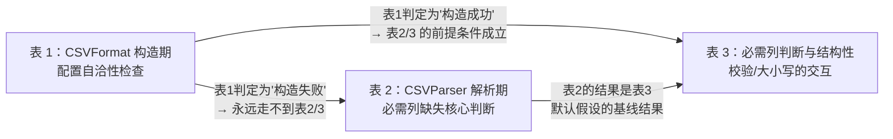

# 第三章 设计面向验收测试的 Spec

在让 Agent 针对新需求生成生产代码之前，如何判断 Agent 生成的验收测试用例能全面覆盖新需求的业务且没有遗漏和重复？

第二章的影响分析已经确定了改动会落在哪些类，也留下了 5 个开放设计问题没有裁决。本章要做两件事：先用轻量的 [ADR](https://adr.github.io/)（Architecture Decision Record）把这些开放问题逐一裁决，再用 [Decision Table Testing](https://www.virtuosoqa.com/post/decision-table-testing)（决策表测试法）把裁决结果系统性地推导成一份不遗漏、不重复的验收测试用例清单。

如果你想真正检验自己有没有吃透决策表的推导逻辑，不妨先通读一遍本章，再把本章末尾的提示词复制给你的 Agent，让它独立跑一遍同样的 ADR 裁决和决策表推导，然后拿它的产出和本章逐条对比——规则数、测试用例数对不上的地方，往往就是你（或它）漏看了某个条件依赖关系的信号。

## 3.1 用 Decision Table 推导验收测试以便不遗漏不重复

**定义**：决策表测试法是一种把"条件（condition，影响系统行为的输入变量）× 条件取值 × 动作（action，系统对应的响应）"组织成表格、再系统性枚举所有有意义组合的测试设计方法。表的每一列是一条规则（rule），对应一种条件取值组合和它应该触发的动作；表格本身既是设计工具，也是可以直接转成测试用例的产出物。根据条件取值是否限定为二元（True/False），决策表可以分成有限决策表（Limited）、扩展决策表（Extended，条件可以有多个取值）等不同形态；条件之间存在依赖/门控关系时，则适合用规则型决策表（Rule Based）来组织，同一张大表拆成多张互相关联的小表，避免条件数一多就出现规则数爆炸。标准的推导流程是七步：识别所有条件、定义条件取值、计算规则数、识别所有动作、填充表格、尽可能化简（用"don't care"标记对结果无影响的条件）、把每条规则转成测试用例。

**价值**：决策表测试法把"验收测试覆盖全不全"这件事，从"我觉得应该测这几种情况"的主观列举，变成一套可追溯、可复核的系统性推导——每一条测试用例都能回答"它在验证哪条规则、为什么这条规则需要被验证"。对于用 Agent 生成验收测试的场景，这一点格外关键：Agent 很擅长"照着一个例子生成几个相似的变体"，但不一定天然具备"这批测试用例有没有漏掉某种条件组合"的判断力，而决策表恰好能把这种判断力显式地落到纸面上。

**没有它的危害**：没有系统性的推导工具时，验收测试用例的设计很容易变成"想到哪测到哪"——覆盖了几个直觉上"明显"的场景，却漏掉了"两个条件叠加才会触发"的边界组合（比如本章要处理的"大小写差异"和"必需列缺失"同时发生时该怎么判定）。更隐蔽的风险是**重复**：没有意识到两个看起来不同的测试用例，其实在验证同一条规则，白白增加维护成本却没有换来新的覆盖率。

**独特优势**：决策表测试法天然适合"条件之间会互相影响"的业务规则场景——比如"大小写是否生效"这个结果依赖于"是否存在大小写差异"这另一个条件，这正是决策表要系统处理的典型情形，而并非简单的独立二元判断。它还强制你在"化简"这一步显式写出"为什么这个条件在这里不重要"，这个动作本身就是对系统行为理解程度的一次检验——写不出理由，往往说明理解还不到位。

**主要劣势**：条件数一多，笛卡尔积会指数级增长（10 个二元条件就是 1024 条规则），没有拆分成多张小表、没有识别条件间的依赖关系去化简，表格会变得难以创建、审查和维护；它也更适合离散、分类的输入，面对连续区间的输入（时间、价格）需要先用等价类划分把区间收敛成有限的类别，再套用决策表。

**适用场景**：业务规则涉及多个会互相影响的离散条件、且需要"完全可追溯"的验收测试覆盖率证明（比如本章这种"条件之间存在门控关系"的真实场景）；需要把一批容易靠直觉遗漏或重复的测试场景，变成可以让产品经理、测试、开发三方共同评审的结构化产出物。

**不适用场景**：条件本身是连续区间且没有先做等价类划分；或者需求本身只有一两个互相独立的二元开关，用决策表反而比直接列举测试用例更繁琐。

## 3.2 开放设计问题决策记录

### 3.2.1 事实依据

裁决下面 7 条决策之前，先实地核查 `commons-csv` 源码得到的事实：

1. `requiredHeaders` / `setRequiredHeaders` 目前**不存在**于源码中。
2. `CSVParser.createHeaders()` 现有的两类表头结构错误——空列名、重复列名——都抛 `IllegalArgumentException`（非受检异常），而受检异常 `CSVException` 只用于 `Lexer`/`Token` 层面"输入序列本身不合法"的场景，语义上是两类不同的错误家族。
3. `CSVParser.createEmptyHeaderMap()` 在 `ignoreHeaderCase=true` 时返回大小写不敏感的 `TreeMap`，否则返回普通 `LinkedHashMap`——即 `headerMap` 本身天然携带大小写语义。
4. `createHeaders()` 内部循环**逐列**检查空列名/重复列名，一旦命中就立刻 `throw`（fail-fast），`headerMap` 是在循环过程中逐步建好的；循环结束后才返回。
5. 自动从首行解析表头、手工指定表头两种模式，在 `createHeaders()` 里只是 `headerRecord` 的来源不同，之后汇入**同一段**"构建 headerMap"循环。
6. `CSVFormat.Builder.setHeader(String...)` 的既有语义：空数组表示"自动从首行解析表头"，这是一个**有特殊含义**的空值，而其他配置项没有这种先例。
7. `CSVFormat.validate()` 现有的校验全部是**不依赖输入数据**的"声明形状"校验，在 `CSVFormat` 构造时同步执行。

### 3.2.2 决策1：异常类型复用原有而不新建

**决策**：缺失必需列抛出既有的 `IllegalArgumentException`，不新增专门的异常类型。

**理由**：证据 #2 显示"表头结构有问题"这类错误在这个代码库里已有确立的惯例——构造期同步抛 `IllegalArgumentException`，"缺必需列"属于同一语义家族，理应沿用；新增公开异常类型是公开 API 面的扩张，一旦发布就要承担长期兼容负担，而需求原文没有要求调用方必须精确 `catch` 这个错误类型。

**错误消息格式**：`Missing required header name(s): [currency]. Header names found: [date, amount]`——多个列同时缺失时列出全部，而非只报第一个。

### 3.2.3 决策2：大小写敏感尊重原代码逻辑

**决策**：必需列比较直接复用已建好的 `headerMap` 做 `containsKey()` 查找，从而自动尊重 `ignoreHeaderCase`，不单独引入大小写开关。

**理由**：证据 #3 显示 `headerMap` 本身在 `ignoreHeaderCase=true` 时就是大小写不敏感的，大小写语义是"免费"继承来的；这也让 `requiredHeaders` 的行为和用户已经熟悉的 `CSVRecord.get(String)` 的大小写语义保持一致。

### 3.2.4 决策3：必需列检查放在循环后且结构错误优先

**决策**：必需列缺失检查放在 `createHeaders()` 现有循环**结束之后**；同一次解析里若同时存在结构性错误（空列名/重复列名且未被允许）和必需列缺失，结构性错误先抛出，必需列检查根本不会被执行到。

**理由**：这个顺序谈不上是什么设计选择，用结构性限制来形容反而更准确——证据 #4 已经把这一点钉死了：必需列检查依赖**完整**的 `headerMap`，结构性错误检查在循环内部逐列发生、一旦命中就立刻 `throw`，循环都没跑完；反过来当结构性问题被允许时，循环跑完、`headerMap` 完整，必需列检查正常执行。

### 3.2.5 决策4：打印校验不改动

**决策**：本次不在 `CSVPrinter`（写路径）增加任何 `requiredHeaders` 相关校验。

**理由**：需求原文描述的是"对账时上游 CSV 应当包含若干固定列"——读/解析场景，并非生成场景；没有需求驱动的对称设计是典型的过度设计（YAGNI 反例）。

### 3.2.6 决策5：setHeader() 两种模式下校验行为一致

**决策**：无论表头是自动解析还是手工指定，必需列检查的时机、对象、行为完全一致。

**理由**：证据 #5 已确认两种模式最终都汇入同一段循环，必需列检查放在循环之后执行，天然对两种模式一视同仁——这是"读代码即可确认答案，不需要新决策"的问题，但仍写进 ADR，是为了在决策表里明确排除"表头模式"作为一个会影响结果的条件维度，避免把不影响结果的维度也堆进决策表。

### 3.2.7 决策6：配置了必需列但未启用表头模式在构造期报错

**决策**：如果设置了非空的 `requiredHeaders`，但完全没有启用表头模式，这是声明形状本身自相矛盾的配置，应该在 `CSVFormat.Builder.validate()`（构造期）就同步抛出异常，不等到解析期才发现。

**理由**：证据 #7 表明 `validate()` 的职责边界正是"只依赖声明本身，不依赖输入数据"的校验，这条规则完全符合这个边界；提前在构造期报错比等到解析期才报错对调用方更友好。错误消息格式：`Field requiredHeaders is set but field header is not set`。

### 3.2.8 决策7：requiredHeaders 空值意味着功能未启用

**决策**：`setRequiredHeaders()` 传入 `null` 或长度为 0 的数组，语义都是"不启用必需列校验"，没有任何特殊含义，不借用 `setHeader()` 的"自动解析"特殊语义。

**理由**：证据 #6 指出 `setHeader(String...)` 的空数组特殊含义，是因为 `header` 字段同时承担"要不要启用表头模式"和"表头内容是什么"两个职责；`requiredHeaders` 不存在这种双重职责，没有理由模仿这个特殊语义，否则会让使用者误以为两者行为一致而踩坑。

**决策记录汇总表**：

| # | 开放问题 | 决策 | 依据 |
| --- | --- | --- | --- |
| 1 | 异常类型 | 复用 `IllegalArgumentException`，固定消息格式 | 证据 #2 |
| 2 | 大小写敏感性 | 查 `headerMap`，自动尊重 `ignoreHeaderCase` | 证据 #3 |
| 3 | 与重复/空列名的交互顺序 | 必需列检查放循环后；结构性错误优先 | 证据 #4 |
| 4 | 是否对称校验 `CSVPrinter` | 不做，本次范围排除 | 需求原文 |
| 5 | `setHeader()` 两种模式是否一致 | 一致，无需特殊分支 | 证据 #5 |
| 6 | 配置了必需列但无表头模式 | 构造期报错 | 证据 #7 |
| 7 | 空值语义 | `null`/空数组=未启用 | 证据 #6 |

## 3.3 决策表

### 3.3.1 决策表类型选择与理由

选择：**Rule Based Decision Table（规则型决策表）作为整体方法，内部拆成 3 张子表**，分别对应 3 个独立的决策点：

1. `CSVFormat` 构造期的配置自洽性（对应决策 6、7）；
2. `CSVParser` 解析期必需列是否缺失的核心判断（对应决策 1）；
3. 必需列判断与既有结构性校验、`ignoreHeaderCase` 的交互（对应决策 2、3）——"大小写是否生效"这个结果**依赖于**另一个条件（是否存在大小写差异），这正是条件之间会互相影响的典型情形。

为什么不用单一的表：如果把 3 个决策点、6 个以上条件硬塞进一张表，会出现规则数爆炸，也会把互不相关的条件强行搭配出笛卡尔积，产生大量不可能或无意义的组合。所以采用"分层"思路：3 张小表，表与表之间用"前一张表的某个结果是后一张表的前提条件"来串联。


```mermaid
graph LR
    T1["表 1：CSVFormat 构造期<br/>配置自洽性检查"]
    T2["表 2：CSVParser 解析期<br/>必需列缺失核心判断"]
    T3["表 3：必需列判断与结构性<br/>校验/大小写的交互"]

    T1 -- "表1判定为'构造失败'<br/>→ 永远走不到表2/3" --> T2
    T1 -- "表1判定为'构造成功'<br/>→ 表2/3 的前提条件成立" --> T3
    T2 -- "表2的结果是表3<br/>默认假设的基线结果" --> T3
```

### 3.3.2 步骤1：识别所有条件

| 表 | 条件编号 | 条件名称 | 来源 |
| --- | --- | --- | --- |
| 1 | T1-C1 | `requiredHeaders` 是否配置 | 决策 7 |
| 1 | T1-C2 | `requiredHeaders` 数组自身是否"形状良好"（无空白/重复元素） | 比照现有校验 |
| 1 | T1-C3 | 是否启用了表头模式 | 决策 6 |
| 2 | T2-C1 | `requiredHeaders` 是否配置 | 需求原文 |
| 2 | T2-C2 | 真实解析出的表头是否全部包含 `requiredHeaders` 的每一个名字 | `createHeaders()` 结构 |
| 3 | T3-C1 | 是否存在"未被允许"的结构性表头问题 | 决策 3 |
| 3 | T3-C2 | `ignoreHeaderCase` 是否为 `true` | 决策 2 |
| 3 | T3-C3 | 必需列名字与实际表头名字大小写是否不同 | 决策 2 |

被显式排除、不作为条件的维度：`setHeader()` 自动解析 vs 手工指定（决策 5 已证明不影响结果）；`DuplicateHeaderMode` 的 `ALLOW_EMPTY` vs `ALLOW_ALL`（两者效果相同，合并为同一等价类）；`CSVPrinter` 相关条件（决策 4 已排除在范围外）。

### 3.3.3 步骤2：定义条件取值

| 条件 | 可能取值 |
| --- | --- |
| T1-C1 | `Set`（非空数组）/ `Unset`（`null` 或空数组） |
| T1-C2 | `WellFormed` / `Malformed`（含空白元素或内部重复） |
| T1-C3 | `HeaderEnabled` / `NoHeader` |
| T2-C1 | `Set` / `Unset` |
| T2-C2 | `AllPresent` / `SomeMissing`（1 个或多个缺失，判定结果等价，消息内容在测试数据层面区分） |
| T3-C1 | `Preempted`（存在未被允许的结构性问题）/ `Clean` |
| T3-C2 | `true` / `false` |
| T3-C3 | `CaseDiffers` / `CaseSame` |

### 3.3.4 步骤3：计算规则数

| 表 | 理论笛卡尔积 | 化简后 |
| --- | --- | --- |
| 表1 | 2×2×2=8 | T1-C1=Unset 时后两个条件都是 don't-care，合并为 1 条；T1-C2=Malformed 时 T1-C3 也是 don't-care，再合并——**最终 4 条** |
| 表2 | 2×2=4 | T2-C1=Unset 时 T2-C2 是 don't-care——**最终 3 条** |
| 表3 | 2×2×2=8 | T3-C1=Preempted 时后两个条件都是 don't-care；T3-C3=CaseSame 时 T3-C2 也是 don't-care——**最终 4 条** |

三张表合计 **11 条规则**，是后续验收测试用例的基础（测试数据层面会在"缺列数量"等维度上再做变体，但不增加新规则）。

### 3.3.5 步骤4：识别所有动作

| 动作 | 描述 | 对应异常/消息 |
| --- | --- | --- |
| A-BUILD-OK | `CSVFormat` 构造成功 | 无异常 |
| A-BUILD-FAIL-SHAPE | 构造失败：数组自身形状不合法 | `IllegalArgumentException`，指出具体是哪个元素非法 |
| A-BUILD-FAIL-NOHEADER | 构造失败：设置了必需列但未启用表头模式 | `IllegalArgumentException("Field requiredHeaders is set but field header is not set")` |
| A-PARSE-OK | `CSVParser` 构造成功 | 无异常 |
| A-PARSE-FAIL-MISSING | 构造失败：必需列缺失 | `IllegalArgumentException("Missing required header name(s): [...]. Header names found: [...]")` |
| A-PARSE-FAIL-STRUCTURAL | 构造失败：既有结构性表头错误，必需列检查**未被执行** | 沿用现有消息，**不会**出现"Missing required header"字样 |

### 3.3.6 步骤5：填充决策表

**表 1：CSVFormat 构造期配置自洽性**

| 规则 | T1-C1 | T1-C2 | T1-C3 | 动作 |
| --- | --- | --- | --- | --- |
| R1.1 | Unset | – | – | A-BUILD-OK |
| R1.2 | Set | Malformed | – | A-BUILD-FAIL-SHAPE |
| R1.3 | Set | WellFormed | NoHeader | A-BUILD-FAIL-NOHEADER |
| R1.4 | Set | WellFormed | HeaderEnabled | A-BUILD-OK |

**表 2：CSVParser 解析期必需列缺失核心判断**

| 规则 | T2-C1 | T2-C2 | 动作 |
| --- | --- | --- | --- |
| R2.1 | Unset | – | A-PARSE-OK（回归基线） |
| R2.2 | Set | AllPresent | A-PARSE-OK |
| R2.3 | Set | SomeMissing | A-PARSE-FAIL-MISSING |

**表 3：必需列判断与结构性校验/大小写的交互**

| 规则 | T3-C1 | T3-C2 | T3-C3 | 动作 |
| --- | --- | --- | --- | --- |
| R3.1 | Preempted | – | – | A-PARSE-FAIL-STRUCTURAL（必需列检查未执行） |
| R3.2 | Clean | – | CaseSame | A-PARSE-OK |
| R3.3 | Clean | true | CaseDiffers | A-PARSE-OK（证明决策2：尊重 `ignoreHeaderCase`） |
| R3.4 | Clean | false | CaseDiffers | A-PARSE-FAIL-MISSING（默认精确匹配语义） |

### 3.3.7 步骤6：尽可能化简

- **R1.1 的后两个条件标"–"**：`requiredHeaders` 根本没配置时，它的数组形状、表头是否启用都与它无关——这是条件之间"存在依赖关系"（T1-C1 是门控条件）的体现，并非违反条件独立性假设。
- **R1.2 的 T1-C3 标"–"**：数组形状本身不合法是一个纯粹"自己和自己"的校验，不需要等到看了表头是否启用才决定要不要报错——形状校验优先于交叉字段校验。
- **R2.1 的 T2-C2 标"–"**：没有配置必需列，"是否缺失"这个概念不存在，这条规则本质上是"既有行为的回归基线"，确保新功能是纯新增、向后兼容的。
- **R3.1 的后两个条件标"–"**：这是**最重要的一处化简**，对应决策3的核心论点——结构性问题一旦"抢跑"，必需列检查的代码**根本没有机会执行**，所以大小写相关的条件在这条规则下，说"碰巧不影响结果"还不够准确，准确地说，是"在因果链条上压根没被读到"。
- **R3.2 的 T3-C2 标"–"**：大小写完全相同时，`headerMap` 用普通匹配或大小写不敏感匹配都会命中同一个键，`ignoreHeaderCase` 的取值不改变结果。

检查后结论：**没有**逻辑上不可能的组合需要剔除——这点在填表前已经靠读真实源码的控制流核实过，而非凭空枚举再筛选。

### 3.3.8 步骤7：将规则转为测试用例

以下给出三张表里有代表性的若干条用例的详细展开，剩余用例的要点收进文末汇总表（覆盖全部 11 条规则，没有信息损失，只是不逐条展开叙述）。

**TC-1.3（对应 R1.3）—— 设置了必需列但完全没有启用表头模式**
- 前置条件：`CSVFormat.Builder` 不调用任何 `setHeader(...)` 变体。
- 测试数据：`setRequiredHeaders("currency")`。
- 预期结果：构造 `CSVFormat` 时抛出 `IllegalArgumentException("Field requiredHeaders is set but field header is not set")`。

**TC-2.3a（对应 R2.3）—— 缺 1 个必需列**
- 测试数据：`setHeader().setRequiredHeaders("date", "amount", "currency")`；CSV 文本 `"date,amount\n2026-01-01,100\n"`（缺 `currency`）。
- 预期结果：抛出 `IllegalArgumentException("Missing required header name(s): [currency]. Header names found: [date, amount]")`，且这个异常必须发生在任何一条记录可被取到之前。

**TC-3.1a（对应 R3.1）—— 空列名抢先于必需列检查报错**
- 测试数据：`setHeader().setRequiredHeaders("currency")`；CSV 文本 `"date,,currency\n2026-01-01,x,USD\n"`（第二列是空列名）。
- 预期结果：抛出**现有的**空列名异常，消息中**不**出现"Missing required header"字样——用于断言必需列检查确实没有被执行到。

**TC-3.3（对应 R3.3）—— `ignoreHeaderCase=true` 时必需列比较忽略大小写**
- 测试数据：`ignoreHeaderCase(true).setRequiredHeaders("Currency")`；CSV 表头实际为 `"currency"`。
- 预期结果：构造成功——证明必需列检查复用了 `headerMap` 的大小写不敏感语义。

**全部 11 条规则 → 测试用例汇总表**：

| 表 | 规则 | 测试要点 |
| --- | --- | --- |
| 1 | R1.1 | 未设置必需列，构造不受影响（回归基线） |
| 1 | R1.2 | `requiredHeaders` 内部有重复/空白元素 → 构造失败 |
| 1 | R1.3 | 设置了必需列但无表头模式 → 构造失败 |
| 1 | R1.4 | 必需列 + 表头模式都启用（自动解析/手工指定两种变体） → 构造成功 |
| 2 | R2.1 | 不启用必需列功能 → 解析行为与现状一致（回归，含空数组变体） |
| 2 | R2.2 | 必需列全部存在 → 解析成功 |
| 2 | R2.3 | 缺 1 个 / 缺多个必需列（消息要列全） → 解析失败 |
| 3 | R3.1 | 空列名 / 重复列名（严格模式）抢先报错；`ALLOW_ALL` 模式下不抢跑 |
| 3 | R3.2 | 大小写相同，`ignoreHeaderCase` 取值不影响结果 |
| 3 | R3.3 | `ignoreHeaderCase=true` 时大小写不同仍算存在 |
| 3 | R3.4 | `ignoreHeaderCase=false`（默认）时大小写不同算缺失 |

这份汇总表共同构成 `required headers` 需求的验收标准：既覆盖需求原文的核心诉求（表2），也覆盖代码核查后发现的必要前置防线（表1），还覆盖开放问题中真正会改变外部可观察行为的两个交互场景（表3）。下一章会把这些测试用例落地成真正可执行的 Approved Scenarios 自动化测试。

## 3.4 动手练习提示词

为方便实操，这里把本章 3.1～3.3 节的“裁决开放设计问题（ADR）”和“推导决策表”相应的提示词合并成一份完整的提示词，让你一次性走完"代码核查 → ADR → 决策表七步法"的完整链路。

使用前请把下面三处占位符替换成你自己的实际信息：

- `{{SUBDOMAIN_ANALYSIS_DOC_PATH}}`——子域分析文档的绝对路径（如果你做了第二章的动手练习，这里可以填你自己产出的文档 A 路径；没有就留空，不影响任务完成）
- `{{IMPACT_ANALYSIS_DOC_PATH}}`——影响分析文档的绝对路径（同理，可以填你自己产出的文档 B 路径）
- `{{COMMONS_CSV_REPO_PATH}}`——commons-csv 代码库在本机的路径（如果该路径下还没有代码，提示词里已经包含"先 `git clone` 到当前工作目录"的指令，你只需要把占位符换成克隆源地址或已存在的本机路径；也可以换成你自己的目标代码库）

下面为本章的完整提示词。

````
# 任务：用决策表测试法为 commons-csv 的 `required headers` 新需求设计验收测试用例

你是一名资深测试架构师，要为 Apache Commons CSV 代码库里一个尚未实现的新需求，设计验收测试用例。你要用**决策表测试法**（Decision Table Testing）来保证测试用例推导过程清晰、全面、不遗漏，而不是凭直觉随手列几个例子。

决策表测试法的方法论知识，本书 3.1 节已经介绍过（七步法、五种类型、常见局限），**不要去网上搜索其他资料，只依据本书 3.1 节的方法论讲解和你自己对代码库的实地核查来完成任务**。

## 背景资料（可选，若路径有效请阅读；若无效或你没有访问权限，跳过即可，不影响任务完成）

- 子域分析文档：
```
{{SUBDOMAIN_ANALYSIS_DOC_PATH}}
```
（如果存在，阅读它以了解 CSVFormat / CSVParser / CSVRecord / Lexer 等类在这个代码库里分别承担什么职责，哪些是"核心业务逻辑"，哪些是"支撑性配置"）

- 影响分析文档：
```
{{IMPACT_ANALYSIS_DOC_PATH}}
```
（如果存在，阅读它以了解这次新需求会牵动哪些类、哪些类不受影响）

这两份文档只是**背景参考**，不是必须的输入——下面"需求描述"一节已经包含了你完成任务所需的全部需求信息。

## 代码库

本机路径：

```
{{COMMONS_CSV_REPO_PATH}}
```

把仓库克隆到你当前的工作目录下，然后在克隆下来的副本里做下面的"代码核查"。

**重要：你只能做调研和设计，不能修改/实现这个需求的源码**（即不要去改 `CSVFormat.java`、`CSVParser.java` 等任何生产代码文件）。你唯一要产出的是两份 Markdown 设计文档（见下文"产出要求"）。

## 需求描述

> 我在维护 Apache Commons CSV。我们对账时，上游 CSV 文件应当包含若干固定列（比如 `date`、`amount`、`currency`）。我想给 `CSVFormat.Builder` 加一个新方法 `setRequiredHeaders(String...)`：解析 CSV 时，一旦发现表头缺少这些列，就在读到第一条记录之前抛出一个清楚说明"缺了哪些列"的错误，而不是等业务代码调用 `record.get("currency")` 时才报一个语言含糊的"Mapping for currency not found"式的错误。

这个需求目前**完全没有在源码里实现**（`requiredHeaders`、`setRequiredHeaders` 这两个名字在代码库里还不存在）。

## 第一步：代码核查（在写任何文档之前必须先做）

在你克隆后的上述代码库的本地副本里，至少核查以下事实，并在后续文档里引用你核查到的具体证据（类名、方法名、真实的异常消息文本），而不是凭空假设：

1. `CSVParser.java` 里 `createHeaders()` 方法（或等价的构建表头映射的方法）现在是怎么处理"空列名"和"重复列名"这两类表头结构问题的——抛什么类型的异常？异常消息长什么样？检查发生在循环的什么位置（逐列检查还是全部读完才检查）？
2. `CSVFormat.java` 里 `validate()`（或等价的构造期自检方法）现在校验哪些内容？这些校验是否都不依赖"真实输入数据"，只依赖"声明本身的形状"？
3. `ignoreHeaderCase` 这个配置项，在构建"列名 → 列序号"映射表时是怎么生效的（具体看用的是什么 `Map` 实现、什么比较器）？
4. 表头到底有几种配置模式（例如"自动从首行解析"vs"手工指定表头数组"），这几种模式最终是否会汇入同一段处理逻辑？
5. 和重复表头相关的枚举/配置（如果存在）有哪几个取值？各自的语义是什么？
6. 现有的异常体系里，是否存在"受检异常"和"非受检异常"两类，分别用在什么场景？

把这些核查结果当作你接下来所有设计决策的**事实依据**——你后面写的每一条决策理由，都应该能够追溯到这一步核查到的具体代码行为，而不是"我觉得应该这样"。

## 第二步：先处理需求里没有讲清楚的开放设计问题（产出 ADR 文档 1）

这类"需求挂在一个类的 API 上，但真正的业务规则该不该落在别的类里、该不该与现有某个配置项交互"的问题，往往有好几个关键细节是需求原文没有明说的。在动笔设计决策表之前，你需要先自己识别并裁决这些开放问题，形式上做成一份轻量的 ADR（Architecture Decision Record，架构决策记录）。

**至少要覆盖以下问题**（如果你在第一步核查代码时发现了需求原文没提到、但确实需要裁决的额外问题，也要一并补充进来，不要漏掉）：

1. 异常类型：复用现有的异常类型（保持风格一致），还是新增一个专门的异常类型（让调用方可以精确 `catch`）？两者各有什么代价？
2. 大小写敏感性：必需列的名字比较，要不要尊重 `ignoreHeaderCase` 这个已有配置？
3. 与现有"重复列名""空列名"校验的交互顺序：如果同一次解析里，既有结构性表头错误，又缺必需列，应该先报哪个错？为什么？
4. 对称性问题：如果有人用同一份配置去"写" CSV（而不是"读"），要不要也校验一下要写的数据包含这些必需列？
5. 表头的"自动解析"模式和"手工指定"模式下，必需列校验的时机和行为是否应该一致？
6. 配置本身的自洽性：如果调用方设置了必需列，却完全没有启用任何表头模式，这种"自相矛盾"的配置应该在什么时候被发现（构造配置对象时，还是等到真正解析数据时）？
7. 空值/未设置语义：必需列这个新配置项，传 `null` 或空数组应该是什么含义？会不会和代码库里其他配置项的"空数组"特殊含义（如果第一步核查发现有的话）产生混淆？

对每一个问题：
- 给出一个**具体、可执行**的决策（不能是"看情况"这种模糊回答）；
- 用第一步核查到的**具体代码事实**作为理由支撑这个决策（引用真实的方法名、类名、异常消息文本）；
- 如果这条决策会影响后面决策表的"条件"或"动作"，要点明是哪一条。

**产出文件**：把这份 ADR 保存为当前工作目录下的

```
01-3-adr.md
```

（Markdown 格式），结构建议：
- 开头一段核查证据清单（对应上面"第一步"的发现）
- 每条决策单独一个二级标题，包含"决策"和"理由"两部分
- 结尾一张"决策记录汇总表"（问题 / 决策 / 依据的证据）

## 第三步：用决策表测试法设计验收测试用例（产出 Decision Table 文档 2）

严格按照本书 3.1 节介绍的七步法来做，不要跳步，每一步都要把结果和理由写出来：

1. **先选定决策表类型，并给出理由**。一共有 5 种类型（Limited / Extended / Condition Action / Switch / Rule Based）。你要对照你的任务的真实复杂度（条件数量、条件之间是否存在互相影响/门控关系）来挑选，并在文档里明确说："因为……所以我选……"，不能跳过这一步直接开始画表。
2. **Step 1：识别所有条件**——条件要能追溯到第一步的代码核查结果和第二步的 ADR 决策，不能是含糊的描述。同时要明确写出"哪些看起来像条件、但其实不影响结果、因此被我排除掉了"的维度，并说明排除理由（这一点很重要，是判断你有没有真正理解系统行为、还是只是在堆砌组合的关键标志）。
3. **Step 2：定义每个条件的具体取值**——每个取值都要精确、可测试（例如"缺 1 列"和"缺全部列"算同一个取值还是不同取值，要讲清楚判断依据），不能是"差不多""大概"这种模糊说法。
4. **Step 3：计算规则数**——写出理论上的笛卡尔积是多少，再写出利用条件之间的依赖/门控关系消除掉多少"不可能"或"无意义"的组合之后，实际剩下多少条规则，每一步化简都要讲理由。
5. **Step 4：识别所有动作**——包括正常路径（成功）和异常路径（各种报错），每个异常动作要写清楚具体的异常类型和消息格式（可以参考你在 ADR 里定下来的格式）。
6. **Step 5：填充决策表**——正式画出表格（用 Markdown 表格语法），每一列是一条规则，行是条件和动作。**如果你发现一张表装不下全部逻辑（条件太多、或者有些条件只在特定的决策点才有意义），可以拆成多张表**，但必须在文档里清楚说明这几张表之间的关系（比如：表 A 的某个结果是表 B 成立的前提条件；或者表 A、表 B 是同一个判断逻辑在不同输入组合下的两个独立决策点）。
7. **Step 6：尽可能化简**——用"don't care"（用"–"表示）标记那些在某条规则下不影响结果的条件，并对**每一个**"–"都写一句话理由（不能只是机械地标，要让人看出"为什么这个条件在这里真的不重要"）。同时检查表里是否存在逻辑上不可能出现的组合，如果有，要剔除并说明理由。
8. **Step 7：把每条规则转成一个验收测试用例**——用结构化的文字/表格描述（前置条件 / 测试数据 / 预期结果），**不需要写可编译运行的代码骨架**。如果同一条规则下有几种不同的具体测试数据值得分别测一下（比如"缺 1 列"和"缺全部列"是同一个判断逻辑，但消息内容不同，值得各写一个测试用例），可以在同一条规则下派生出多个测试用例变体，并说明它们是变体而不是新规则。

**产出文件**：把这份决策表和测试用例保存为当前工作目录下的

```
01-2-decision-table.md
```
（Markdown 格式），结构建议：
- 开头一段：决策表类型选择与理由，以及（如果拆成多张表）各表之间关系的说明图/说明文字
- Step 1 到 Step 7 依次成节，每节标注对应的 Step 编号
- 结尾一张汇总表：每张决策表产出了几条规则、派生了几个测试用例、对应 ADR 里的哪条决策

## 质量标准（自检清单，交付前检查一遍）

- [ ] 每一条设计决策、每一个决策表条件，都能在文档里找到"这是根据代码库里哪个具体事实/哪条 ADR 决策得出的"的说明，不是凭空猜测。
- [ ] 没有把互相独立、对结果没有交互影响的维度（比如两种等价的"允许"配置取值）硬塞成决策表的新条件，导致规则数不必要地膨胀。
- [ ] 没有把一个条件的"取值集合"写得含糊不清（例如"大小写差异较大"这种无法直接变成测试数据的说法）。
- [ ] 每一条规则都对应一个真实可达的程序状态，不存在"理论组合但实际不可能发生"却没有被剔除或说明的规则。
- [ ] 第 7 步产出的测试用例，任何一个拿去跟同事复述，对方都能明确说出"这个测试用例在验证哪条业务规则、输入什么、期望输出什么"，不需要再追问你。
- [ ] 两份产出文件（`01-3-adr.md` 和 `01-2-decision-table.md`）都是独立可读的 Markdown 文档，不依赖你在对话里说过的话才能看懂。
````

以上为本章的完整提示词。

跑完之后，数一数你的 Agent 推导出多少条规则、多少个测试用例，和本章的 11 条规则、11 个测试用例对比——如果数字差异很大，回头看看是否漏掉了某个条件之间的依赖关系，或者把本该合并的等价类拆成了多条规则。
