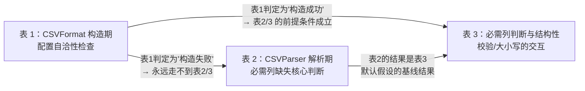

<a id="ch3-top"></a>

# 第三章 设计面向验收测试的 Spec

在让 Agent 针对新需求生成生产代码之前，如何判断 Agent 生成的验收测试用例能全面覆盖新需求的业务且没有遗漏和重复？

第二章的影响分析已经确定了改动会落在哪些类，也留下了 5 个开放设计问题没有裁决。本章要做两件事：先用轻量的 [ADR](https://adr.github.io/)（Architecture Decision Record）把这些开放问题逐一裁决，再用 [Decision Table Testing](https://www.virtuosoqa.com/post/decision-table-testing)（决策表测试法）把裁决结果系统性地推导成一份不遗漏、不重复的验收测试用例清单。

如果你想真正检验自己有没有吃透决策表的推导逻辑，不妨先通读一遍本章，再把本章末尾的提示词复制给你的 Agent，让它独立跑一遍同样的 ADR 裁决和决策表推导，然后拿它的产出和本章逐条对比——规则数、测试用例数对不上的地方，往往就是你（或它）漏看了某个条件依赖关系的信号。

> [!TIP]
> **TL;DR · 读完本章你会：**
> - 看到第二章留下的 5 个开放设计问题，如何用一份轻量 ADR 逐条裁决、每条决策都能追溯到具体代码证据；
> - 学会决策表测试法的七步推导流程：识别条件 → 定义取值 → 计算规则数 → 识别动作 → 填充 → 化简 → 转为测试用例；
> - 看到真实案例——`required headers` 需求最终被拆成 3 张小表、11 条规则、17 个验收测试用例；
> - 理解为什么"条件之间会互相影响"（比如大小写敏感性依赖另一个条件）正是决策表要系统处理的典型场景，而非简单的独立二元判断。

<a id="ch3-toc"></a>
**本章目录**：[3.1 用决策表推导验收测试](#ch3-1) · [3.2 ADR 决策记录](#ch3-2) · [3.3 决策表](#ch3-3) · [3.4 动手练习提示词](#ch3-exercise)

<a id="ch3-1"></a>

## 3.1 用 Decision Table 推导验收测试以便不遗漏不重复

<a id="ch3-def"></a>

#### 定义

决策表测试法是一种把"条件（condition，影响系统行为的输入变量）× 条件取值 × 动作（action，系统对应的响应）"组织成表格、再系统性枚举所有有意义组合的测试设计方法。表的每一列是一条规则（rule），对应一种条件取值组合和它应该触发的动作；表格本身既是设计工具，也是可以直接转成测试用例的产出物。根据条件取值是否限定为二元（True/False），决策表可以分成有限决策表（Limited）、扩展决策表（Extended，条件可以有多个取值）等不同形态；条件之间存在依赖/门控关系时，则适合用规则型决策表（Rule Based）来组织，同一张大表拆成多张互相关联的小表，避免条件数一多就出现规则数爆炸。标准的推导流程是七步：识别所有条件、定义条件取值、计算规则数、识别所有动作、填充表格、尽可能化简（用"don't care"标记对结果无影响的条件）、把每条规则转成测试用例。

<a id="ch3-value"></a>

#### 价值

决策表测试法把"验收测试覆盖全不全"这件事，从"我觉得应该测这几种情况"的主观列举，变成一套可追溯、可复核的系统性推导——每一条测试用例都能回答"它在验证哪条规则、为什么这条规则需要被验证"。对于用 Agent 生成验收测试的场景，这一点格外关键：Agent 很擅长"照着一个例子生成几个相似的变体"，但不一定天然具备"这批测试用例有没有漏掉某种条件组合"的判断力，而决策表恰好能把这种判断力显式地落到纸面上。

<a id="ch3-risk"></a>

#### 没有它的危害

没有系统性的推导工具时，验收测试用例的设计很容易变成"想到哪测到哪"——覆盖了几个直觉上"明显"的场景，却漏掉了"两个条件叠加才会触发"的边界组合（比如本章要处理的"大小写差异"和"必需列缺失"同时发生时该怎么判定）。更隐蔽的风险是**重复**：没有意识到两个看起来不同的测试用例，其实在验证同一条规则，白白增加维护成本却没有换来新的覆盖率。

<a id="ch3-strength"></a>

#### 独特优势

决策表测试法天然适合"条件之间会互相影响"的业务规则场景——比如"大小写是否生效"这个结果依赖于"是否存在大小写差异"这另一个条件，这正是决策表要系统处理的典型情形，而并非简单的独立二元判断。它还强制你在"化简"这一步显式写出"为什么这个条件在这里不重要"，这个动作本身就是对系统行为理解程度的一次检验——写不出理由，往往说明理解还不到位。

<a id="ch3-weakness"></a>

#### 主要劣势

条件数一多，笛卡尔积会指数级增长（10 个二元条件就是 1024 条规则），没有拆分成多张小表、没有识别条件间的依赖关系去化简，表格会变得难以创建、审查和维护；它也更适合离散、分类的输入，面对连续区间的输入（时间、价格）需要先用等价类划分把区间收敛成有限的类别，再套用决策表。

<a id="ch3-fit"></a>

#### 适用场景

业务规则涉及多个会互相影响的离散条件、且需要"完全可追溯"的验收测试覆盖率证明（比如本章这种"条件之间存在门控关系"的真实场景）；需要把一批容易靠直觉遗漏或重复的测试场景，变成可以让产品经理、测试、开发三方共同评审的结构化产出物。

<a id="ch3-nofit"></a>

#### 不适用场景

条件本身是连续区间且没有先做等价类划分；或者需求本身只有一两个互相独立的二元开关，用决策表反而比直接列举测试用例更繁琐。

<a id="ch3-2"></a>

## 3.2 开放设计问题决策记录（ADR，Architecture Decision Record）

> [!IMPORTANT]
> 从这里到本章"动手练习提示词"之间展示的内容，都是作者与 Claude Code 搭配 Sonnet 5、用"假设体检 + 追问"提示词共创出来的结果，并经过作者本人验证。由于大模型的不确定性，你把本章末尾的"动手练习提示词"发给自己常用的 Agent 和大模型组合后，会看到不完全相同的产出——这是很正常的现象。所以本节到"动手练习提示词"之前展示的内容，仅供你参考，而并非唯一答案。条条大路通罗马，解决问题的答案会有很多种。只要你理解了这份经过评审的参考结果背后的底层逻辑，再带着这份理解去评判你的 Agent 产出是否做到了"让 Agent 一次生成可信代码"，就已经能在亲身实践中有所收获。

### 3.2.1 事实依据

实地核查 `src/main/java/org/apache/commons/csv/` 得到以下事实，是下面每条决策的依据：

1. `requiredHeaders` / `setRequiredHeaders` 目前**不存在**于源码中（`grep` 无匹配）。
2. `CSVParser.createHeaders()` 现有的两类表头结构错误——空列名、重复列名——都抛 `IllegalArgumentException`（非受检异常），而 `CSVException`（继承 `IOException`，受检）只用于 `Lexer`/`Token` 层面的"输入序列本身不合法"（如畸形引号转义），语义上是两类不同的错误家族。
3. `CSVParser.createEmptyHeaderMap()`：
   ```java
   private Map<String, Integer> createEmptyHeaderMap() {
       return format.getIgnoreHeaderCase() ?
               new TreeMap<>(String.CASE_INSENSITIVE_ORDER) :
               new LinkedHashMap<>();
   }
   ```
   即 `headerMap` 在 `ignoreHeaderCase=true` 时天然是大小写不敏感的 `TreeMap`。
4. `createHeaders()` 内部循环**逐列**检查空列名/重复列名，一旦命中就立刻 `throw`（fail-fast），`headerMap` 是在循环过程中逐步建好的；循环结束后才 `return new Headers(headerMap, ...)`。
5. `setHeader()`（自动从首行解析）和 `setHeader(String...)`（手工指定）两种模式在 `createHeaders()` 里只是 `headerRecord` 的来源不同（`formatHeader.length == 0` 分支 vs `else` 分支），之后汇入**同一段**"构建 headerMap"循环。
6. `CSVFormat.Builder.setHeader(String...)` 的既有语义：空数组 `[]` 表示"自动从首行解析表头"，这是一个**有特殊含义**的空值；而其他配置项（如 `requiredHeaders` 将要新增的）没有这种先例，需要我们自己明确定义空值语义（见决策 7）。
7. `CSVFormat.validate()` 现有的校验全部是**不依赖输入数据**的"声明形状"校验（分隔符/引号/转义符/注释符是否互相冲突、表头数组自身有没有重复/空名），在 `CSVFormat` 构造时（即 `Builder.build()`/`get()`）同步执行，抛 `IllegalArgumentException`。
8. `DuplicateHeaderMode` 的三个取值是 `DISALLOW`（默认，严格）、`ALLOW_EMPTY`、`ALLOW_ALL`。

### 3.2.2 决策1：异常类型——复用 `IllegalArgumentException`，不新建类型

**决策**：缺失必需列抛出的异常类型为既有的（非受检）`IllegalArgumentException`，不新增 `MissingRequiredHeaderException` 之类的专门类型。

**理由**：
- 证据 #2 显示，"表头结构有问题"这一类错误（空列名、重复列名）在这个代码库里有一个已经确立的惯例：构造期同步抛 `IllegalArgumentException`。"缺必需列"在语义上和它们属于同一个家族——都是"表头这件事本身不对，还没轮到读数据"——理应沿用同一惯例，而并非为同一语义家族里的一个新成员单开一个异常体系，这会让调用方要处理两套不一致的异常分类方式。
- 需求原文（01-3 §1）只要求"抛出一个清楚说明缺了哪些列的错误"，没有要求"调用方必须能用 `catch` 精确区分这个错误和其他配置错误"——01-3 §6 问题 1 本身就承认这是权衡，而并非需求的硬性约束，所以在"风格一致"与"类型精确"之间，优先选对现有用户影响更小、改动面更小的一侧。
- 新增公开异常类型是公开 API 面的扩张，一旦发布就要承担长期兼容负担；而本次需求的"最小必要"范围（M2）不要求这个扩张。

**错误消息格式**（供决策表的"动作"精确引用）：
```
Missing required header name(s): [currency]. Header names found: [date, amount]
```
多个必需列同时缺失时，列出全部缺失列（并非只报第一个）：
```
Missing required header name(s): [currency, amount]. Header names found: [date]
```
与现有重复表头消息的措辞风格（`"The header contains a duplicate name: ... %s"`）保持同一文体：先说"缺了什么"，再附"实际有什么"方便调用方排查。

### 3.2.3 决策2：大小写敏感性——尊重 `ignoreHeaderCase`，且零新增代码

**决策**：`requiredHeaders` 与实际解析出的表头之间的名字比较，直接复用已经建好的 `headerMap` 做 `containsKey()` 查找，从而自动尊重 `ignoreHeaderCase`；不单独为 `requiredHeaders` 引入一个独立的大小写开关。

**理由**：
- 证据 #3 显示 `headerMap` 本身在 `ignoreHeaderCase=true` 时就是一个大小写不敏感的 `TreeMap`。如果必需列检查写成 `Arrays.stream(requiredHeaders).filter(h -> !headerMap.containsKey(h))`，大小写语义就是"免费"继承来的，不需要再写一行与大小写相关的代码。
- 这也让 `requiredHeaders` 的行为和用户已经熟悉的 `CSVRecord.get(String)` 按名访问的大小写语义完全一致（两者都是查同一个 `headerMap`）——对使用者来说，"大小写规则在哪都一样"比"每个新特性自己发明一套大小写规则"更可预测。

### 3.2.4 决策3：与重复/空列名检查的交互与报错顺序——必需列检查放在循环之后，结构错误优先

**决策**：必需列缺失检查，放在 `createHeaders()` 现有循环**结束之后**（`headerMap` 已经完整建好、`return` 之前）才执行；如果同一次解析里同时存在"结构性错误"（空列名且不允许、重复列名且不允许）和"必需列缺失"，**结构性错误先抛出**，必需列检查根本不会被执行到。

**理由**：
- 证据 #4 决定了这个顺序并非"设计选择"而是"结构性限制"：必需列检查依赖于**完整**的 `headerMap`，而结构性错误检查在循环内部逐列发生、一旦命中就立刻 `throw`，循环都没跑完，`headerMap` 还不完整——必需列检查没有机会，也没有能力在一个不完整的 `headerMap` 上给出有意义的判断。
- 这个顺序不需要新增任何"优先级裁决"逻辑，只是老代码已有的 fail-fast 行为的自然延伸，符合"最小必要改动"（M2）的精神。
- 反过来，当结构性问题被配置为"允许"（`allowMissingColumnNames=true`，或 `DuplicateHeaderMode.ALLOW_ALL`/`ALLOW_EMPTY`）时，循环不会在那一列上 `throw`，会继续跑完、建好完整的 `headerMap`，必需列检查正常执行——这意味着"重复列名被允许"不会影响必需列检查的结果（因为 `headerMap.put()` 对重复列名是无条件覆盖写入，最后一次出现的那一列的名字始终在 `headerMap` 里）。

### 3.2.5 决策4：不对称校验 `CSVPrinter`——写路径本次不改动

**决策**：本次不在 `CSVPrinter`（写路径）增加任何 `requiredHeaders` 相关的校验。

**理由**：
- 需求原文（01-3 §1）描述的场景是"对账时上游 CSV 应当包含若干固定列"——这是**读**/解析场景，并非生成 CSV 的场景；`01-3` §3/§4 也已经确认 `CSVPrinter` 不受这次需求触碰。
- 遵循 M2 的指示"先聚焦最小可行场景"：没有需求驱动的对称设计是 YAGNI（you aren't gonna need it）的典型反例——真正对称校验写路径需要额外定义"数据源里有没有这些列"这种和"表头"完全不同的概念（CSVPrinter 面对的是任意 `Appendable` + 任意数据行，并非"表头"这个概念），属于一次独立的需求，不应该在本次顺带做。
- 在决策表设计里，`CSVPrinter` 相关的场景不会出现——这是"刻意排除在范围外"，并非遗漏。

### 3.2.6 决策5：`setHeader()` 两种模式下校验行为一致

**决策**：无论表头是通过 `setHeader()`（自动从首行解析）还是 `setHeader(String...)`（手工指定），必需列检查的时机、对象、行为完全一致。

**理由**：证据 #5 已经确认两种模式最终都汇入 `createHeaders()` 里同一段"构建 `headerMap`"的循环，必需列检查放在循环之后执行，天然对两种模式一视同仁，不需要也不应该写任何 `if (isAutoHeader) {...} else {...}` 式的特殊分支。这是一个"读代码即可确认答案，不需要新决策"的问题——之所以仍然写进 ADR，是为了在决策表里明确排除"setHeader 模式"作为一个会影响结果的条件维度（避免 Round 0 提到的"把不影响结果的维度也当条件堆进表里"的常见错误）。

### 3.2.7 决策6：`requiredHeaders` 配置了但未启用表头模式——在 `CSVFormat` 构造期（而并非解析期）报错

**决策**：如果调用方设置了非空的 `requiredHeaders`，但 `format.getHeader() == null`（既没调用无参 `setHeader()`，也没手工指定表头），这是一个**声明形状本身自相矛盾**的配置——"要求有某些列存在"但"根本没有表头模式"——应该在 `CSVFormat.Builder.validate()`（构造 `CSVFormat` 对象时）就同步抛出 `IllegalArgumentException`，不需要等到 `CSVParser` 解析阶段才发现。

**理由**：
- 证据 #7 表明 `validate()` 的职责边界是"只依赖声明本身，不依赖输入数据"的校验。"`requiredHeaders` 非空但 `headers` 为空"这条规则完全符合这个边界——判断它不需要看任何一行 CSV 数据。
- 这是本次核查代码后才发现的、`01-3` 原文没有明说的必要决策点（`01-3` §6 的 5 个问题都是"运行期行为"层面的问题，没有覆盖"构造期配置自相矛盾"这一层）。按 M1 的授权，由我补充这条决策并写明依据。
- 提前在构造期报错比等到解析期才报错对调用方更友好（更早发现配置错误，不用构造一个真实的 Reader/CSV 文件才能触发）。

**错误消息格式**：
```
Field requiredHeaders is set but field header is not set
```
与 `validate()` 现有消息风格（"The quoteChar character and the delimiter cannot be the same"）保持一致的简洁陈述句式。

### 3.2.8 决策7：`requiredHeaders` 的空值语义——`null` 或空数组 = 功能未启用，不借用 `setHeader()` 的"自动解析"特殊含义

**决策**：`setRequiredHeaders()` 传入 `null` 或长度为 0 的数组，语义都是"不启用必需列校验"（等价于从未调用过这个方法），没有任何特殊含义。

**理由**：
- 证据 #6 指出 `setHeader(String...)` 的空数组**已经**有一个特殊含义（"自动从首行解析"）——这是因为 `header` 这个字段同时承担"要不要启用表头模式"和"表头内容是什么"两个职责。`requiredHeaders` 不存在这种双重职责（它只回答"这些列必须存在吗"），所以没有理由、也不应该模仿 `setHeader()` 的空数组特殊语义，否则会让使用者誤以为两者行为一致而踩坑。
- 这条决策是一个"排除歧义"的边界声明，直接对应决策表里一条需要显式测试的边界场景（见 `01-2-decision-table.md` 表 2 的 R1 测试用例变体）。

**决策记录汇总表**：

| # | 开放问题 | 决策 | 决策依据的证据 |
| --- | --- | --- | --- |
| 1 | 异常类型 | 复用 `IllegalArgumentException`，固定消息格式 | 证据 #2 |
| 2 | 大小写敏感性 | 查 `headerMap`，自动尊重 `ignoreHeaderCase`，零新增代码 | 证据 #3 |
| 3 | 与重复/空列名的交互顺序 | 必需列检查放循环后；结构性错误（未被允许时）优先抛出 | 证据 #4、#8 |
| 4 | 是否对称校验 `CSVPrinter` | 不做，本次范围排除 | 需求原文 + M2 |
| 5 | `setHeader()` 两种模式是否一致 | 一致，无需特殊分支 | 证据 #5 |
| 6 | `requiredHeaders` 设置但无表头模式 | 构造期（`validate()`）报错，不等到解析期 | 证据 #7 |
| 7 | `requiredHeaders` 空值语义 | `null`/空数组=未启用，不借用 `setHeader()` 的特殊含义 | 证据 #6 |

<a id="ch3-3"></a>

## 3.3 决策表

### 3.3.1 决策表类型选择与理由

选择：**Rule Based Decision Table（规则型决策表）作为整体方法，内部拆成 3 张子表**，分别对应 3 个独立的决策点：

1. `CSVFormat` 构造期的配置自洽性（对应决策 6、7）；
2. `CSVParser` 解析期必需列是否缺失的核心判断（对应决策 1）；
3. 必需列判断与既有结构性校验、`ignoreHeaderCase` 的交互（对应决策 2、3）——"大小写是否生效"这个结果**依赖于**另一个条件（是否存在大小写差异），这正是条件之间会互相影响的典型情形。

为什么不用单一的表：如果把 3 个决策点、6 个以上条件硬塞进一张表，会出现规则数爆炸，也会把互不相关的条件强行搭配出笛卡尔积，产生大量不可能或无意义的组合。所以采用"分层"思路：3 张小表，表与表之间用"前一张表的某个结果是后一张表的前提条件"来串联。


```mermaid
graph LR
    T1["表 1：CSVFormat 构造期<br/>配置自洽性检查"]
    T2["表 2：CSVParser 解析期<br/>必需列缺失核心判断"]
    T3["表 3：必需列判断与结构性<br/>校验/大小写的交互"]

    T1 -- "表1判定为'构造失败'<br/>→ 永远走不到表2/3" --> T2
    T1 -- "表1判定为'构造成功'<br/>→ 表2/3 的前提条件成立" --> T3
    T2 -- "表2的结果是表3<br/>默认假设的基线结果" --> T3
```

### 3.3.2 步骤1：识别所有条件

逐张表列出，并注明条件来自哪份文档/哪条 ADR 决策。

#### 表 1 的条件（CSVFormat 构造期，对应 3.2 决策 6、7）

| 条件编号  | 条件名称                                             | 来源                                                   |
| ----- | ------------------------------------------------ | ---------------------------------------------------- |
| T1-C1 | `requiredHeaders` 是否配置（非 `null` 且长度 > 0）         | 2.3 需求原文 + ADR 决策 7                                |
| T1-C2 | `requiredHeaders` 数组自身是否"形状良好"（无 `null`/空白/重复元素） | 比照 `CSVFormat.validate()` 现有对 `headers` 数组自身的重复/空名校验 |
| T1-C3 | `format.getHeader() != null`（是否启用了表头模式，无论哪种模式）   | ADR 决策 6                                             |

#### 表 2 的条件（CSVParser 解析期核心判断，对应 ADR 决策 1，假设表 1 已判定"构造成功"）

| 条件编号 | 条件名称 | 来源 |
| --- | --- | --- |
| T2-C1 | `requiredHeaders` 是否配置（非 `null` 且长度 > 0） | 2.3 需求原文 |
| T2-C2 | 真实解析/指定出来的 `headerRecord` 中，`requiredHeaders` 的每一个名字是否都能在最终建好的 `headerMap` 里找到 | `CSVParser.createHeaders()` 代码结构 |

#### 表 3 的条件（交互场景，对应 ADR 决策 2、3）

| 条件编号 | 条件名称 | 来源 |
| --- | --- | --- |
| T3-C1 | 本次解析中，是否存在"未被允许"的结构性表头问题（空列名且 `allowMissingColumnNames=false`，或重复列名且 `DuplicateHeaderMode=DISALLOW`） | ADR 决策 3 + `createHeaders()` fail-fast 循环结构 |
| T3-C2 | `format.getIgnoreHeaderCase()` 是否为 `true` | ADR 决策 2 |
| T3-C3 | 某个必需列的名字与实际解析出的表头名字，大小写是否不同（但归一化后相同，例如 `"Currency"` vs `"currency"`） | ADR 决策 2 |

**被显式排除、不作为条件的维度**（Step 1 阶段就要讲清楚排除理由，呼应 Round 0 的"常见错误"）：

- `setHeader()` 是自动解析首行还是手工指定表头——ADR 决策 5 已证明两者汇入同一段代码，不影响结果，**并非条件**，只在 Step 7 的测试数据里用两个变体各测一次（验证"确实不影响"这件事本身）。
- `DuplicateHeaderMode` 的具体取值（`ALLOW_EMPTY` vs `ALLOW_ALL`）——两者的共同效果都是"不触发 fail-fast"，对必需列判断的影响完全相同，合并为 T3-C1 的"No"分支下的同一等价类，不拆成两个条件取值（指南 Step 6"Simplify Where Possible"的直接应用）。
- `CSVPrinter` 相关的任何条件——ADR 决策 4 已排除在范围外。

### 3.3.3 步骤2：定义条件取值

| 条件 | 可能取值 | 备注 |
| --- | --- | --- |
| T1-C1 | `Set`（非空数组） / `Unset`（`null` 或空数组，按 ADR 决策 7 两者等价） | 二元 |
| T1-C2 | `WellFormed` / `Malformed`（含 `null` 元素、空白元素、或数组内部重复） | 二元，仅在 T1-C1=Set 时有意义 |
| T1-C3 | `HeaderEnabled`（`getHeader() != null`） / `NoHeader`（`getHeader() == null`） | 二元 |
| T2-C1 | `Set` / `Unset` | 与 T1-C1 同一概念，承接表 1 的"构造成功"前提 |
| T2-C2 | `AllPresent` / `SomeMissing`（1 个或多个缺失，消息格式需要列全，但判定结果等价，属于同一等价类——测试数据层面再细分） | 仅在 T2-C1=Set 时有意义 |
| T3-C1 | `Preempted`（存在未被允许的结构性问题，会 fail-fast） / `Clean`（无结构性问题，或问题被配置允许） | 二元 |
| T3-C2 | `IgnoreCase=true` / `IgnoreCase=false` | 二元，仅在 T3-C1=Clean 时有意义 |
| T3-C3 | `CaseDiffers` / `CaseSame` | 二元，仅在 T3-C1=Clean 时有意义；"CaseSame"分支下 T3-C2 取值不影响结果（与 T2 的 AllPresent 等价类重合，不重复建规则） |

按指南 Step 2 的要求做精确化检查："credit score above 700 可测，good credit score 不可测"——对照：

- T2-C2 的 `SomeMissing` 并非模糊描述，在 Step 7 会具体化为"缺 1 列" / "缺全部列"两种测试数据，但判定结果（动作）相同，属于同一规则的不同测试实例，并非不同规则。
- T3-C3 的 `CaseDiffers` 具体化为"必需列声明为 `Currency`，实际表头是 `currency`"这种可直接写进测试数据的例子，并非"大小写有点不一样"这种模糊说法。

### 3.3.4 步骤3：计算规则数

| 表   | 条件与取值                              | 理论笛卡尔积 | 消去"N/A"（某条件在上游条件取另一分支时无意义）后的有效规则数                                                                                                                                                                                |
| --- | ---------------------------------- | ------ | ---------------------------------------------------------------------------------------------------------------------------------------------------------------------------------------------------------------- |
| 表 1 | T1-C1(2) × T1-C2(2) × T1-C3(2) = 8 | 8      | T1-C1=Unset 时 T1-C2/T1-C3 都是 don't-care → 4 种组合合并为 1 条规则；剩余 T1-C1=Set 的 4 种组合全部有效 → **1 + 4 = 5**，但其中 T1-C2=Malformed 时 T1-C3 也是 don't-care（形状错误本身就该报错，不用管有没有 header）→ 再合并 2 条为 1 条 → **最终 4 条规则**（见 Step 6 的化简） |
| 表 2 | T2-C1(2) × T2-C2(2) = 4            | 4      | T2-C1=Unset 时 T2-C2 是 don't-care → 2 种组合合并为 1 条 → **最终 3 条规则**                                                                                                                                                   |
| 表 3 | T3-C1(2) × T3-C2(2) × T3-C3(2) = 8 | 8      | T3-C1=Preempted 时 T3-C2/T3-C3 都是 don't-care → 4 种组合合并为 1 条；T3-C3=CaseSame 时 T3-C2 是 don't-care（大小写规则不生效也无所谓，反正本来就相同）→ 再合并 2 条为 1 条 → **最终 1 + 1 + 2 = 4 条规则**                                                    |

三张表合计 **11 条规则** = 11 个验收测试用例的基础（Step 7 会在"缺列数量"等维度上再做数据层面的变体，但不增加新规则）。

### 3.3.5 步骤4：识别所有动作

| 动作编号 | 动作描述 | 对应异常类型与消息（来自 3.2） |
| --- | --- | --- |
| A-BUILD-OK | `CSVFormat` 构造成功，返回不可变对象 | 无异常 |
| A-BUILD-FAIL-SHAPE | `CSVFormat` 构造失败：`requiredHeaders` 数组自身形状不合法 | `IllegalArgumentException`，消息指出具体是哪个元素非法（空白/重复） |
| A-BUILD-FAIL-NOHEADER | `CSVFormat` 构造失败：设置了 `requiredHeaders` 但未启用表头模式 | `IllegalArgumentException("Field requiredHeaders is set but field header is not set")` |
| A-PARSE-OK | `CSVParser` 构造成功，`getHeaderMap()`/`iterator()` 可正常使用，之后 `CSVRecord.get(...)` 对 required 列必然命中 | 无异常 |
| A-PARSE-FAIL-MISSING | `CSVParser` 构造失败：必需列缺失 | `IllegalArgumentException("Missing required header name(s): [...]. Header names found: [...]")`，在拿到第一条 `CSVRecord` 之前抛出 |
| A-PARSE-FAIL-STRUCTURAL | `CSVParser` 构造失败：既有的结构性表头错误（空列名/重复列名），必需列检查**未被执行** | 沿用现有消息（"A header name is missing in ..."或"The header contains a duplicate name..."），**不会**出现"Missing required header"字样——这是验证"报错顺序"的关键断言点 |

### 3.3.6 步骤5：填充决策表

#### 表 1：CSVFormat 构造期配置自洽性（Extended Decision Table）

| 规则 | T1-C1 requiredHeaders | T1-C2 数组形状 | T1-C3 header 是否启用 | 动作 |
| --- | --- | --- | --- | --- |
| R1.1 | Unset | – | – | A-BUILD-OK |
| R1.2 | Set | Malformed | – | A-BUILD-FAIL-SHAPE |
| R1.3 | Set | WellFormed | NoHeader | A-BUILD-FAIL-NOHEADER |
| R1.4 | Set | WellFormed | HeaderEnabled | A-BUILD-OK |

（"–"= don't care，对应 Step 6 的化简；详见下方 Step 6 说明。）

#### 表 2：CSVParser 解析期必需列缺失核心判断（Extended Decision Table，最小可行场景）

| 规则 | T2-C1 requiredHeaders | T2-C2 是否全部在 headerMap 中找到 | 动作 |
| --- | --- | --- | --- |
| R2.1 | Unset | – | A-PARSE-OK（现有行为不变，回归基线） |
| R2.2 | Set | AllPresent | A-PARSE-OK |
| R2.3 | Set | SomeMissing | A-PARSE-FAIL-MISSING |

（本表的前提：表 1 已判定为 A-BUILD-OK，即 `CSVFormat` 对象已合法构造出来。）

#### 表 3：必需列判断与结构性校验/大小写的交互（Rule Based Decision Table，扩大场景）

| 规则 | T3-C1 是否被结构性问题抢先 | T3-C2 ignoreHeaderCase | T3-C3 大小写是否不同 | 动作 |
| --- | --- | --- | --- | --- |
| R3.1 | Preempted | – | – | A-PARSE-FAIL-STRUCTURAL（必需列检查未执行，T2 的结果被"抢跑"） |
| R3.2 | Clean | – | CaseSame | A-PARSE-OK（与 T2-R2.2 同一等价类，用于确认"没有大小写差异时，ignoreHeaderCase 的取值不影响结果"） |
| R3.3 | Clean | true | CaseDiffers | A-PARSE-OK（证明 ADR 决策 2：必需列比较尊重 `ignoreHeaderCase`） |
| R3.4 | Clean | false | CaseDiffers | A-PARSE-FAIL-MISSING（证明：不开 `ignoreHeaderCase` 时，大小写不同 = 视为缺失，回归既有精确匹配语义） |

（本表的前提：表 1 已判定为 A-BUILD-OK，且 T2-C1=Set，即确实配置了 `requiredHeaders`——否则谈不上"大小写差异"这个概念。）

### 3.3.7 步骤6：尽可能化简

应用指南"若某条件在特定规则下对结果没有影响，标记为 don't care（用"–"表示）"的原则，已经体现在上面的表格里。逐条说明化简依据，保证每一个"–"都有理由，而并非偷懒：

- **R1.1 的 T1-C2/T1-C3 标"–"**：`requiredHeaders` 根本没配置时，它的数组形状、以及表头是否启用都与它无关——这是条件之间"存在依赖关系"（T1-C1 是 T1-C2/T1-C3 的"门控条件"）的直接体现，并非条件独立性假设的违反（指南 Limitations 提到的"Assumption of condition independence"陷阱，这里是主动识别并处理了依赖关系，而并非忽略它）。
- **R1.2 的 T1-C3 标"–"**：数组形状本身不合法（比如 `requiredHeaders` 里有重复元素）是一个纯粹"自己和自己"的校验，不需要也不应该等到看了 T1-C3 才决定要不要报错——这是 `01-3-adr.md` 决策 6/7 里"形状校验优先于交叉字段校验"的具体落地，理由见 ADR 原文"检查最简单、最独立的不变式优先"。
- **R2.1 的 T2-C2 标"–"**：没有配置必需列，"是否缺失"这个概念不存在，这条规则本质上是"既有行为的回归基线"，用于确保新功能是**纯新增、向后兼容**的（对应 `01-3-impact-analysis.md` §5 的"向后兼容的 open-host-service 式演进"结论）。
- **R3.1 的 T3-C2/T3-C3 标"–"**：这是本文档里**最重要的一处化简**，直接对应 `01-3-adr.md` 决策 3 的核心论点——结构性问题一旦"抢跑"（preempted, fail-fast），必需列检查的代码**根本没有机会执行**，所以 `ignoreHeaderCase`、大小写差异这些条件在这条规则下并非"碰巧不影响结果"，而是"在因果链条上压根没被读到"。这正是指南里"若结果与某条件无关，该条件可标 don't care"的教科书式场景。
- **R3.2 的 T3-C2 标"–"**：大小写完全相同时，`headerMap` 用普通匹配或大小写不敏感匹配都会命中同一个键，`ignoreHeaderCase` 的取值不改变结果——避免把"大小写相同 + ignoreHeaderCase=true"和"大小写相同 + ignoreHeaderCase=false"拆成两条规则（本来是 2×2=4 种组合，因为 T3-C3=CaseSame 分支下 T3-C2 不影响结果，合并成 1 条规则，只有 T3-C3=CaseDiffers 分支才需要展开 T3-C2 的两个取值）——这就是 Step 3 里"8 → 4"的具体来源。

**是否存在"不可能组合"需要剔除？**（指南 Best Practices 第 4 条）——检查后结论：**没有**。T1/T2/T3 三张表里所有保留下来的规则都对应真实可达的程序状态，不存在"逻辑上不可能"的组合需要剔除，这点在填表前已经靠"读真实源码 `createHeaders()`/`validate()` 的控制流"核实过（而并非凭空枚举再筛选）。

### 3.3.8 步骤7：将规则转为测试用例

> 按用户 M3 的要求，这里只给出结构化的文字/表格描述（前置条件、测试数据、预期结果），不给 JUnit 骨架代码。
> 测试用例编号与规则编号对应（`TC-1.x` ↔ `R1.x`），同一条规则下如有多个测试数据变体，用 `a/b/c` 区分——变体不增加新规则，只是同一判定逻辑下的不同输入，用于覆盖"消息内容要列全""两种 setHeader 模式确实等价""ALLOW_ALL 对必需列判断没有副作用"等需要具体数据才能验证的细节。

### 表 1 对应的测试用例

**TC-1.1（对应 R1.1）—— 未设置必需列，构造不受影响（回归基线）**
- 前置条件：`CSVFormat.Builder` 正常设置 `delimiter`、`header` 等已有字段，不调用 `setRequiredHeaders(...)`。
- 测试数据：任意一个有效的 `CSVFormat.Builder` 配置（例如 `DEFAULT.builder().setHeader("date", "amount", "currency")`）。
- 预期结果：`build()`/`get()` 正常返回 `CSVFormat` 实例，`getRequiredHeaders()` 返回 `null` 或空数组。

**TC-1.2a（对应 R1.2）—— `requiredHeaders` 内部有重复元素**
- 前置条件：`setHeader("date", "amount", "currency")`。
- 测试数据：`setRequiredHeaders("currency", "currency")`。
- 预期结果：构造 `CSVFormat` 时抛出 `IllegalArgumentException`，消息指出 `requiredHeaders` 内部存在重复元素 `"currency"`。

**TC-1.2b（对应 R1.2）—— `requiredHeaders` 内部有空白/`null` 元素**
- 测试数据：`setRequiredHeaders("currency", null)` 或 `setRequiredHeaders("currency", "")`。
- 预期结果：抛出 `IllegalArgumentException`，消息指出 `requiredHeaders` 包含空白元素。

**TC-1.3（对应 R1.3）—— 设置了必需列，但完全没有启用表头模式**
- 前置条件：`CSVFormat.Builder` **不**调用任何 `setHeader(...)` 变体（`header` 字段保持 `null`）。
- 测试数据：`setRequiredHeaders("currency")`。
- 预期结果：构造 `CSVFormat` 时抛出 `IllegalArgumentException("Field requiredHeaders is set but field header is not set")`。

**TC-1.4a（对应 R1.4）—— 必需列 + 自动解析表头模式，构造成功**
- 测试数据：`setHeader().setRequiredHeaders("currency")`（`setHeader()` 无参，自动从首行解析）。
- 预期结果：构造成功，`getRequiredHeaders()` 返回 `["currency"]`。

**TC-1.4b（对应 R1.4）—— 必需列 + 手工指定表头模式，构造成功**
- 测试数据：`setHeader("date", "amount", "currency").setRequiredHeaders("currency")`。
- 预期结果：构造成功——与 TC-1.4a 一起，验证 ADR 决策 5（两种模式在这一步行为一致）。

### 表 2 对应的测试用例

**TC-2.1（对应 R2.1）—— 不启用必需列功能，解析行为与现状完全一致（回归）**
- 前置条件：`CSVFormat` 不设置 `requiredHeaders`，`setHeader()` 自动解析首行。
- 测试数据：CSV 文本 `"date,amount\n2026-01-01,100\n"`。
- 预期结果：`CSVParser` 正常构造，`getRecords()` 返回 1 条记录，`record.get("date")` 正常工作——证明纯新增、不破坏任何现状。

**TC-2.1b（边界场景，对应 ADR 决策 7）—— `requiredHeaders` 传空数组，等价于未启用**
- 测试数据：`setHeader("date", "amount").setRequiredHeaders()`（零长度可变参数）。
- 预期结果：构造成功，行为等同于 TC-2.1——专门验证"空数组 ≠ `setHeader()` 式的特殊含义"（避免使用者按 `setHeader()` 的直觉误以为空数组会触发某种自动推断必需列的行为）。

**TC-2.2（对应 R2.2）—— 必需列全部存在，解析成功**
- 前置条件：`setHeader().setRequiredHeaders("date", "amount", "currency")`。
- 测试数据：CSV 文本 `"date,amount,currency\n2026-01-01,100,USD\n"`。
- 预期结果：`CSVParser` 构造成功，`record.get("currency")` 返回 `"USD"`。

**TC-2.3a（对应 R2.3）—— 缺 1 个必需列**
- 测试数据：`setHeader().setRequiredHeaders("date", "amount", "currency")`；CSV 文本 `"date,amount\n2026-01-01,100\n"`（缺 `currency`）。
- 预期结果：`CSVParser` 构造函数（或对应的 `parse(...)` 工厂方法）抛出 `IllegalArgumentException("Missing required header name(s): [currency]. Header names found: [date, amount]")`，且这个异常必须发生在**任何一条 `CSVRecord` 可被取到之前**（可以通过断言"异常发生在 `parse(...)` 调用本身，而并非之后的 `iterator().next()`"来验证 01-3 §1 的核心约束）。

**TC-2.3b（对应 R2.3）—— 同时缺多个必需列，消息要列全**
- 测试数据：`setRequiredHeaders("date", "amount", "currency")`；CSV 文本 `"date\n2026-01-01\n"`（缺 `amount`、`currency`）。
- 预期结果：抛出 `IllegalArgumentException("Missing required header name(s): [amount, currency]. Header names found: [date]")`——验证"清楚说明缺了哪些列"这条需求原话，并非只报第一个就了事。

### 表 3 对应的测试用例

**TC-3.1a（对应 R3.1）—— 空列名抢先于必需列检查报错**
- 前置条件：`setHeader().setRequiredHeaders("currency")`，`allowMissingColumnNames` 保持默认（`false`）。
- 测试数据：CSV 文本 `"date,,currency\n2026-01-01,x,USD\n"`（第二列是空列名）。
- 预期结果：抛出**现有的**空列名异常（`"A header name is missing in [...]"`），消息中**不**出现 `"Missing required header"` 字样——用于断言"必需列检查确实没有被执行到"，验证 ADR 决策 3。

**TC-3.1b（对应 R3.1）—— 重复列名（默认严格模式）抢先于必需列检查报错**
- 测试数据：`setHeader().setRequiredHeaders("currency")`；CSV 文本 `"currency,currency\n1,2\n"`，`duplicateHeaderMode` 保持默认 `DISALLOW`。
- 预期结果：抛出现有的重复列名异常，消息中不出现必需列相关字样。

**TC-3.1c（对应 R3.1 的"Clean"反例，用于证明 ALLOW_ALL 不会意外影响必需列判断）**
- 测试数据：`setHeader().setRequiredHeaders("currency").setDuplicateHeaderMode(DuplicateHeaderMode.ALLOW_ALL)`；CSV 文本 `"currency,currency\n1,2\n"`。
- 预期结果：**不**抛出结构性异常（重复被允许），且必需列检查正常执行并通过（因为 `headerMap` 里 `"currency"` 这个键最终存在，指向最后一次出现的列）——这条严格来说是 R3.2（Clean 分支）的一个测试数据变体，放在这里便于和 TC-3.1a/b 对照阅读。

**TC-3.2（对应 R3.2）—— 大小写相同，`ignoreHeaderCase` 取值不影响结果**
- 测试数据两组：(a) `ignoreHeaderCase(false)`；(b) `ignoreHeaderCase(true)`；两组都用 `setRequiredHeaders("currency")` + CSV 表头 `"currency"`（大小写完全相同）。
- 预期结果：两组都构造成功——验证"没有大小写差异时，这个开关确实无关"，这正是 Step 6 把这两种组合合并成一条规则的依据。

**TC-3.3（对应 R3.3）—— `ignoreHeaderCase=true` 时，必需列比较忽略大小写（证明 ADR 决策 2）**
- 测试数据：`ignoreHeaderCase(true).setRequiredHeaders("Currency")`；CSV 表头实际为 `"currency"`（小写）。
- 预期结果：构造成功，`record.get("Currency")`（任意大小写）都能取到值——证明必需列检查复用了 `headerMap` 的大小写不敏感语义。

**TC-3.4（对应 R3.4）—— `ignoreHeaderCase=false`（默认）时，大小写不同 = 视为缺失**
- 测试数据：不调用 `ignoreHeaderCase(...)`（沿用默认值 `false`）或显式调用 `ignoreHeaderCase(false)`，二者等价；**且**设置 `.setRequiredHeaders("Currency")`；CSV 表头实际为 `"currency"`（小写）。
- 预期结果：抛出 `IllegalArgumentException("Missing required header name(s): [Currency]. Header names found: [currency]")`——证明在精确匹配模式下，`Currency` 和 `currency` 是两个不同的名字，不会被静默地当成同一列，回归既有精确匹配语义。

<a id="ch3-exercise"></a>

## 3.4 动手练习提示词

为方便实操，这里把本章 3.1～3.3 节的“裁决开放设计问题（ADR）”和“推导决策表”相应的提示词合并成一份完整的提示词，让你一次性走完"代码核查 → ADR → 决策表七步法"的完整链路。

使用前请把下面三处占位符替换成你自己的实际信息：

- `<SUBDOMAIN_ANALYSIS_DOC_PATH>`——子域分析文档的绝对路径（如果你做了第二章的动手练习，这里可以填你自己产出的文档 A 路径；没有就留空，不影响任务完成）
- `<IMPACT_ANALYSIS_DOC_PATH>`——影响分析文档的绝对路径（同理，可以填你自己产出的文档 B 路径）
- `<COMMONS_CSV_REPO_PATH>`——commons-csv 代码库在本机的路径（如果该路径下还没有代码，提示词里已经包含"先 `git clone` 到当前工作目录"的指令，你只需要把占位符换成克隆源地址或已存在的本机路径；也可以换成你自己的目标代码库）

<details>
<summary>📋 点击展开/折叠完整提示词（可直接复制给 Agent）</summary>

提示词开始，请从这里往下全部复制

````
# 任务：用决策表测试法为 commons-csv 的 `required headers` 新需求设计验收测试用例

你是一名资深测试架构师，要为 Apache Commons CSV 代码库里一个尚未实现的新需求，设计验收测试用例。你要用**决策表测试法**（Decision Table Testing）来保证测试用例推导过程清晰、全面、不遗漏，而并非凭直觉随手列几个例子。

本提示词末尾的"附录 A：决策表测试法指南"包含你需要的全部方法论知识，**不要去网上搜索其他资料，只依据附录 A 和你自己对代码库的实地核查来完成任务**。

## 背景资料（可选，若路径有效请阅读；若无效或你没有访问权限，跳过即可，不影响任务完成）

- 子域分析文档：
```
<SUBDOMAIN_ANALYSIS_DOC_PATH>
```
（如果存在，阅读它以了解 CSVFormat / CSVParser / CSVRecord / Lexer 等类在这个代码库里分别承担什么职责，哪些是"核心业务逻辑"，哪些是"支撑性配置"）

- 影响分析文档：
```
<IMPACT_ANALYSIS_DOC_PATH>
```
（如果存在，阅读它以了解这次新需求会牵动哪些类、哪些类不受影响）

这两份文档只是**背景参考**，并非必须的输入——下面"需求描述"一节已经包含了你完成任务所需的全部需求信息。

## 代码库

本机路径：

```
<COMMONS_CSV_REPO_PATH>
```

把仓库克隆到你当前的工作目录下，然后在克隆下来的副本里做下面的"代码核查"。

**重要：你只能做调研和设计，不能修改/实现这个需求的源码**（即不要去改 `CSVFormat.java`、`CSVParser.java` 等任何生产代码文件）。你唯一要产出的是两份 Markdown 设计文档（见下文"产出要求"）。

## 需求描述

> 我在维护 Apache Commons CSV。我们对账时，上游 CSV 文件应当包含若干固定列（比如 `date`、`amount`、`currency`）。我想给 `CSVFormat.Builder` 加一个新方法 `setRequiredHeaders(String...)`：解析 CSV 时，一旦发现表头缺少这些列，就在读到第一条记录之前抛出一个清楚说明"缺了哪些列"的错误，而不用等业务代码调用 `record.get("currency")` 时才报一个语言含糊的"Mapping for currency not found"式的错误。

这个需求目前**完全没有在源码里实现**（`requiredHeaders`、`setRequiredHeaders` 这两个名字在代码库里还不存在）。

## 第一步：代码核查（在写任何文档之前必须先做）

在你克隆后的上述代码库的本地副本里，至少核查以下事实，并在后续文档里引用你核查到的具体证据（类名、方法名、真实的异常消息文本），而并非凭空假设：

1. `CSVParser.java` 里 `createHeaders()` 方法（或等价的构建表头映射的方法）现在是怎么处理"空列名"和"重复列名"这两类表头结构问题的——抛什么类型的异常？异常消息长什么样？检查发生在循环的什么位置（逐列检查还是全部读完才检查）？
2. `CSVFormat.java` 里 `validate()`（或等价的构造期自检方法）现在校验哪些内容？这些校验是否都不依赖"真实输入数据"，只依赖"声明本身的形状"？
3. `ignoreHeaderCase` 这个配置项，在构建"列名 → 列序号"映射表时是怎么生效的（具体看用的是什么 `Map` 实现、什么比较器）？
4. 表头到底有几种配置模式（例如"自动从首行解析"vs"手工指定表头数组"），这几种模式最终是否会汇入同一段处理逻辑？
5. 和重复表头相关的枚举/配置（如果存在）有哪几个取值？各自的语义是什么？
6. 现有的异常体系里，是否存在"受检异常"和"非受检异常"两类，分别用在什么场景？

把这些核查结果当作你接下来所有设计决策的**事实依据**——你后面写的每一条决策理由，都应该能够追溯到这一步核查到的具体代码行为，而并非"我觉得应该这样"。

## 第二步：先处理需求里没有讲清楚的开放设计问题（产出 ADR 文档 1）

这类"需求挂在一个类的 API 上，但真正的业务规则该不该落在别的类里、该不该与现有某个配置项交互"的问题，往往有好几个关键细节是需求原文没有明说的。在动笔设计决策表之前，你需要先自己识别并裁决这些开放问题，形式上做成一份轻量的 ADR（Architecture Decision Record，架构决策记录）。

**至少要覆盖以下问题**（如果你在第一步核查代码时发现了需求原文没提到、但确实需要裁决的额外问题，也要一并补充进来，不要漏掉）：

1. 异常类型：复用现有的异常类型（保持风格一致），还是新增一个专门的异常类型（让调用方可以精确 `catch`）？两者各有什么代价？
2. 大小写敏感性：必需列的名字比较，要不要尊重 `ignoreHeaderCase` 这个已有配置？
3. 与现有"重复列名""空列名"校验的交互顺序：如果同一次解析里，既有结构性表头错误，又缺必需列，应该先报哪个错？为什么？
4. 对称性问题：如果有人用同一份配置去"写" CSV（而并非"读"），要不要也校验一下要写的数据包含这些必需列？
5. 表头的"自动解析"模式和"手工指定"模式下，必需列校验的时机和行为是否应该一致？
6. 配置本身的自洽性：如果调用方设置了必需列，却完全没有启用任何表头模式，这种"自相矛盾"的配置应该在什么时候被发现（构造配置对象时，还是等到真正解析数据时）？
7. 空值/未设置语义：必需列这个新配置项，传 `null` 或空数组应该是什么含义？会不会和代码库里其他配置项的"空数组"特殊含义（如果第一步核查发现有的话）产生混淆？

对每一个问题：
- 给出一个**具体、可执行**的决策（不能是"看情况"这种模糊回答）；
- 用第一步核查到的**具体代码事实**作为理由支撑这个决策（引用真实的方法名、类名、异常消息文本）；
- 如果这条决策会影响后面决策表的"条件"或"动作"，要点明是哪一条。

**产出文件**：把这份 ADR 保存为当前工作目录下的

```
adr.md
```

（Markdown 格式），结构建议：
- 开头一段核查证据清单（对应上面"第一步"的发现）
- 每条决策单独一个二级标题，包含"决策"和"理由"两部分
- 结尾一张"决策记录汇总表"（问题 / 决策 / 依据的证据）

## 第三步：用决策表测试法设计验收测试用例（产出 Decision Table 文档 2）

严格按照附录 A 里"How to Create a Decision Table: Step by Step"的 7 个步骤来做，不要跳步，每一步都要把结果和理由写出来：

1. **先选定决策表类型，并给出理由**。一共有 5 种类型（Limited / Extended / Condition Action / Switch / Rule Based）。你要对照你的任务的真实复杂度（条件数量、条件之间是否存在互相影响/门控关系）来挑选，并在文档里明确说："因为……所以我选……"，不能跳过这一步直接开始画表。
2. **Step 1：识别所有条件**——条件要能追溯到第一步的代码核查结果和第二步的 ADR 决策，不能是含糊的描述。同时要明确写出"哪些看起来像条件、但其实不影响结果、因此被我排除掉了"的维度，并说明排除理由（这一点很重要，是判断你有没有真正理解系统行为、还是只是在堆砌组合的关键标志）。
3. **Step 2：定义每个条件的具体取值**——每个取值都要精确、可测试（例如"缺 1 列"和"缺全部列"算同一个取值还是不同取值，要讲清楚判断依据），不能是"差不多""大概"这种模糊说法。
4. **Step 3：计算规则数**——写出理论上的笛卡尔积是多少，再写出利用条件之间的依赖/门控关系消除掉多少"不可能"或"无意义"的组合之后，实际剩下多少条规则，每一步化简都要讲理由。
5. **Step 4：识别所有动作**——包括正常路径（成功）和异常路径（各种报错），每个异常动作要写清楚具体的异常类型和消息格式（可以参考你在 ADR 里定下来的格式）。
6. **Step 5：填充决策表**——正式画出表格（用 Markdown 表格语法），每一列是一条规则，行是条件和动作。**如果你发现一张表装不下全部逻辑（条件太多、或者有些条件只在特定的决策点才有意义），可以拆成多张表**，但必须在文档里清楚说明这几张表之间的关系（比如：表 A 的某个结果是表 B 成立的前提条件；或者表 A、表 B 是同一个判断逻辑在不同输入组合下的两个独立决策点）。
7. **Step 6：尽可能化简**——用"don't care"（用"–"表示）标记那些在某条规则下不影响结果的条件，并对**每一个**"–"都写一句话理由（不能只是机械地标，要让人看出"为什么这个条件在这里真的不重要"）。同时检查表里是否存在逻辑上不可能出现的组合，如果有，要剔除并说明理由。
8. **Step 7：把每条规则转成一个验收测试用例**——用结构化的文字/表格描述（前置条件 / 测试数据 / 预期结果），**不需要写可编译运行的代码骨架**。如果同一条规则下有几种不同的具体测试数据值得分别测一下（比如"缺 1 列"和"缺全部列"是同一个判断逻辑，但消息内容不同，值得各写一个测试用例），可以在同一条规则下派生出多个测试用例变体，并说明它们是变体而并非新规则。

**产出文件**：把这份决策表和测试用例保存为当前工作目录下的

```
decision-table.md
```
（Markdown 格式），结构建议：
- 开头一段：决策表类型选择与理由，以及（如果拆成多张表）各表之间关系的说明图/说明文字
- Step 1 到 Step 7 依次成节，每节标注对应的 Step 编号
- 结尾一张汇总表：每张决策表产出了几条规则、派生了几个测试用例、对应 ADR 里的哪条决策

## 质量标准（自检清单，交付前检查一遍）

- [ ] 每一条设计决策、每一个决策表条件，都能在文档里找到"这是根据代码库里哪个具体事实/哪条 ADR 决策得出的"的说明，并非凭空猜测。
- [ ] 没有把互相独立、对结果没有交互影响的维度（比如两种等价的"允许"配置取值）硬塞成决策表的新条件，导致规则数不必要地膨胀。
- [ ] 没有把一个条件的"取值集合"写得含糊不清（例如"大小写差异较大"这种无法直接变成测试数据的说法）。
- [ ] 每一条规则都对应一个真实可达的程序状态，不存在"理论组合但实际不可能发生"却没有被剔除或说明的规则。
- [ ] 第 7 步产出的测试用例，任何一个拿去跟同事复述，对方都能明确说出"这个测试用例在验证哪条业务规则、输入什么、期望输出什么"，不需要再追问你。
- [ ] 两份产出文件（`adr.md` 和 `decision-table.md`）都是独立可读的 Markdown 文档，不依赖你在对话里说过的话才能看懂。

# 附录 A：决策表测试法指南（节选自 "What Is Decision Table Testing? Types and Examples"）

## Key Components of a Decision Table（决策表的四个核心组成部分）

### 1. Conditions（条件）

Conditions are the input variables that influence the system's behavior. Each condition represents a factor that the system evaluates when making a decision. In a loan approval system, conditions might include credit score, annual income, and employment status. In an e-commerce checkout, conditions might include payment method, shipping address validity, and coupon code applicability.

Each condition has a defined set of possible values. For binary conditions, these are typically True or False (sometimes represented as Y or N). For multi-valued conditions, these might be categories like High, Medium, or Low, or specific ranges like "income above $50,000" versus "income below $50,000."

### 2. Actions（动作）

Actions are the system's expected responses when a particular combination of conditions is met. Actions represent what the system does, not what it evaluates. In the loan approval example, actions might include "approve loan," "reject loan," or "refer to manual underwriting." In the e-commerce example, actions might include "process payment," "display error message," or "apply discount."

### 3. Rules（规则）

Rules are the columns of the decision table. Each rule defines one specific combination of condition values and the corresponding action or actions the system should execute. If a decision table has three binary conditions, the table will have up to eight rules (2^3), with each rule representing a unique test case.

### 4. Condition Alternatives and Action Entries（条件取值与动作条目）

Condition alternatives are the specific values assigned to each condition within a rule. Action entries indicate which actions are triggered (or not triggered) for each rule. Together, they populate the body of the table and define the complete decision logic under test.

## Types of Decision Tables（决策表的五种类型）

### 1. Limited Decision Table（有限决策表）

A limited decision table restricts condition values to binary states: True/False or Yes/No. This is the simplest form and works well for systems with straightforward, independent conditions.

典型例子：User Authentication System（用户名有效性 × 密码有效性 → 四种组合，四个测试用例）。

### 2. Extended Decision Table（扩展决策表）

An extended decision table allows conditions to have multiple values beyond binary. This is essential for systems where inputs are categorical or range-based.

典型例子：Insurance Policy Underwriting（年龄分段 × 理赔历史 → 不同的核保结论和保费档位）。

### 3. Condition Action Table（条件-动作表）

A condition action table maps each condition directly to a specific outcome, making it particularly useful when the relationship between inputs and outputs is clear and one to one.

典型例子：E-commerce Discount Engine。

### 4. Switch Table（开关/分支表）

A switch table applies when a single controlling condition determines the outcome through multiple branches. It simplifies decision logic into a lookup structure.

典型例子：Shipping Method Selection（按运输方式这一个主控条件分支）。

### 5. Rule Based Decision Table（规则型决策表）

Rule based decision tables combine multiple interacting conditions to handle complex, layered business logic. They are the most comprehensive form and are commonly used in financial services, healthcare, and insurance systems where regulatory compliance demands complete traceability.

典型例子：Healthcare Patient Triage System——症状严重程度和既往病史会共同决定"是否立即收治"和"是否触发专科会诊提醒"这两个动作，每条路径都要能被显式定义和测试。

## How to Create a Decision Table: Step by Step（七步法）

### Step 1: Identify All Conditions

Start by listing every input condition that influences the system's decision. Review requirements documents, user stories, and business rules to ensure completeness. For an enterprise loan origination system, conditions might include credit score range, debt to income ratio, employment verification status, and loan amount requested.

### Step 2: Define Condition Values

For each condition, define the complete set of possible values. Binary conditions have two values. Multi-valued conditions might have three, four, or more. Be precise: "credit score above 700" is testable; "good credit score" is not.

### Step 3: Calculate the Number of Rules

For a limited decision table with binary conditions, the number of rules equals 2^n, where n is the number of conditions. For extended tables, multiply the number of values for each condition. Three conditions with 2, 3, and 2 values respectively produce 2 × 3 × 2 = 12 rules.

### Step 4: Identify All Actions

List every possible action the system can take. Include both positive outcomes (approve, process, route) and negative outcomes (reject, display error, escalate). Include compound actions where the system performs multiple responses for a single rule.

### Step 5: Populate the Table

Fill in the condition alternatives for each rule, ensuring every unique combination is represented. Then assign the correct action or actions for each rule based on the business logic.

### Step 6: Simplify Where Possible

Some conditions may be irrelevant for certain rules. If the outcome is the same regardless of a condition's value, that condition can be marked as "don't care" (often represented with a dash) for those rules. This reduces redundancy without sacrificing coverage.

### Step 7: Convert Rules to Test Cases

Each column (rule) becomes one test case. Define the specific test data, expected results, and preconditions for each. This traceability from business rule to test case is one of decision table testing's greatest strengths.

## Limitations of Decision Table Testing（局限性，设计时要主动规避）

### 1. Exponential growth with many conditions

A system with 10 binary conditions produces 1,024 rules. With multi-valued conditions, the number grows even faster. Large tables become difficult to create, review, and maintain without tool support or optimization techniques.

### 2. Weak fit for continuous or range based data

Decision tables work best with discrete, categorical inputs. Conditions involving continuous ranges (temperature, price, time) require equivalence partitioning or boundary value analysis to reduce values to testable categories before a decision table can be applied.

### 3. Assumption of condition independence

Standard decision tables assume conditions are independent. When the value of one condition constrains the possible values of another (for example, if "account type = savings" limits "overdraft eligibility" to "no"), the table may include invalid combinations that must be identified and removed.

### 4. Maintenance overhead in fast changing systems

When business rules change frequently, decision tables require constant updates. This overhead can become a bottleneck, particularly for large enterprise systems with hundreds of decision points.

## Best Practices for Enterprise Decision Table Testing（最佳实践）

### 1. Start with the business rules, not the UI

Decision tables should be derived from documented business rules and requirements, not from observing the application's interface. This ensures the table tests intended behavior, not incidental behavior.

### 2. Apply equivalence partitioning before building the table

For conditions with continuous ranges, use equivalence partitioning to reduce the range to representative categories. Then build the table using those categories. This prevents the table from growing unmanageably large while maintaining meaningful coverage.

### 3. Always test boundary conditions

After building the decision table, supplement it with boundary value analysis for any condition that involves a range. If a condition threshold is "income above $50,000," test at $49,999, $50,000, and $50,001. Boundaries are where defects cluster.

### 4. Eliminate impossible combinations

Review the completed table for rules that represent logically impossible combinations of conditions. Remove or mark them to avoid wasting test execution time on invalid scenarios.

### 5. Automate with data driven testing

Convert the decision table into a data source (CSV, database, or API) and feed it into an automation platform that supports parameterized execution. This transforms the table from a planning document into an executable test suite.

## 补充：常见问答（FAQ 节选）

**How many test cases does a decision table produce?**
The number of test cases equals the number of rules (columns) in the table. For a limited decision table with n binary conditions, this is 2^n. For extended tables, multiply the number of possible values for each condition. Three conditions with 2, 3, and 4 values respectively produce 2 × 3 × 4 = 24 test cases.

**What is the difference between a limited and extended decision table?**
A limited decision table restricts all conditions to binary values (Yes/No or True/False), producing a fixed number of rules calculated as 2^n where n is the number of conditions. An extended decision table allows conditions to have multiple values (such as High, Medium, Low), which increases the number of rules but provides more granular coverage of complex business logic.

**How does decision table testing relate to equivalence partitioning and boundary value analysis?**
These techniques are complementary. Equivalence partitioning reduces continuous input ranges into representative categories, which are then used as condition values in the decision table. Boundary value analysis supplements the table by testing the edges of those categories, where defects are most likely to occur. Used together, they produce comprehensive coverage that is both efficient and thorough.
````

提示词结束，以上内容请整段复制给 Agent。

</details>

跑完之后，数一数你的 Agent 推导出多少条规则、多少个测试用例，和本章的 11 条规则、11 个测试用例对比——如果数字差异很大，回头看看是否漏掉了某个条件之间的依赖关系，或者把本该合并的等价类拆成了多条规则。

---

⬅️ 上一章：[第二章 理解代码所承载的复杂业务逻辑](../ch02/README.md#ch2-top) ｜ ➡️ 下一章：[第四章 构建面向业务不变式的自动化验收测试](../ch04/README.md#ch4-top)
